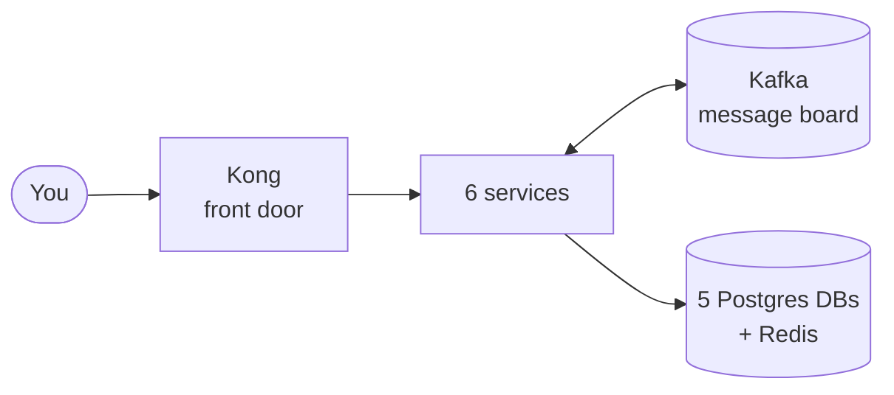

# START HERE — Read This First

## What is this project?

An online shop (like a tiny Amazon) built the way real companies build software:
6 small Java programs ("microservices") that work together, deployed with the same
tools professionals use — Docker, Kubernetes, AWS (simulated), and automated pipelines.

## The 6 services, in one line each

| Service | Job | Port |
|---|---|---|
| user-service | Register, login, give out JWT tokens | 8081 |
| product-service | Show products (with a Redis cache for speed) | 8082 |
| order-service | Take orders, run the "order saga" | 8083 |
| inventory-service | Track stock, reserve it when someone orders | 8084 |
| payment-service | Charge the customer (simulated) | 8085 |
| notification-service | Send emails when things happen | 8086 |

## Dictionary — every scary word, in plain English

| Word | Meaning |
|---|---|
| **Container** | One program packed with everything it needs, running in isolation. Like a food truck: kitchen + ingredients + menu, all in one box. |
| **Docker** | The tool that builds and runs containers. |
| **Image** | The frozen recipe/blueprint of a container. `docker build` makes an image; running it makes a container. |
| **Pod** | Kubernetes' word for "one running container that I manage." |
| **Kubernetes (K8s)** | The head office that manages hundreds of containers: restarts dead ones, adds more when busy. It never cooks — it only manages trucks. |
| **Deployment** | An order to Kubernetes: "keep N copies of this app alive, always." For apps that hold no data. |
| **StatefulSet** | Same, but for apps that DO hold data (databases). Each gets a permanent disk. |
| **Service (K8s)** | A fixed internal phone number. Callers dial the name; K8s connects them to any healthy pod. |
| **Kafka** | A message board between services. One service posts an event, others read it. Services never call each other directly. |
| **Redis** | A super-fast memory store. Used here for: login sessions, product cache, stock locks. |
| **Kong** | The API gateway — the single front door. Every request enters here first and gets routed to the right service. |
| **AWS** | Amazon's cloud — rent servers/databases instead of owning them. |
| **Floci** | A fake AWS running on your laptop. Same commands, zero cost. |
| **CI/CD** | Robots that test and deploy your code automatically every time you push to GitHub. |
| **JWT** | A signed ticket proving who you are. Login once, show the ticket on every request. |

## The learning order (do NOT skip ahead)

```
1. 01-DOCKER.md       → how one service becomes a container
2. 02-KUBERNETES.md   → how containers are managed at scale
3. 03-KAFKA.md        → how services talk without calling each other
4. 04-AWS-FLOCI.md    → what the cloud pieces are for
5. 05-CICD.md         → how code goes from git push to running in production
6. 06-RUNBOOK.md      → actually run everything + debug commands
```

## The 30-second big picture



A request enters through Kong, hits one service, that service saves to its own
database and posts events on Kafka; other services react to those events.
That's the whole system. Every doc after this just zooms into one part.
