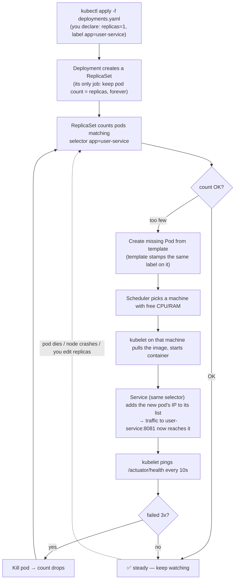
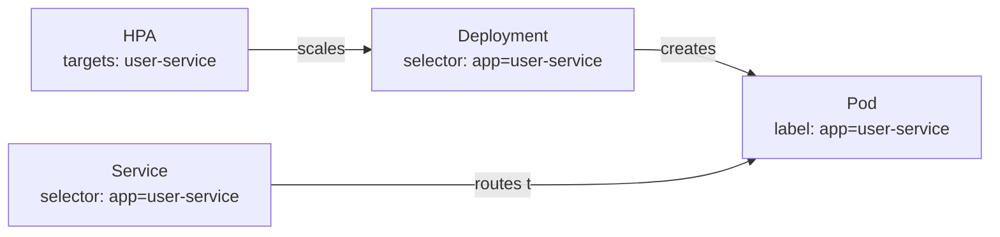

# 02 — Kubernetes (The Head Office for Containers)

## Start with the analogy — food trucks

- One **container** = one food truck (self-contained, sells one thing)
- **Kubernetes** = the head office managing hundreds of trucks across a city:
  - Truck breaks down → replacement sent automatically
  - One street gets busy → send more trucks there (autoscaling)
  - New menu rollout → swap trucks one at a time, street never empty
- A **pod** = head office's word for "one truck I manage" (in this project, 1 pod = 1 container)

## Stateless vs Stateful — the most important split

| | Stateless (cashier) | Stateful (record book) |
|---|---|---|
| Holds data itself? | No — data lives in the DB | Yes — IS the database |
| If it dies? | Start a fresh copy, nothing lost | Must reconnect to the SAME disk |
| K8s object | `Deployment` | `StatefulSet` + `PersistentVolumeClaim` |
| In this project | 6 services, Kong | 5 Postgres, Kafka, Redis |

## THE core workflow — what actually happens (memorize this one)

This loop **never stops**. It's called the reconciliation loop:



**One sentence:** you declare *what you want*; controllers loop forever fixing
the difference between "want" and "have." That's why a killed pod resurrects itself.

## Labels are the glue


Nothing references anything by ID — everything just **matches the same label**.
Mismatch the label = everything silently disconnects (classic bug).

## Reading this project's `k8s/services/deployments.yaml`

```yaml
kind: Deployment              # stateless app
spec:
  replicas: 1                 # keep exactly 1 pod alive
  selector:
    matchLabels:
      app: user-service       # "find pods with this tag"
  template:                   # blueprint for new pods
    metadata:
      labels:
        app: user-service     # "stamp this tag on pods I create" (MUST match selector)
    spec:
      containers:
      - image: REGISTRY/ecommerce/user-service:IMAGE_TAG   # placeholder, swapped at deploy
        env:
        - name: SPRING_DATASOURCE_PASSWORD
          valueFrom:
            secretKeyRef:      # "fetch from the locked safe (Secret), not written here"
              name: app-secrets
              key: USER_DB_PASS
        resources:
          requests: {memory: 256Mi, cpu: 250m}   # guaranteed minimum
          limits:   {memory: 512Mi, cpu: 500m}   # hard ceiling
        livenessProbe:   # "are you alive?" fail 3x → restart pod
          httpGet: {path: /actuator/health, port: 8081}
        readinessProbe:  # "ready for traffic?" fail → pause traffic, don't kill
          httpGet: {path: /actuator/health, port: 8081}
```

Then a `Service` (fixed phone number) and an `HPA` (CPU > 70% → up to 3 pods).
All 6 services repeat this exact shape — learn one block, you know them all.

## Commands you'll actually use

```bash
kubectl get pods -n ecommerce            # what's running?
kubectl logs <pod> -n ecommerce          # my app's logs
kubectl describe pod <pod> -n ecommerce  # why is it broken? (events at bottom)
kubectl delete pod <pod> -n ecommerce    # kill one — watch it come back!
```

Next: **03-KAFKA.md** — how these pods talk to each other without direct calls.
