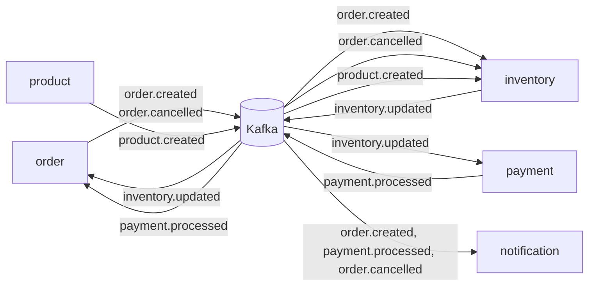
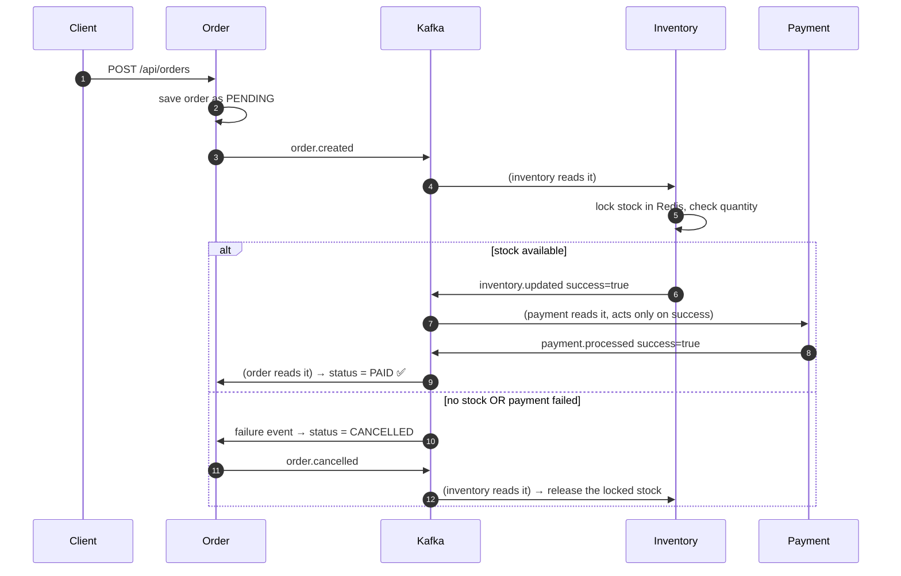

# 03 — Kafka (How Services Talk Without Calling Each Other)

## The idea in one line

**Services drop messages on a notice board (topic); whoever cares, reads them.**
Nobody waits for anybody. Nobody knows anybody's address.

## Why not just call each other's REST APIs?

If order-service called payment-service directly and payment was down → order fails.
With Kafka: order posts "order created!" and moves on. Payment reads it whenever
it's back up. **Loose coupling + no lost work.**

## Who posts, who reads (this project)



5 topics: `order.created` `inventory.updated` `payment.processed` `order.cancelled` `product.created`

## The Order Saga — the heart of this project

A "saga" = a multi-step business flow spread across services, driven by events:



**Key design rule:** payment fires ONLY after inventory confirms stock.
Never charge a customer for something you can't ship.

## The 4 words you need

| Word | Meaning |
|---|---|
| **Topic** | One named notice board (e.g. `order.created`) |
| **Partition** | A topic's lane. More lanes = more parallel readers. Same key (orderId) → same lane → events stay in order per order |
| **Consumer group** | One service's team of readers. Each service has its OWN group, so every service gets its own full copy of every message |
| **concurrency** | Threads per pod reading lanes in parallel (never set above partition count) |

## Reliability settings (KafkaConfig.java)

```java
ACKS_CONFIG = "all"              // message counts as sent only when safely stored
RETRIES_CONFIG = 3               // retry network blips
ENABLE_IDEMPOTENCE_CONFIG = true // a retry can never create a duplicate charge
```

## Java side — how simple it actually is

**Post a message:**
```java
kafkaTemplate.send("order.created", orderId.toString(), payloadJson);
```
**Read messages:**
```java
@KafkaListener(topics = "order.created", groupId = "inventory-service-group", concurrency = "6")
public void handleOrderCreated(String message) { ... }
```
That's it. Spring handles connections, retries, and group balancing.

Next: **04-AWS-FLOCI.md** — the cloud pieces around all this.
