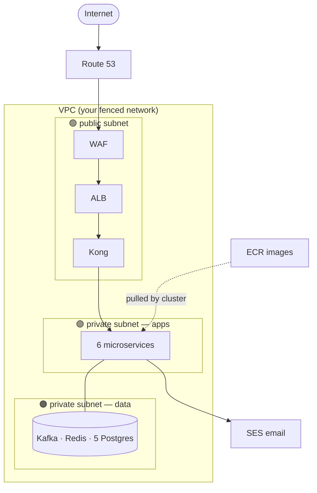

# 04 — AWS & Floci (The Cloud, Without the Bill)

## What is AWS, really?

Renting instead of owning. Instead of buying servers, you rent: machines (EC2),
databases (RDS), file storage (S3), a Kubernetes brain (EKS)… per hour.

## What is Floci?

A **fake AWS on your laptop**. It listens on `localhost:4566` and accepts the
exact same commands as real AWS (`aws eks create-cluster`, `aws ecr ...`) —
but instead of billing you, it starts local containers. Same learning, zero cost.

## The pieces this project uses, and what each is FOR

| Piece | Plain-English job | Created by |
|---|---|---|
| **VPC** | Your private fenced-off network in the cloud | `scripts/01-vpc.sh` |
| **Subnets** | Rooms inside the fence: *public* (internet can reach) and *private* (hidden) | `01-vpc.sh` |
| **Security Groups** | Per-door firewall rules ("only port 443 in") | `01-vpc.sh` |
| **ALB** | The front gate: receives ALL internet traffic, spreads it across Kong pods | `scripts/02-alb.sh` |
| **WAF** | Bouncer at the gate: blocks attack-shaped requests | `02-alb.sh` |
| **Route 53** | DNS — turns a name into your ALB's address | `02-alb.sh` |
| **ECR** | Shelf where your Docker images are stored; cluster pulls from here | `scripts/03-ecr.sh` |
| **EKS** | AWS-managed Kubernetes brain (you saw it in doc 02) | `scripts/04-eks.sh` |
| **SES** | Email-sending service (notification-service uses it) | used directly by code |

## How it fits together



**Why public/private split?** Databases and services must NEVER be reachable
from the internet directly. Only the front gate (ALB) is public; everything
else hides in private subnets. This is the #1 cloud security pattern.

## The deploy scripts, in order

```
01-vpc.sh   → build the fenced network
02-alb.sh   → build the front gate (+ WAF + DNS)
03-ecr.sh   → build 6 images, push to the shelf
04-eks.sh   → create the Kubernetes cluster (Floci actually starts k3s)
05-deploy.sh→ kubectl apply everything in the right order
06-teardown.sh → delete it all
```

`05-deploy.sh` order matters: namespace → secrets/config → databases (wait ready)
→ Kong → services → register Kong in ALB → monitoring. Rule: **a thing must exist
before anything that references it starts.**

## EKS vs ECS vs Fargate (interview one-liner)

- **EKS** = AWS-managed *Kubernetes* (this project)
- **ECS** = AWS's own non-Kubernetes container manager (different, simpler, AWS-only)
- **Fargate** = a *node option* under EKS/ECS: no visible machines, AWS finds capacity per-pod
  (this project uses EC2 node groups instead — see `04-eks.sh`)

Next: **05-CICD.md** — how a `git push` turns into a tested, deployed release.
