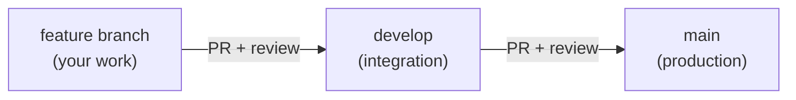
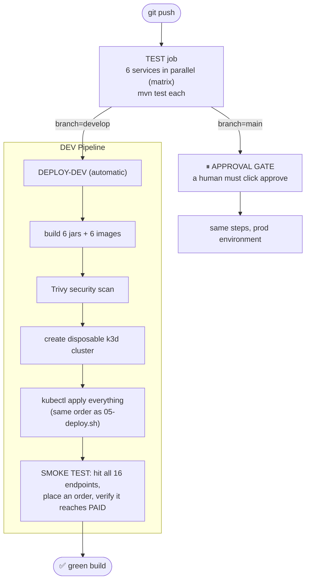

# 05 — CI/CD (From git push to Production)

## The idea

**CI** (Continuous Integration): every push → robots build + test your code.
**CD** (Continuous Delivery): if green → robots deploy it. Humans only approve prod.

## The git workflow (how you and teammates work)

- Nobody pushes to `develop`/`main` directly (branch protection blocks it)
- A PR merges only when reviews pass AND all 6 service tests are green

## This project's pipeline (`.github/workflows/ci-cd.yml`)

## What each piece means

| Piece | Plain English |
|---|---|
| **Matrix test** | Run the same test job 6 times in parallel, once per service |
| **Trivy** | Scans your Docker images for known security holes |
| **k3d** | A tiny throwaway Kubernetes cluster created inside the CI machine, destroyed after |
| **Smoke test** | A script that uses the app like a real user: register → add product → stock → order → check it becomes PAID. If the saga breaks, the build fails |
| **Environment `dev`** | Auto-deploys, no questions |
| **Environment `production`** | Pipeline PAUSES until a human approves in GitHub UI |
| **GitHub Secrets** | Passwords the pipeline needs (DB creds, JWT secret) — stored in repo Settings → Secrets, never in code |

## Where do passwords live in each environment? (loose coupling)

| Environment | Secrets live in |
|---|---|
| 🔵 Docker Compose (laptop) | `.env` file (gitignored) |
| 🟠 Floci/K8s | K8s `Secret` object (`kubectl create secret`) |
| 🟣 CI | GitHub Actions Secrets |

Same code, three secret sources — **no file ever contains a real password.**

## Reading a failed pipeline (your actual job as a dev)

1. GitHub → Actions tab → click the red run
2. Click the red job → the red step
3. Read the LAST 30 lines of the log — the real error is almost always there
4. Common failures: a test broke (fix the test/code), image build failed
   (Dockerfile/jar problem), smoke test failed (the saga broke — check service logs)

Next: **06-RUNBOOK.md** — commands to run and debug everything yourself.
