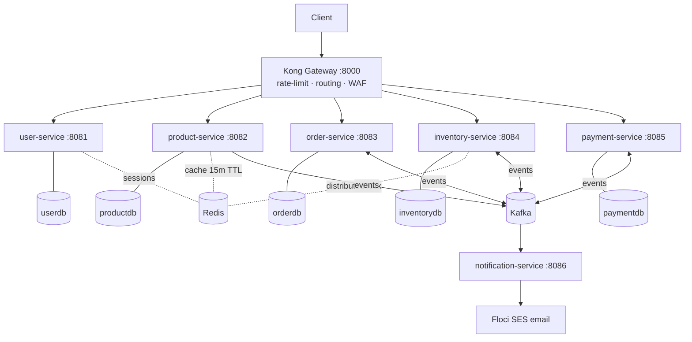
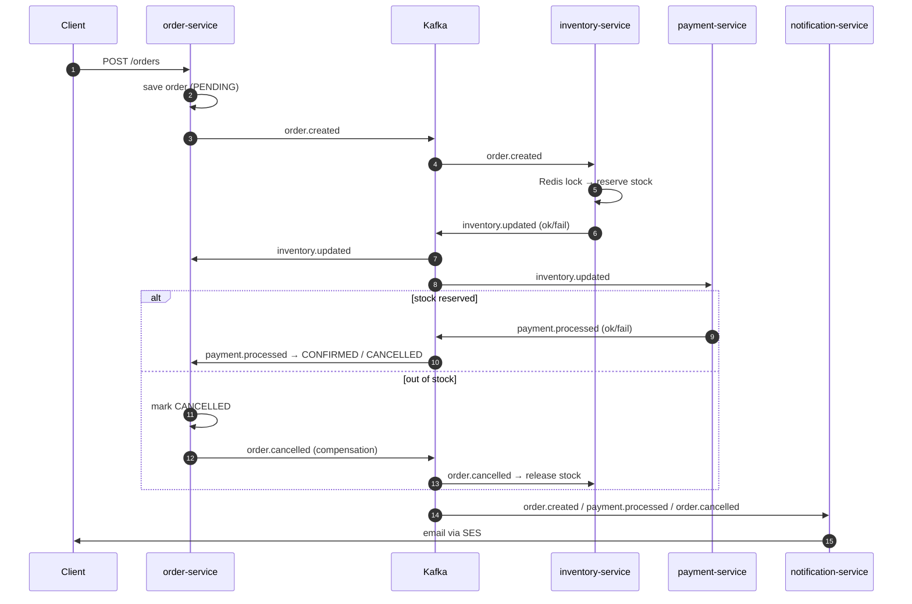
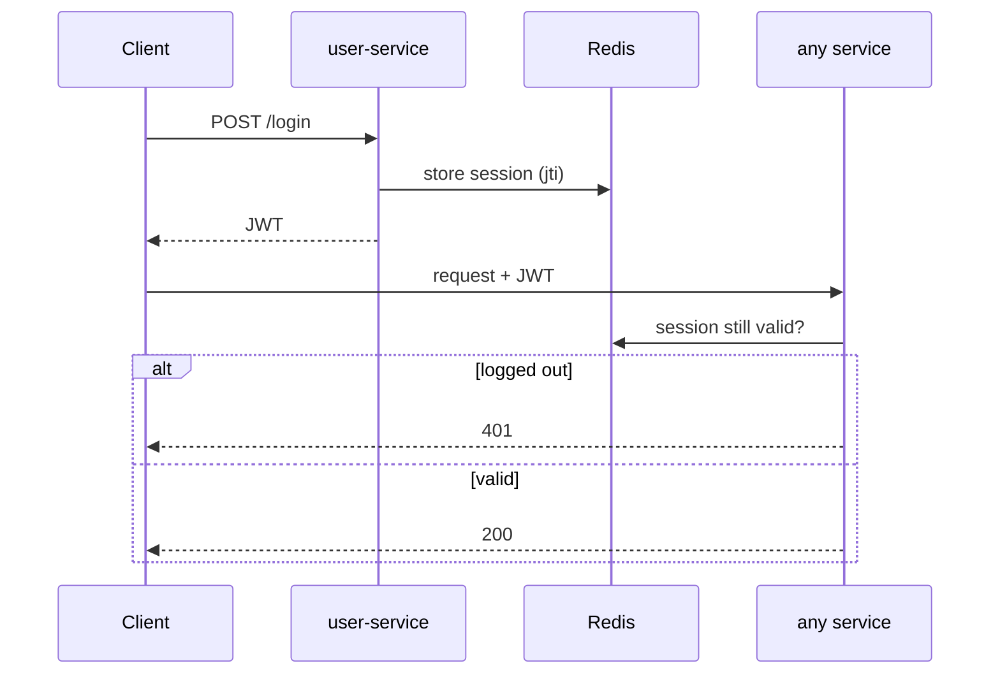
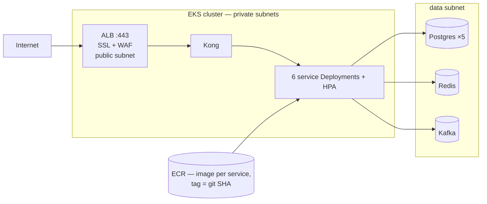
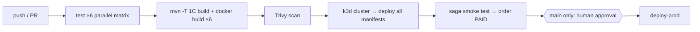

# Architecture — Deep Dive

> 6 Spring Boot microservices · Kafka saga · Kong gateway · Redis · Postgres-per-service · Floci (AWS sim)
> How everything ships end-to-end → [WORKFLOW.md](WORKFLOW.md)

---

## 1. System Overview

Every request enters through Kong (rate-limited per IP). Services never call each other over REST — all cross-service communication is Kafka events.

- **DB-per-service** — no shared tables; each service owns its schema (Flyway migrations run on startup).
- **Redis, 3 distinct jobs** — JWT session store (real logout), product cache, inventory distributed lock (oversell prevention).

---

## 2. Order Saga (choreography — no orchestrator)

Each service reacts to events and emits the next one. Failure at any step emits a compensating event.

**5 topics:** `order.created` · `inventory.updated` · `payment.processed` · `order.cancelled` · `product.created`
One consumer group per service; 3–6 concurrent listeners per topic for throughput.

---

## 3. Auth Flow (JWT + Redis sessions)

Logout deletes the Redis session → token dead instantly, even before its expiry.

---

## 4. Cloud Topology (Floci EKS)

- 3-tier network: **public** (ALB only) → **private** (EKS nodes, Kong, services) → **data** (DBs, Kafka, Redis). Security groups enforce each hop.
- 2 EKS node groups: `general` (m5.large — most services, Kong) and `high-mem` (r5.large — Kafka consumers).
- Manifests in [k8s/](../k8s/): `namespace/ postgres/ redis/ kafka/ kong/ services/ monitoring/`. Same manifests work on real AWS — only env vars change.

---

## 5. CI/CD (summary — full detail in [WORKFLOW.md](WORKFLOW.md))

---

## 6. Per-Service Detail

| Service | Port | Owns | Publishes | Consumes | Special |
|---|---|---|---|---|---|
| user | 8081 | users, auth | — | — | JWT + Redis sessions |
| product | 8082 | catalog | `product.created` | — | Redis cache 15-min TTL |
| order | 8083 | orders, saga state | `order.created`, `order.cancelled` | `inventory.updated`, `payment.processed` | Saga initiator |
| inventory | 8084 | stock | `inventory.updated` | `order.created`, `order.cancelled`, `product.created` | Redis lock — no oversell |
| payment | 8085 | payments | `payment.processed` | `inventory.updated` | Pays only after stock reserved |
| notification | 8086 | — (stateless) | — | `order.created`, `payment.processed`, `order.cancelled` | SES email |
