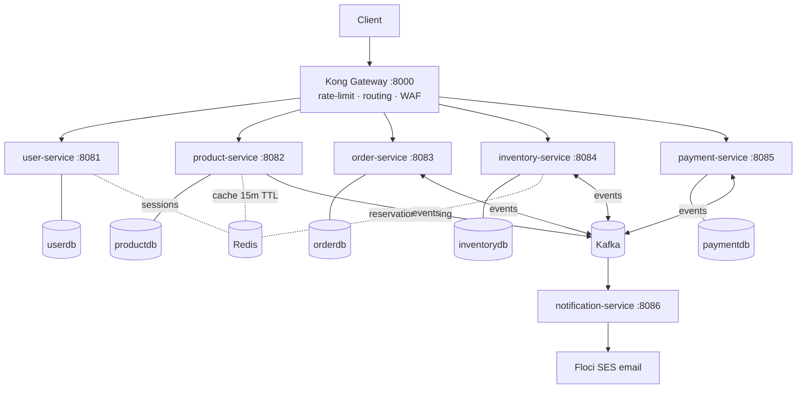
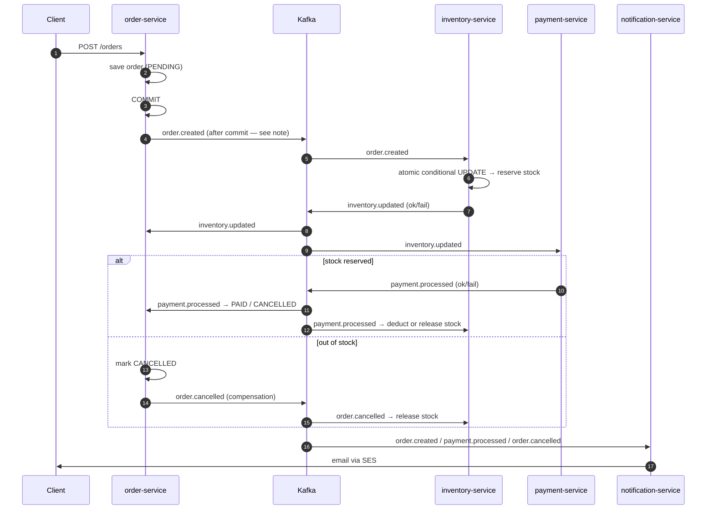
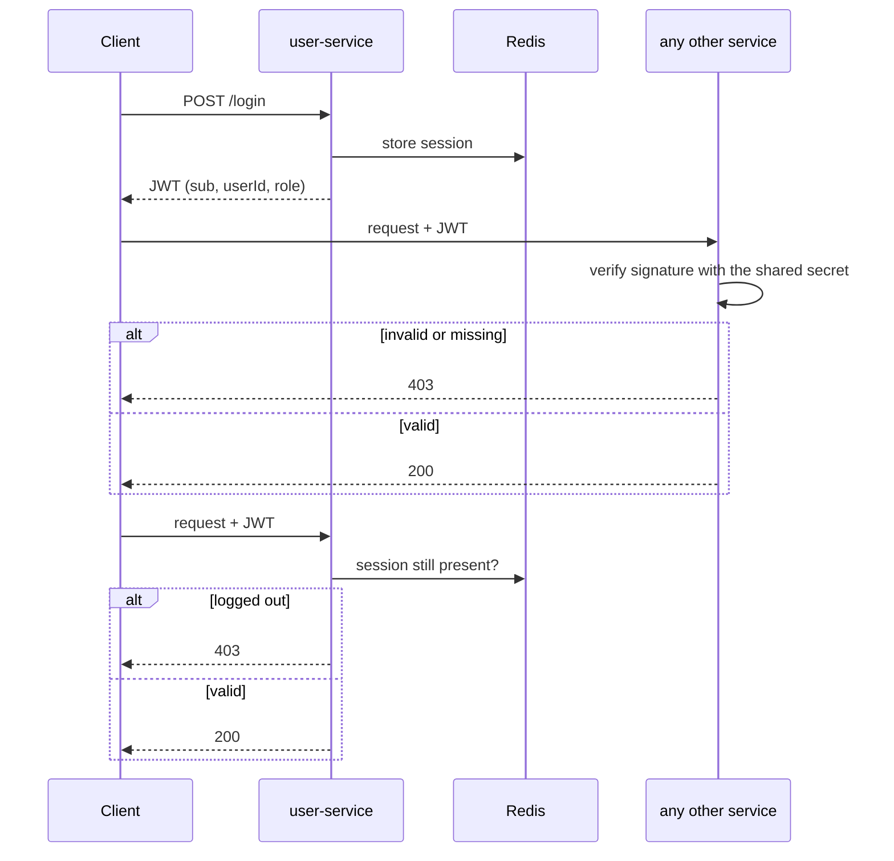
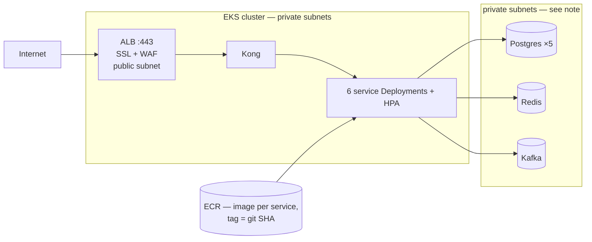
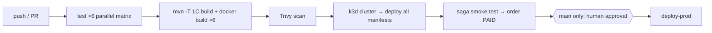
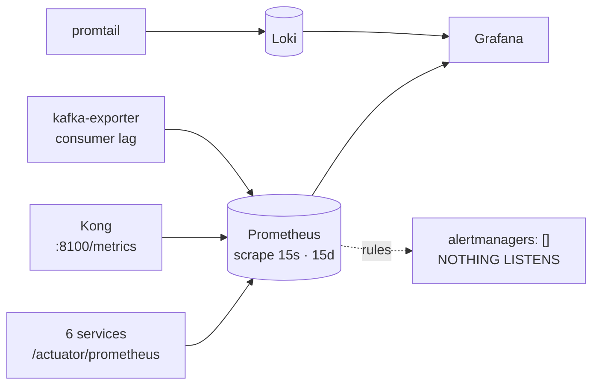

# Architecture — Deep Dive

> 6 Spring Boot microservices · Kafka saga · Kong gateway · Redis · Postgres-per-service · Floci (AWS sim)
> How everything ships end-to-end → [WORKFLOW.md](WORKFLOW.md)

---

## 1. System Overview

Every request enters through Kong (rate-limited per IP). Services never call each other over REST — all cross-service communication is Kafka events.

- **DB-per-service** — no shared tables; each service owns its schema (Flyway migrations run on startup).
- **Redis, 3 distinct jobs** — JWT session store (logout, enforced at user-service only), product cache, and per-order reservation tracking for inventory.
  The oversell guard is *not* the Redis lock it used to be: that lock was released in a `finally` block while the method was still `@Transactional`, so it was gone before the write committed and 40 concurrent orders sold 18 units out of 10. It is now a single conditional `UPDATE ... WHERE quantity - reserved >= :qty`.

---

## 2. Order Saga (choreography — no orchestrator)

Each service reacts to events and emits the next one. Failure at any step emits a compensating event.

**5 topics:** `order.created` · `inventory.updated` · `payment.processed` · `order.cancelled` · `product.created`
One consumer group per service; 3–6 concurrent listeners per topic for throughput.

**Why the diagram shows COMMIT before the publish.** order-service used to send
`order.created` from inside the `@Transactional` method. The Kafka send goes out
immediately; the commit happens when the method returns. Under a 20-order burst
inventory-service replied within milliseconds — before the order row was visible
to anyone else — and order-service's reply handler looked the order up, found
nothing, and returned without a word. Measured on a live cluster: 21 orders, 21
`order.created`, 21 `inventory.updated` replies, consumer lag 0, and **4 orders
stranded at PENDING with no log line at all**. Events now go out on
`AFTER_COMMIT`, so a reply cannot arrive before the order exists.

If the process dies between the commit and the send, the event is still lost —
that residual gap is covered by a stale-order reaper rather than by a
transactional outbox, so a lost event degrades to a cancelled order rather than
a stuck one.

---

## 3. Auth Flow (JWT per service, Redis sessions at user-service)

Each service verifies the signature itself rather than trusting the gateway —
Kong is not the only route to a pod, since `kubectl port-forward` goes straight
past it. The token carries a **userId** claim, which is what lets order-service
identify the caller without reading a user id out of the request body.

**Two things this diagram deliberately shows, because both used to be described
wrongly here:**

1. Until the authorisation work, five of the six services had no security
   configuration at all. `POST /api/orders` with no `Authorization` header
   returned **200**. An earlier version of this diagram showed *every* service
   asking Redis whether the session was valid; no service except user-service
   ever did that.

2. **Logout is still only enforced at user-service.** It deletes the Redis
   session, so user-service rejects the token immediately — but the other five
   verify the signature and expiry only, and will keep accepting that token
   until it expires (24h). Closing that needs either a shared revocation check
   or short-lived tokens with refresh. It is a known gap, not a solved problem.

---

## 4. Cloud Topology (Floci EKS)

- **This is a 2-tier deployment, not 3.** `scripts/01-vpc.sh` creates data subnets
  and a `db-sg`, but nothing uses them: Postgres, Redis and Kafka are StatefulSets,
  so they run as pods on the EKS nodes in the **private** subnets, and `db-sg` is
  never attached to anything. Isolation is enforced in Kubernetes instead — see
  `k8s/security/networkpolicy.yaml`, which is *stricter* than `db-sg` would have
  been: `db-sg` let any pod carrying `eks-sg` reach any database on 5432, whereas
  the policies allow only order-service → postgres-order, and so on. Security
  groups filter per-ENI and cannot express per-pod rules.
- 2 EKS node groups: `general` (m5.large — most services, Kong) and `high-mem` (r5.large — Kafka consumers).
- Manifests in [k8s/](../k8s/): `namespace/ postgres/ redis/ kafka/ kong/ services/ monitoring/`. Same manifests work on real AWS — only env vars change.

---

## 5. CI/CD (summary — full detail in [WORKFLOW.md](WORKFLOW.md))

---

---

## 6. Observability

**Three layers, and the third is the one that matters.**

| Layer | Examples | Answers |
|---|---|---|
| RED | request rate, 5xx share, p50/p95/p99 | is the API healthy |
| USE | JVM heap, GC pause, consumer lag, targets up | is the machine healthy |
| **Business** | `orders_pending_oldest_age_seconds`, `payment_without_order_total`, `saga_duration_seconds`, `inventory_reserve_total` | **is the business working** |

The business layer exists because of a specific incident. Four orders were
stranded at PENDING permanently, and every other signal was green: pods healthy,
consumer lag 0, CPU normal, no exceptions, Grafana reporting `"database": "ok"`.
Nothing in RED or USE can express *customers' orders are disappearing*. The
oldest-pending gauge can, and it alerts at two minutes because a healthy saga
finishes in seconds.

**What this stack does not yet do.** There is no Alertmanager. The nine rules in
`k8s/monitoring/alerts.yaml` evaluate and fire into
`alertmanagers: static_configs: targets: []`, so nothing reaches a person. Until
that is wired to Slack or PagerDuty, this is monitoring you have to be watching —
and at 3am nobody is watching. Also absent: dashboard variables for drill-down,
any Grafana panel that reads Loki, distributed tracing across the saga's four
services, HA Prometheus, and long-term storage beyond 15 days.

**A warning worth keeping.** Grafana being up tells you nothing about whether
monitoring works. It stores no data — it asks Prometheus. Throughout the period
when all ten targets were down, Grafana was `1/1 Running` and answering
`"database": "ok"`, cheerfully drawing empty panels. That is why the cluster
dashboard shows *targets up* before it shows a single graph.

## 7. Per-Service Detail

| Service | Port | Owns | Publishes | Consumes | Special |
|---|---|---|---|---|---|
| user | 8081 | users, auth | — | — | JWT + Redis sessions |
| product | 8082 | catalog | `product.created` | — | Redis cache 15-min TTL |
| order | 8083 | orders, saga state | `order.created`, `order.cancelled` | `inventory.updated`, `payment.processed` | Saga initiator |
| inventory | 8084 | stock | `inventory.updated` | `order.created`, `order.cancelled`, `payment.processed`, `product.created` | Atomic conditional UPDATE — no oversell |
| payment | 8085 | payments | `payment.processed` | `inventory.updated` | Pays only after stock reserved |
| notification | 8086 | — (stateless) | — | `order.created`, `payment.processed`, `order.cancelled` | SES email |
