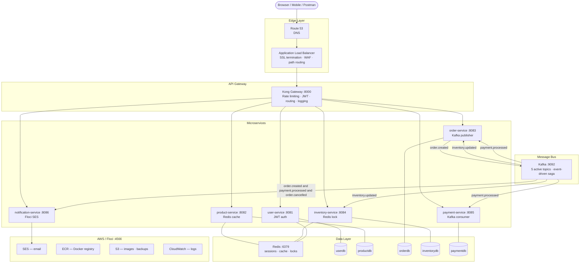
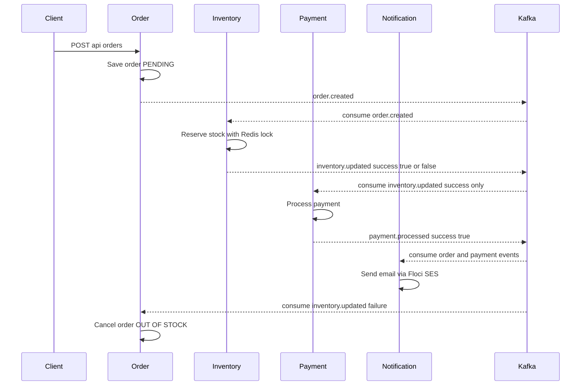

# Architecture

## System Overview



---

## Kafka Event Flow (Order Saga)



**Key design decision:** Payment only fires AFTER inventory confirms stock is reserved.
If inventory fails → order is automatically cancelled → no payment taken.

---

## Data Model (DB per service)

Each service owns its own PostgreSQL database. No cross-service DB queries.

```
userdb        → users (id, email, password_hash, role, active)
productdb     → products (id, name, price, category, stock=in inventory)
orderdb       → orders + order_items
inventorydb   → inventory (product_id, quantity, reserved, version)
paymentdb     → payments (order_id, amount, status, transaction_id)
```

---

## Redis Usage (3 purposes)

| Purpose | Service | Key pattern | TTL |
|---|---|---|---|
| JWT sessions | user-service | `session:<email>` | 24h |
| Product cache | product-service | `product:<id>` | 15 min |
| Distributed lock | inventory-service | `inventory:lock:<productId>` | 30s |

---

## Security Layers

```
Internet
  ↓
WAF (OWASP rules + rate limit 2000 req/5min + SQLi blocking)
  ↓
ALB (SSL/TLS termination — HTTPS only)
  ↓
Kong (rate limiting 1000/min + correlation IDs + JWT validation)
  ↓
Services (Spring Security + JWT + input validation)
  ↓
Databases (separate credentials per service, no cross-service access)
```

---

## Floci vs Real AWS

| Component | Floci (local) | Real AWS |
|---|---|---|
| VPC / Subnets / SGs | ✅ Full API simulation | AWS EC2 |
| ALB + listeners | ✅ Port 80 redirect works; port 443 TLS not implemented | AWS ELB |
| WAF | ✅ API works | AWS WAF |
| ACM (SSL cert) | ✅ API works | AWS ACM |
| Route 53 | ✅ API works | AWS Route 53 |
| ECR (push/pull) | ✅ Real Docker Registry v2 at localhost:5100 | AWS ECR |
| EKS (cluster) | ✅ Real k3s cluster provisions | AWS EKS |
| SES (email) | ✅ Real API, emails logged | AWS SES |
| S3 | ✅ Full API | AWS S3 |
| CloudWatch Logs | ✅ API works | AWS CloudWatch |
