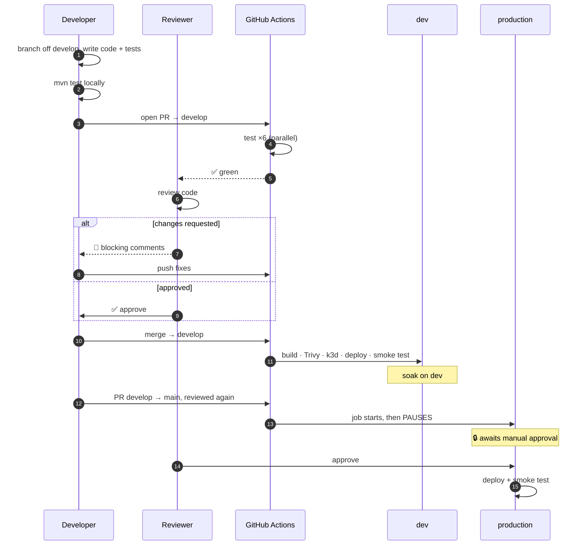

# CI/CD — GitHub Actions

> Documents the actual pipeline in `.github/workflows/ci-cd.yml` and `codeql.yml`,
> plus what developers and reviewers are each responsible for.
>
> **No Jenkins here** — this project is fully GitHub Actions. (The food-delivery
> project uses Jenkins + ArgoCD; different repo, different model.)

---

## 1. Pipeline at a glance


```yaml
on:
  push:
    branches: [main, develop]
  pull_request:
    branches: [main, develop]
  workflow_dispatch:          # manual "Run workflow" button
```

| Event | What runs |
|---|---|
| **PR** → main/develop | `test` only — nothing deploys |
| **Push** → `develop` | `test` → `deploy-dev` |
| **Push** → `main` | `test` → `deploy-prod` *(gated on human approval)* |
| **Manual** | `test` |

---

## 2. JOB 1 — `test`

Runs **all 6 services in parallel**, each in its own runner:

```yaml
strategy:
  fail-fast: false
  matrix:
    service: [user-service, product-service, order-service,
              inventory-service, payment-service, notification-service]
```

**`fail-fast: false` matters.** GitHub's default cancels every remaining job the
moment one fails. With it disabled, one broken service still lets the other five
report — so you see *all* the problems in one run instead of fixing them one at a time.

### Real service containers

Tests run against actual Postgres and Redis, not mocks:

```yaml
services:
  postgres:
    image: postgres:15
    env: { POSTGRES_DB: testdb, POSTGRES_USER: test, POSTGRES_PASSWORD: test }
    ports: ["5432:5432"]
  redis:
    image: redis:7-alpine
    ports: ["6379:6379"]
```

### Steps

```yaml
- uses: actions/setup-java@v4
  with:
    java-version: '17'
    distribution: 'temurin'
    cache: maven              # ← caches ~/.m2 between runs
- run: mvn -B -pl ${{ matrix.service }} -am test
```

| Flag | Meaning |
|---|---|
| `-B` | batch mode — no ANSI colours, cleaner logs |
| `-pl <service>` | build **only this module** |
| `-am` | **also make** dependencies this module needs |
| `cache: maven` | reuses `~/.m2`, cutting minutes off every run |

---

## 3. JOB 2 — `deploy-dev`

```yaml
needs: test
if: github.event_name == 'push' && github.ref == 'refs/heads/develop'
environment: dev
```

`needs: test` means **all six** matrix jobs must pass first.

### The 11 steps

| # | Step | What it does |
|---|---|---|
| 1 | Build all services | `mvn -B -T 1C package -DskipTests` — `-T 1C` = one thread per CPU core |
| 2 | Build images | Docker image per service |
| 3 | **Trivy scan** | CVE scan of a built image |
| 4 | Create k3d cluster | real Kubernetes inside the runner |
| 5 | Import images | load images into k3d (no registry push needed) |
| 6 | Namespace, secrets, config | `k8s/namespace/`, secrets from GitHub Secrets |
| 7 | Deploy data layer | Postgres ×5, Redis, Kafka — waits for Ready |
| 8 | Deploy Kong | gateway up before services |
| 9 | Deploy microservices | all 6 |
| 10 | Verify cluster state | pods, services, endpoints |
| 11 | **End-to-end smoke test** | `bash .github/smoke-test.sh` |
| — | Dump logs on failure | `if: failure()` — logs from every pod |

### Why k3d and not a shared dev cluster

k3d runs a real Kubernetes cluster **inside the GitHub runner**. Every run gets a
completely clean cluster that's destroyed afterwards — no drift, no "works because
someone left something running", no shared environment to break for others.

### The smoke test — the real gate

From `.github/smoke-test.sh`:

```
Endpoints covered (16):
  users:     register, login, logout, get
  products:  create, list, get, category, search, update
  inventory: restock, get
  orders:    create, get, list-by-user, cancel
  (payment + notification have no REST API — verified via the saga)
```

It doesn't just check that pods are `Running` — it drives a **real order through
the entire Kafka saga** and asserts it reaches `PAID`. That exercises
order-service → Kafka → inventory (Redis lock) → Kafka → payment → notification.

**If the saga breaks, the deploy fails.** A pipeline that only checked pod status
would happily ship a completely broken order flow.

---

## 4. JOB 3 — `deploy-prod`

```yaml
needs: test
if: github.event_name == 'push' && github.ref == 'refs/heads/main'
environment: production   # requires manual reviewer approval in GitHub
```

Same steps as dev, with one difference: `environment: production`.

**How the gate works:** GitHub Environments can require **manual approval**. The
job starts, then **pauses** and waits for a named reviewer to click Approve. Until
then nothing is applied.

Configure at **Settings → Environments → production → Required reviewers**.

---

## 5. CodeQL — `codeql.yml`

```yaml
on:
  schedule: ...
languages: java
```

GitHub's static analysis for security vulnerabilities — SQL injection, path
traversal, unsafe deserialization. Runs on a schedule rather than per-commit
because a full scan is slow. Findings land in the **Security** tab.

---

## 6. Two layers of scanning

| Tool | Scans | Catches |
|---|---|---|
| **Trivy** | the Docker **image** | vulnerable OS packages and libraries (CVEs) |
| **CodeQL** | your **source code** | injection flaws, unsafe patterns |

Different targets. Trivy finds a vulnerable `openssl` in your base image; CodeQL
finds a SQL string built by concatenation. Neither replaces the other.

---

# 7. Developer responsibilities

## Before opening a PR

```bash
# 1. Branch off develop
git checkout develop && git pull
git checkout -b feat/order-cancellation

# 2. Run the same tests CI will run
mvn -B -pl order-service -am test

# 3. Full local verification (optional but faster than waiting on CI)
docker compose up -d
KONG_URL=http://localhost:8000 bash .github/smoke-test.sh
```

## Checklist

| ✅ | Item |
|---|---|
| ☐ | Tests pass locally — don't outsource that to CI |
| ☐ | New/changed behaviour has a test |
| ☐ | **No secrets in code** — no tokens, passwords, or connection strings |
| ☐ | New config added to `k8s/services/configmap.yaml` (and Secrets if sensitive) |
| ☐ | Conventional Commit message: `feat(order): add cancellation endpoint` |
| ☐ | PR description says **what** changed and **why** |
| ☐ | Saga-affecting changes note the compensation path |
| ☐ | Target `develop`, not `main` |

## Commit format

```
<type>(<scope>): <description>

feat(order):     new feature
fix(inventory):  bug fix
refactor(user):  no behaviour change
test(payment):   tests only
chore(ci):       tooling/pipeline
docs(readme):    documentation
```

## When CI fails

**Read the log before re-running.** Re-running a deterministic failure just wastes
five minutes.

| Failure | Usual cause |
|---|---|
| One service's tests | your change — check that job's log |
| All six | shared code, or a `pom.xml` change |
| Trivy | a base image needs bumping |
| Smoke test | a saga step broke — check that service's logs in the "Dump logs" step |
| k3d timeout | a pod never became Ready — usually config or a missing Secret |

## Rules

- **Never push directly to `main` or `develop`.** Always a PR.
- **Never commit secrets.** If you do: rotate the credential immediately — removing
  the commit is not enough, it's in the history and possibly already cloned.
- **Never disable a failing test to go green.** Fix it or mark it `@Disabled` with
  a linked issue explaining why.

---

# 8. Reviewer responsibilities

## Order of review

**1. Check CI is green first.** If it's red, stop — ask the author to fix it before
you spend time reading.

**2. Then read the code.**

## Checklist

### Correctness
| ✅ | |
|---|---|
| ☐ | Does it do what the PR description claims? |
| ☐ | Edge cases — null, empty list, zero quantity, concurrent calls? |
| ☐ | Error handling — what happens when the DB or Kafka is down? |
| ☐ | Any new query parameterized? (no string concatenation into SQL) |

### This project's specific risks
| ✅ | |
|---|---|
| ☐ | **Kafka consumers idempotent?** Events can be redelivered — will processing twice corrupt state? |
| ☐ | **Saga compensation** — if a new step can fail, is there a compensating event? |
| ☐ | **Redis lock** — if stock is touched, is the lock held? Is it released on **every** path including exceptions? |
| ☐ | **Cross-service DB access?** Each service owns its own database — reject any direct access to another's |
| ☐ | **JWT/session** — does auth still check the Redis session, not just signature validity? |

### Tests
| ✅ | |
|---|---|
| ☐ | Is there a test that **fails without this change**? |
| ☐ | Does it test behaviour, or just that mocks were called? |
| ☐ | Concurrency-sensitive change → is there a concurrent test? |

### Operational
| ✅ | |
|---|---|
| ☐ | New config in ConfigMap/Secret, not hardcoded |
| ☐ | New env var documented |
| ☐ | Schema change → is there a Flyway migration, and is it backward-compatible? |
| ☐ | Logs added at state transitions, with the order/user ID |

## How to leave feedback

**Distinguish blocking from optional:**

```
🔴 Blocking — this will double-decrement stock if the event is redelivered.
   Suggest an idempotency check on orderId before applying.

🟡 Non-blocking — could extract this into a helper, but fine as is.

💬 Question — why a pessimistic lock here rather than the Redis lock
   used elsewhere in inventory?
```

**Ask, don't assert, when you're unsure.** *"What happens if this throws before
the lock is released?"* is better than *"This leaks the lock"* — you might be wrong,
and the question gets the same fix without friction.

**Approve when it's good enough to ship, not when it's perfect.** Blocking a
solid PR over naming preferences slows everyone down.

## Reviewing a `main` PR (production)

Extra scrutiny — this one goes to prod:

| ✅ | |
|---|---|
| ☐ | Has this already been running on `develop`? |
| ☐ | Is it reversible? Schema changes especially |
| ☐ | Would a rollback be safe if it fails after deploy? |
| ☐ | Migrations backward-compatible with the **currently running** version? |

> **Backward compatibility matters** because during a rolling deploy, old and new
> pods run **simultaneously** against the same database. A migration that drops a
> column the old version still reads will break live traffic mid-deploy.

---

# 9. Full flow — developer to production



---

# 10. Required GitHub Secrets

**Settings → Secrets and variables → Actions**

| Secret | Used for |
|---|---|
| `JWT_SECRET` | token signing (tests + runtime) |
| `DB_PASSWORD` | Postgres |
| `REDIS_PASSWORD` | Redis `--requirepass` |

Tests inject dummy values (`test`/`test`); real values are only used by the deploy jobs.

> Secrets are **write-only** — you can set them but never read them back. Lost one
> means generating a new one. They're also masked in logs, so `echo $SECRET` prints `***`.

---

# 11. Known gaps

Honest list — see [IMPROVEMENT-PLAN.md](IMPROVEMENT-PLAN.md) for detail:

| Gap | Impact |
|---|---|
| **1 test file per service** | the matrix looks impressive but runs very little |
| No Testcontainers | can't test Kafka consumers or the saga properly |
| Deploys to **k3d**, not real EKS | the pipeline never exercises actual AWS |
| No rollback step | a bad prod deploy needs manual intervention |
| Trivy scans **one** image | the other five are unscanned |
| No correlation ID | a failing saga means grepping five services by timestamp |

**Highest-value fix: Testcontainers plus a saga compensation test.** The pipeline
structure is genuinely good — it's the tests inside it that are thin.
