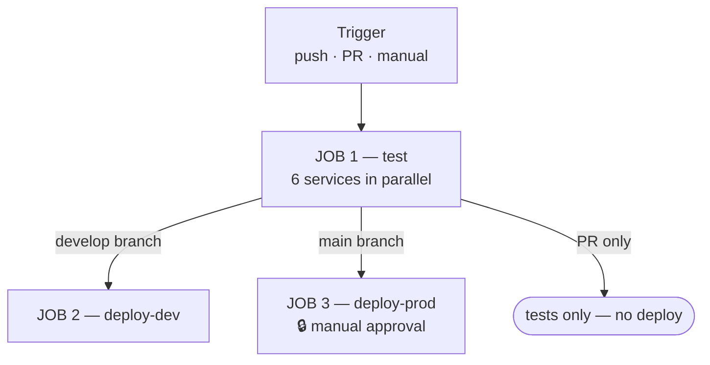

# CI/CD — GitHub Actions

> Documents the actual pipeline in `.github/workflows/ci-cd.yml` and `codeql.yml`,
> plus what developers and reviewers are each responsible for.
>
> **No Jenkins here** — this project is fully GitHub Actions. (The food-delivery
> project uses Jenkins + ArgoCD; different repo, different model.)

---

## 1. Pipeline at a glance



```yaml
on:
  push:
    branches: [main, develop]
  pull_request:
    branches: [main, develop]
  workflow_dispatch:          # manual "Run workflow" button
```

| Event | What runs |
|---|---|
| **PR** → main/develop | `test` only — nothing deploys |
| **Push** → `develop` | `test` → `deploy-dev` |
| **Push** → `main` | `test` → `deploy-prod` *(gated on human approval)* |
| **Manual** | `test` |

---

## 2. JOB 1 — `test`

Runs **all 6 services in parallel**, each in its own runner:

```yaml
strategy:
  fail-fast: false
  matrix:
    service: [user-service, product-service, order-service,
              inventory-service, payment-service, notification-service]
```

**`fail-fast: false` matters.** GitHub's default cancels every remaining job the
moment one fails. With it disabled, one broken service still lets the other five
report — so you see *all* the problems in one run instead of fixing them one at a time.

### Real service containers

Tests run against actual Postgres and Redis, not mocks:

```yaml
services:
  postgres:
    image: postgres:15
    env: { POSTGRES_DB: testdb, POSTGRES_USER: test, POSTGRES_PASSWORD: test }
    ports: ["5432:5432"]
  redis:
    image: redis:7-alpine
    ports: ["6379:6379"]
```

### Steps

```yaml
- uses: actions/setup-java@v4
  with:
    java-version: '17'
    distribution: 'temurin'
    cache: maven              # ← caches ~/.m2 between runs
- run: mvn -B -pl ${{ matrix.service }} -am test
```

| Flag | Meaning |
|---|---|
| `-B` | batch mode — no ANSI colours, cleaner logs |
| `-pl <service>` | build **only this module** |
| `-am` | **also make** dependencies this module needs |
| `cache: maven` | reuses `~/.m2`, cutting minutes off every run |

---

## 3. JOB 2 — `deploy-dev`

```yaml
needs: test
if: github.event_name == 'push' && github.ref == 'refs/heads/develop'
environment: dev
```

`needs: test` means **all six** matrix jobs must pass first.

### The 11 steps

| # | Step | What it does |
|---|---|---|
| 1 | Build all services | `mvn -B -T 1C package -DskipTests` — `-T 1C` = one thread per CPU core |
| 2 | Build images | Docker image per service |
| 3 | **Trivy scan** | CVE scan of a built image |
| 4 | Create k3d cluster | real Kubernetes inside the runner |
| 5 | Import images | load images into k3d (no registry push needed) |
| 6 | Namespace, secrets, config | `k8s/namespace/`, secrets from GitHub Secrets |
| 7 | Deploy data layer | Postgres ×5, Redis, Kafka — waits for Ready |
| 8 | Deploy Kong | gateway up before services |
| 9 | Deploy microservices | all 6 |
| 10 | Verify cluster state | pods, services, endpoints |
| 11 | **End-to-end smoke test** | `bash .github/smoke-test.sh` |
| — | Dump logs on failure | `if: failure()` — logs from every pod |

### Why k3d and not a shared dev cluster

k3d runs a real Kubernetes cluster **inside the GitHub runner**. Every run gets a
completely clean cluster that's destroyed afterwards — no drift, no "works because
someone left something running", no shared environment to break for others.

### The smoke test — the real gate

From `.github/smoke-test.sh`:

```
Endpoints covered (16):
  users:     register, login, logout, get
  products:  create, list, get, category, search, update
  inventory: restock, get
  orders:    create, get, list-by-user, cancel
  (payment + notification have no REST API — verified via the saga)
```

It doesn't just check that pods are `Running` — it drives a **real order through
the entire Kafka saga** and asserts it reaches `PAID`. That exercises
order-service → Kafka → inventory (Redis lock) → Kafka → payment → notification.

**If the saga breaks, the deploy fails.** A pipeline that only checked pod status
would happily ship a completely broken order flow.

---

## 4. JOB 3 — `deploy-prod`

```yaml
needs: test
if: github.event_name == 'push' && github.ref == 'refs/heads/main'
environment: production   # requires manual reviewer approval in GitHub
```

Same steps as dev, with one difference: `environment: production`.

**How the gate works:** GitHub Environments can require **manual approval**. The
job starts, then **pauses** and waits for a named reviewer to click Approve. Until
then nothing is applied.

Configure at **Settings → Environments → production → Required reviewers**.

---

## 5. CodeQL — `codeql.yml`

```yaml
on:
  schedule: ...
languages: java
```

GitHub's static analysis for security vulnerabilities — SQL injection, path
traversal, unsafe deserialization. Runs on a schedule rather than per-commit
because a full scan is slow. Findings land in the **Security** tab.

---

## 6. Two layers of scanning

| Tool | Scans | Catches |
|---|---|---|
| **Trivy** | the Docker **image** | vulnerable OS packages and libraries (CVEs) |
| **CodeQL** | your **source code** | injection flaws, unsafe patterns |

Different targets. Trivy finds a vulnerable `openssl` in your base image; CodeQL
finds a SQL string built by concatenation. Neither replaces the other.

---

# 7. Developer responsibilities

## Before opening a PR

```bash
# 1. Branch off develop
git checkout develop && git pull
git checkout -b feat/order-cancellation

# 2. Run the same tests CI will run
mvn -B -pl order-service -am test

# 3. Full local verification (optional but faster than waiting on CI)
docker compose up -d
KONG_URL=http://localhost:8000 bash .github/smoke-test.sh
```

## Checklist

| ✅ | Item |
|---|---|
| ☐ | Tests pass locally — don't outsource that to CI |
| ☐ | New/changed behaviour has a test |
| ☐ | **No secrets in code** — no tokens, passwords, or connection strings |
| ☐ | New config added to `k8s/services/configmap.yaml` (and Secrets if sensitive) |
| ☐ | Conventional Commit message: `feat(order): add cancellation endpoint` |
| ☐ | PR description says **what** changed and **why** |
| ☐ | Saga-affecting changes note the compensation path |
| ☐ | Target `develop`, not `main` |

## Commit format

```
<type>(<scope>): <description>

feat(order):     new feature
fix(inventory):  bug fix
refactor(user):  no behaviour change
test(payment):   tests only
chore(ci):       tooling/pipeline
docs(readme):    documentation
```

## When CI fails

**Read the log before re-running.** Re-running a deterministic failure just wastes
five minutes.

| Failure | Usual cause |
|---|---|
| One service's tests | your change — check that job's log |
| All six | shared code, or a `pom.xml` change |
| Trivy | a base image needs bumping |
| Smoke test | a saga step broke — check that service's logs in the "Dump logs" step |
| k3d timeout | a pod never became Ready — usually config or a missing Secret |

## Rules

- **Never push directly to `main` or `develop`.** Always a PR.
- **Never commit secrets.** If you do: rotate the credential immediately — removing
  the commit is not enough, it's in the history and possibly already cloned.
- **Never disable a failing test to go green.** Fix it or mark it `@Disabled` with
  a linked issue explaining why.

---

# 8. Reviewer responsibilities

## Order of review

**1. Check CI is green first.** If it's red, stop — ask the author to fix it before
you spend time reading.

**2. Then read the code.**

## Checklist

### Correctness
| ✅ | |
|---|---|
| ☐ | Does it do what the PR description claims? |
| ☐ | Edge cases — null, empty list, zero quantity, concurrent calls? |
| ☐ | Error handling — what happens when the DB or Kafka is down? |
| ☐ | Any new query parameterized? (no string concatenation into SQL) |

### This project's specific risks
| ✅ | |
|---|---|
| ☐ | **Kafka consumers idempotent?** Events can be redelivered — will processing twice corrupt state? |
| ☐ | **Saga compensation** — if a new step can fail, is there a compensating event? |
| ☐ | **Redis lock** — if stock is touched, is the lock held? Is it released on **every** path including exceptions? |
| ☐ | **Cross-service DB access?** Each service owns its own database — reject any direct access to another's |
| ☐ | **JWT/session** — does auth still check the Redis session, not just signature validity? |

### Tests
| ✅ | |
|---|---|
| ☐ | Is there a test that **fails without this change**? |
| ☐ | Does it test behaviour, or just that mocks were called? |
| ☐ | Concurrency-sensitive change → is there a concurrent test? |

### Operational
| ✅ | |
|---|---|
| ☐ | New config in ConfigMap/Secret, not hardcoded |
| ☐ | New env var documented |
| ☐ | Schema change → is there a Flyway migration, and is it backward-compatible? |
| ☐ | Logs added at state transitions, with the order/user ID |

## How to leave feedback

**Distinguish blocking from optional:**

```
🔴 Blocking — this will double-decrement stock if the event is redelivered.
   Suggest an idempotency check on orderId before applying.

🟡 Non-blocking — could extract this into a helper, but fine as is.

💬 Question — why a pessimistic lock here rather than the Redis lock
   used elsewhere in inventory?
```

**Ask, don't assert, when you're unsure.** *"What happens if this throws before
the lock is released?"* is better than *"This leaks the lock"* — you might be wrong,
and the question gets the same fix without friction.

**Approve when it's good enough to ship, not when it's perfect.** Blocking a
solid PR over naming preferences slows everyone down.

## Reviewing a `main` PR (production)

Extra scrutiny — this one goes to prod:

| ✅ | |
|---|---|
| ☐ | Has this already been running on `develop`? |
| ☐ | Is it reversible? Schema changes especially |
| ☐ | Would a rollback be safe if it fails after deploy? |
| ☐ | Migrations backward-compatible with the **currently running** version? |

> **Backward compatibility matters** because during a rolling deploy, old and new
> pods run **simultaneously** against the same database. A migration that drops a
> column the old version still reads will break live traffic mid-deploy.

---
---

# 9. One change, start to finish — a worked example

Everything above is a rule. This is what it actually looks like on a real
change: the commands typed, the output that came back, the review that was
written, and the failure in between.

The change is a real one from this repository — adding JWT verification to the
services that had none.

---

## Step 1 — the developer picks up the work

```bash
git checkout develop && git pull
git checkout -b fix/service-jwt-verification
```

**Before writing anything, prove the problem exists.** A fix with no
demonstrated failure is a guess:

```bash
$ curl -s -o /dev/null -w "%{http_code}\n" -X POST http://localhost:8000/api/orders \
    -H 'Content-Type: application/json' \
    -d '{"userId":1,"shippingAddress":"x","items":[...]}'
200
```

**200 with no `Authorization` header at all.** That number goes in the PR
description. It is the reason the change exists.

---

## Step 2 — write the failing test first

```java
@Test
void filterLeavesTheContextEmptyWithNoHeader() throws Exception {
    when(request.getHeader("Authorization")).thenReturn(null);
    filter.doFilter(request, response, chain);
    assertThat(SecurityContextHolder.getContext().getAuthentication()).isNull();
}
```

```bash
$ mvn -B -pl order-service -am test
[ERROR] Tests run: 1, Failures: 1
[ERROR] filterLeavesTheContextEmptyWithNoHeader
        expected: null but was: UsernamePasswordAuthenticationToken
```

Red. Now the test is worth something.

---

## Step 3 — write the fix, run the same command CI will run

```bash
$ mvn -B -pl order-service -am test
[INFO] Tests run: 24, Failures: 0, Errors: 0
[INFO] BUILD SUCCESS
```

**Then remove the fix and run again.** This is the step people skip, and it is
the one that matters:

```bash
$ git stash                          # take the fix away
$ mvn -B -pl order-service -am test
[ERROR] Tests run: 24, Failures: 1   # good — the test can actually fail
$ git stash pop
```

A test that passes with and without the fix protects nothing. It only looks
like it does.

---

## Step 4 — verify end to end locally

```bash
$ bash .github/smoke-test.sh
  ✅ POST /api/orders           no token   → denied  (403)
  ✅ POST /api/orders           bad token  → denied  (403)
  ✅ GET  /api/orders/user/<other user>    → denied  (403)
  RESULT: 29 passed, 0 failed
```

---

## Step 5 — commit and open the PR

```bash
$ git add -A
$ git commit -m "fix(security): verify JWTs in every service

Five of six services had no SecurityConfig and no filter. Confirmed against a
running cluster: POST /api/orders with no Authorization header returned 200.

Each service now verifies the signature itself rather than trusting the gateway,
because Kong is not the only route to a pod — kubectl port-forward goes straight
past it."

$ git push -u origin fix/service-jwt-verification
$ gh pr create --base develop --fill
```

**The PR description that gets a fast review:**

```markdown
## What
JWT verification in product, order, inventory and payment services.

## Why
Measured before the change:

    POST /api/orders             no token  -> 200
    POST /api/orders             garbage   -> 200
    POST /api/inventory/1/restock no token -> 200

The token was issued by user-service and never checked by anything.

## After
All five return 403. Legitimate flow unaffected — smoke test 29/29.

## Risk
Any client not sending a token will now break. Grepped the repo and the
Angular app; none found.

## How to verify
    bash .github/smoke-test.sh
```

**What makes it fast to review:** numbers before and after, the risk stated
rather than left for the reviewer to find, and a command they can run.

---

## Step 6 — CI fails. Read it before touching anything.

```
RESULT: 23 passed, 7 failed
```

The instinct is to look at the seven failures. **Look above them instead:**

```
  ✅ ADMIN token obtained (role=USER)
  ❌ POST /api/products (admin)  (got 403, want 200)
  ❌ PUT  /api/products/1 (admin) (got 403, want 200)
  ❌ POST /api/inventory/1/restock (got 403, want 200)
  ❌ GET  /api/inventory/1        (got 500, want 200)
  ❌ order CANCELLED
  ❌ saga never reached PAID
```

The line that says **✅ says `role=USER`.** The admin promotion silently did
nothing, and all seven failures are downstream of that one line: no admin means
no product, no product means no stock, no stock means the saga cancels.

The cause: the script ran `psql -U postgres`, but CI builds `app-secrets` from
GitHub secrets and the database user is whatever `USER_DB_USER` holds. psql
failed, and the error was thrown away by `2>&1 >/dev/null`.

```bash
$ git commit -m "fix(ci): read the db user from app-secrets when promoting the admin"
$ git push
```

**Two habits worth taking from this:** the first red line usually explains the
rest, and a ✅ that reports success while carrying wrong data is worse than a ❌.

---

## Step 7 — the reviewer

They open the PR and **check CI first**. Green — now the code is worth reading.

### A review that is actually useful

Not "looks good". Not a list of nitpicks either. This is the shape:

```markdown
Correct fix and the before/after numbers make it easy to check. Verifying in
each service rather than trusting the gateway is the right call — port-forward
does bypass Kong.

**🔴 Blocking — the test cannot fail as written.**

`filterAuthenticatesAValidToken` builds its token with the same secret the
filter is configured with, so it passes whether or not the signature is
actually verified. Removing the `isValid()` call leaves it green.

Pinning it needs a token signed with a *different* key.

**🟡 Non-blocking —** `order-service` returns 404 for another user's order
while `product-service` returns 403 for the same class of thing. Worth making
consistent, but not in this PR.

**❓ Question —** what happens to a token issued before the `userId` claim was
added? `extractUserId` returns null and the filter skips authentication, so
those users get 403 until they log in again. Intentional?
```

**Why this works:**

| Marker | Meaning | Effect |
|---|---|---|
| 🔴 Blocking | must change before merge | the author knows what stops the merge |
| 🟡 Non-blocking | worth doing, not now | opinion offered without holding the PR |
| ❓ Question | may not be a problem | asks instead of accusing |

Unlabelled feedback forces the author to guess which comments are mandatory.
That guessing is where review friction comes from.

### The one thing a reviewer should always check

**Can the test fail?**

Not "is there a test" — a test that cannot fail is worse than no test, because
it reports protection that does not exist.

> This happened on a Floci PR from this work. The test was named
> `createClusterValidatesSubnetsInRequestRegionNotDefaultRegion` and it validated
> nothing: `requireSubnet` calls `ensureDefaultResources(region)`, which seeds
> the default subnets into whatever region it is handed, so the subnet resolved
> in every region and the test passed with or without the fix. Only an unrelated
> ARN assertion made it go red.
>
> The maintainer caught it. The author had not tried reverting the fix.

Asking *"does this go red without the change?"* takes one comment and catches
the whole class of problem.

---

## Step 8 — merge to develop

Author pushes the fix, CI goes green, reviewer approves, **squash merge**.

```
develop → CI runs again → deploy-dev (no approval gate)
```

Squash because six commits of "fix typo" say nothing in six months. One commit,
one message that explains why.

---

## Step 9 — develop to production

```bash
$ gh pr create --base main --head develop --title "release: JWT verification"
```

This PR is different. `main` is protected:

```
PR required            : true
approvals needed       : 1
strict (up to date)    : true      ← must be current with main
required checks        : 6         ← the six per-service test jobs
force push allowed     : false
```

**What the reviewer of a `main` PR is actually checking** — not the code again,
that was reviewed going into develop:

| ✅ | |
|---|---|
| ☐ | Has this been running in dev, and for how long? |
| ☐ | Any schema change — is the migration backward-compatible? Can the old version run against the new schema during rollout? |
| ☐ | Config that must exist before deploy — new Secret, new env var? |
| ☐ | What is the rollback? |
| ☐ | Is anyone around if it goes wrong? |

After merge, `deploy-prod` **stops and waits**:

```
production -> required_reviewers + wait_timer
```

That is a GitHub Environment gate, not something in the workflow file. A human
clicks approve, the timer runs, and only then does it deploy.

---

## The whole path

```
feature branch
   │  test fails → fix → test passes → REVERT AND CONFIRM IT FAILS AGAIN
   │  smoke test locally
   ▼
PR to develop
   │  CI: 6 test jobs + build + Trivy + k3d + smoke test
   │  review: blocking / non-blocking / question
   ▼
squash merge to develop
   │  CI again → deploy-dev automatically
   ▼
PR develop → main
   │  6 required checks + 1 approval + up to date with main
   ▼
merge to main
   │  deploy-prod WAITS for a human
   ▼
production
```

---

## The five things that actually matter

**Developer**

1. Prove the problem exists before fixing it. A number, not a description.
2. Write the test first and watch it fail.
3. **After it passes, remove the fix and confirm it fails again.** Skipping this
   is how tests that protect nothing get merged.
4. Read the first red line in a CI failure, not the last.
5. A ✅ carrying wrong data is worse than a ❌.

**Reviewer**

1. CI green before reading anything.
2. Label every comment: blocking, non-blocking, or question.
3. Ask *"does this test go red without the change?"* — every time.
4. On a `main` PR, review the release, not the code.
5. Say what is good too. A review that is only objections gets slower responses
   over time.

---
---

# 10. Maintainer responsibilities

A reviewer owns a pull request. A **maintainer owns the repository** — the
rules, the secrets, the releases, and the answer when someone asks "why can I
not merge this."

Nothing here is theory. Every setting quoted is what this repository currently
has, and every command works against it.

---

## 10.1 Branch protection — the rules you own

```bash
gh api repos/OWNER/REPO/branches/main/protection
```

What this repository has today:

| | `develop` | `main` |
|---|---|---|
| PR required | yes | yes |
| approvals needed | **0** | **1** |
| required status checks | 6 | 6 |
| strict (branch must be current) | — | **yes** |
| force push | blocked | blocked |
| **admins bypass** | **yes** | no |

**Two of those deserve explanation, because they are the ones people get wrong.**

**`admins bypass: true` on develop.** The owner can push straight to `develop`
without a PR. That is why direct pushes worked during this project's build-out.
It is a deliberate trade: fast for a solo owner, and it means the rule is not
actually enforced for the person most likely to be committing. Turn it off the
moment a second person joins:

```bash
gh api -X POST repos/OWNER/REPO/branches/develop/protection/enforce_admins
```

**`strict: true` on main.** A PR must be up to date with `main` before it can
merge. This exists for a failure that is otherwise invisible: two PRs each pass
CI independently, both merge, and the combination is broken because neither was
tested against the other. Strict forces a re-run against the current tip.

The cost is real — every merge to `main` invalidates every open PR against it,
and they all have to update and re-run. On a busy repository that is painful,
which is why it is set on `main` and not on `develop`.

---

## 10.2 Required checks — the trap

The six required checks are named per service:

```
Test user-service      Test product-service     Test order-service
Test inventory-service Test payment-service     Test notification-service
```

Those names come from the **matrix** in `ci-cd.yml`:

```yaml
strategy:
  matrix:
    service: [user-service, product-service, order-service, ...]
```

**Add a seventh service and its check is NOT automatically required.** The
matrix will run it, the PR will show it, and a red result will not block the
merge — because `main`'s required list still names only six.

That is a silent hole: a new service can be merged with failing tests and
nothing objects.

Whenever the matrix changes, update the list:

```bash
gh api -X PATCH repos/OWNER/REPO/branches/main/protection/required_status_checks \
  -f 'contexts[]=Test user-service' \
  -f 'contexts[]=Test billing-service'   # the new one
```

Renaming a job has the same effect. The old name stays required, is never
reported, and **every PR blocks forever** waiting for a check that no longer
exists.

---

## 10.3 Secrets

```bash
gh secret list --repo OWNER/REPO
```

This repository holds 14:

```
FLOCI_AWS_ACCESS_KEY_ID   FLOCI_AWS_SECRET_ACCESS_KEY   JWT_SECRET   REDIS_PASSWORD
USER_DB_USER / _PASS      PRODUCT_DB_USER / _PASS       ORDER_DB_USER / _PASS
INVENTORY_DB_USER / _PASS PAYMENT_DB_USER / _PASS
```

**You can list names. You cannot read values — not even as the owner.** GitHub
stores them one-way. If a value is lost, it is set again, not recovered.

```bash
gh secret set JWT_SECRET --repo OWNER/REPO       # prompts, does not echo
```

**Rotation is a maintainer job, and there is one rule worth internalising:**

> If a secret is ever committed, **rotate it**. Removing the commit is not
> enough. It is in the reflog, in every clone, in every fork, and in GitHub's
> cached views of that commit.

Rotating `JWT_SECRET` here has a consequence the docs should state and this one
does: **every issued token becomes invalid**, because each service verifies the
signature with that key. Every user is logged out. Plan it, or implement key
rotation with a `kid` header first.

**Secrets are not visible to forked-PR workflows.** That is a security feature —
otherwise anyone could open a PR that prints them. It also means a contributor's
first PR from a fork will fail any job needing a secret, and that is expected,
not a bug in their PR.

---

## 10.4 The production gate

```bash
gh api repos/OWNER/REPO/environments
```

```
dev        -> no gate
production -> required_reviewers + wait_timer
```

**This lives in GitHub Environments, not in the workflow file.** Reading
`ci-cd.yml` alone, `deploy-prod` looks fully automatic:

```yaml
deploy-prod:
  needs: test
  if: github.event_name == 'push' && github.ref == 'refs/heads/main'
  environment: production          # ← the gate is behind this one word
```

It is not. The job starts, reaches the environment, and **waits for a human**.

The `wait_timer` is the underrated half: after approval it still pauses. That
window is when someone says "wait, not that one" and cancels. Without it,
approval and deploy are the same click.

Settings → Environments → production. The reviewer list is people or teams;
**the person who pushed cannot self-approve** if you enable that option, which
is what makes the gate mean something.

---

## 10.5 Dependabot

This repository has **12 open Dependabot PRs**:

```
#68 chore(deps): bump org.flywaydb:flyway-database-postgresql
#67 chore(deps): bump software.amazon.awssdk:ses
...
```

The config declares one entry per module, because Dependabot does not recurse
into a multi-module project — a single `directory: /` would only watch the
parent pom and miss every service.

**Triage, in order:**

1. **Security advisories first.** `gh pr list --label dependabot --search "security"`.
   These are not optional.
2. **Patch bumps** — merge if CI is green. That is exactly what CI is for.
3. **Minor bumps** — read the changelog, then merge on green.
4. **Major bumps** — treat as a real change. A Spring Boot major is not a
   dependency bump, it is a migration.

**Do not let them pile up.** Twelve open PRs is the state where people stop
reading them, and the security one gets lost among the routine ones. Either
merge them weekly or reduce the schedule so the volume matches the attention
available.

```bash
gh pr list --author "app/dependabot" --json number,title,statusCheckRollup
gh pr merge 68 --squash --delete-branch     # green ones
```

---

## 10.6 CI health

CI is infrastructure, and it decays.

**A flaky test is worse than a failing one.** A failing test blocks and gets
fixed. A flaky test teaches everyone to hit re-run, and after a month nobody
reads CI failures at all — including the real ones.

Quarantine it the same day:

```java
@Disabled("flaky under parallel execution — see #123")
```

with an issue. Never quietly.

**Watch the runtime.** This pipeline takes about five minutes. Past roughly ten,
people start batching changes into bigger PRs to avoid waiting, and bigger PRs
are harder to review — the pipeline's speed quietly degrades review quality.

**Watch for green-but-wrong.** The failure mode that costs the most is not a red
build; it is a green one that verified nothing. From this project's own history:

- a smoke test that ran entirely without an auth token, so it passed against a
  system where five of six services accepted anonymous requests
- a `✅ ADMIN token obtained (role=USER)` line reporting success while carrying
  the wrong role, with seven failures below it
- a regression test on an upstream PR that could not fail, because the fixture
  it used was seeded into every region

When you review a test, the question is not *is there a test* — it is **can it
fail**.

---

## 10.7 Cutting a release

```bash
gh pr create --base main --head develop \
  --title "release: security, observability and deploy-script fixes"
```

**Do not squash a release PR.** `develop` already holds meaningful commits:

```
fix(security): verify JWTs in every service
fix(infra): make the deploy scripts re-runnable
fix(observability): make the monitoring stack actually collect something
```

Squashing turns eight of those into one commit called "release", and when
production breaks, `git log` on `main` no longer tells you what went in.

```bash
gh pr merge --merge                # merge commit, not squash
git tag -a v1.3.0 -m "..." && git push origin v1.3.0
```

A tag matters because rollback needs a name to roll back **to**. "The commit
before the bad one" is not a plan at 2am.

---

## 10.8 When a deploy goes wrong

The fastest correct action is almost always **roll back, then investigate** —
not debug forward with production down.

```bash
kubectl -n ecommerce rollout undo deploy/order-service
kubectl -n ecommerce rollout status deploy/order-service
```

Then, and only then, revert in git so the repository matches reality:

```bash
git revert -m 1 <merge-commit>       # -m 1 keeps main's side of a merge
```

**Deliberately not `git reset --force`** on `main`. Force push is blocked here,
and that block is correct — rewriting a shared branch breaks every clone and
every open PR.

---

## 10.9 Adding a contributor

1. Add them with **write**, not admin. Admin can change branch protection.
2. Turn off `enforce_admins` bypass on `develop` — with two people, the rule
   should apply to both.
3. Point them at §7 (developer) and §9 (the worked example).
4. **Review their first PR yourself**, however small. The first review sets the
   standard for every one after it.
5. Warn them: a PR from a fork gets no secrets, so secret-dependent jobs will
   fail. That is expected.

---

## 10.10 Reviewing an outside contribution

Different from reviewing a colleague. They cannot see your context, and you
cannot ask them to sit with you.

The pattern that works, taken from a review this project received on an upstream
PR:

**Lead with what is right**, specifically enough that it is clearly not
politeness:

> "Reusing `Ec2Service.requireSubnet` and mirroring `getAccountId()` for the new
> `RegionResolver.getRegion()` are the right instincts."

**Then blocking items, labelled, with the reasoning**, not the instruction:

> **(blocking)** The region regression test cannot fail as described:
> `requireSubnet` calls `ensureDefaultResources(region)` first, seeding default
> subnets in whichever region it is handed, so validation passes pre-fix too.
> Only the ARN assertion discriminates.

That comment says *why*, so the contributor can verify it independently and fix
it properly rather than guessing at what would satisfy you.

**Then scope-control the rest:**

> **(follow-up, separate PR)** The `catch (AwsException e)` relabels any failure
> as a missing subnet.

Real, worth fixing, and explicitly **not** this PR — so the contributor is not
punished with scope creep for having opened one.

**What that review achieved:** the contributor reverted the fix, confirmed the
test could not fail, split it into two honestly named tests, and fixed the
second issue as well. None of that happens if the comment is "tests look weak".

---

## 10.11 The maintainer's checklist

**Weekly**
- ☐ Triage Dependabot; merge green patch bumps, do not let them accumulate
- ☐ Check CodeQL and security alerts
- ☐ Any test been flaky twice? Quarantine it with an issue

**On every workflow change**
- ☐ Did a job name change? Update the required-checks list
- ☐ Did the matrix grow? Add the new check as required
- ☐ Still under ten minutes?

**On every release**
- ☐ Merge commit, not squash
- ☐ Tag it
- ☐ Rollback path known before deploying, not after

**Quarterly**
- ☐ Rotate secrets — and know what breaks when you do
- ☐ Review who has write access
- ☐ Are the required checks still the ones that matter, or just the ones that
  were there first?

---

# 11. Required GitHub Secrets

**Settings → Secrets and variables → Actions**

| Secret | Used for |
|---|---|
| `JWT_SECRET` | token signing (tests + runtime) |
| `DB_PASSWORD` | Postgres |
| `REDIS_PASSWORD` | Redis `--requirepass` |

Tests inject dummy values (`test`/`test`); real values are only used by the deploy jobs.

> Secrets are **write-only** — you can set them but never read them back. Lost one
> means generating a new one. They're also masked in logs, so `echo $SECRET` prints `***`.

---

# 12. Known gaps

Honest list — see [IMPROVEMENT-PLAN.md](IMPROVEMENT-PLAN.md) for detail:

| Gap | Impact |
|---|---|
| **1 test file per service** | the matrix looks impressive but runs very little |
| No Testcontainers | can't test Kafka consumers or the saga properly |
| Deploys to **k3d**, not real EKS | the pipeline never exercises actual AWS |
| No rollback step | a bad prod deploy needs manual intervention |
| Trivy scans **one** image | the other five are unscanned |
| No correlation ID | a failing saga means grepping five services by timestamp |

**Highest-value fix: Testcontainers plus a saga compensation test.** The pipeline
structure is genuinely good — it's the tests inside it that are thin.
