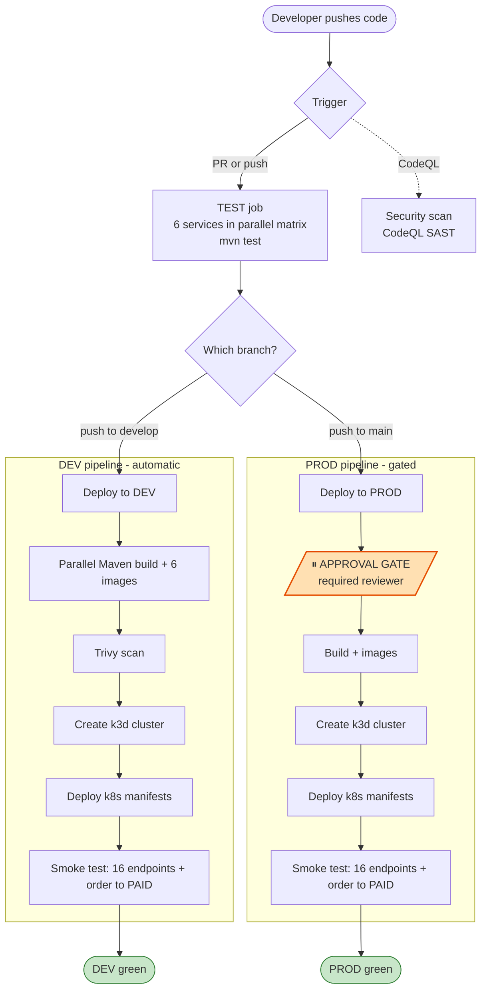

# CI/CD Pipeline

## Overview

Every code change goes through automated testing, security scanning, image building, and deployment before it ever runs in "production."



---

## Job 1: Tests (runs on every PR and push)

**File:** `.github/workflows/ci-cd.yml` → `test` job

```yaml
services:
  postgres: postgres:15    # Real DB for integration tests
  redis: redis:7-alpine    # Real Redis for cache tests
```

**Why real services in CI?** Mocks lie. We run tests against actual Postgres and Redis so that if the DB schema is wrong or a query fails, CI catches it — not production.

**JaCoCo coverage gate:**
```
mvn test
→ generates: target/site/jacoco/index.html
→ fails if line coverage < 50%
→ excludes: dto/, model/, config/, exception/ (boilerplate)
```

**CodeQL (SAST):**
- Scans for SQL injection, XSS, insecure deserialization
- `continue-on-error: true` — private repos don't get Advanced Security for free; scan still runs, results go to Security tab

---

## Job 2: Build + Push + Deploy (develop branch)

Triggered only when code is **pushed to `develop`** (not on PRs).

### Step 1 — Start Floci
```bash
docker compose up -d floci
# Wait for: curl http://localhost:4566/_floci/health
```
Floci is the AWS simulator. ECR, SES, ALB APIs all respond at `localhost:4566`.

### Step 2 — Configure AWS (Floci-safe)
```bash
# We do NOT use aws-actions/configure-aws-credentials
# (that action calls real AWS STS — rejects fake test/test credentials)
echo "AWS_ACCESS_KEY_ID=test" >> $GITHUB_ENV
echo "AWS_SECRET_ACCESS_KEY=test" >> $GITHUB_ENV
```

### Step 3 — Build Images
```bash
for svc in user-service product-service ...; do
  cd $svc && mvn package -DskipTests -q && cd ..
  # Tag for Floci ECR
  docker build -t localhost:5100/ecommerce/$svc:$GIT_SHA .
  # Tag for docker-compose (image name = ecommerce-$svc)
  docker tag localhost:5100/ecommerce/$svc:latest ecommerce-$svc:latest
done
```

Images are tagged with the **git commit SHA** (`abc1234`).
This means every image is traceable back to the exact commit that produced it.

### Step 4 — Trivy Security Scan
```yaml
uses: aquasecurity/trivy-action@master
with:
  image-ref: localhost:5100/ecommerce/user-service:${{ steps.meta.outputs.version }}
  severity: CRITICAL,HIGH
  ignore-unfixed: true
  cache: true   # avoids re-downloading 100MB vulnerability DB each run
```

Scans one representative image (all 6 share the same `eclipse-temurin:21-jre-alpine` base).
`exit-code: 0` — scan reports findings but doesn't fail the build (informational).

### Step 5 — Push to Floci ECR
```bash
aws ecr get-login-password --endpoint-url http://localhost:4566 | \
  docker login --username AWS --password-stdin localhost:5100

docker push localhost:5100/ecommerce/user-service:abc1234
docker push localhost:5100/ecommerce/user-service:latest
```

### Step 6 — Smoke Test via docker-compose
```bash
# Start everything (no-build = uses images we just built)
docker compose up -d --no-build

# Wait for ALL 3 services to be ready (not just one)
for i in $(seq 1 120); do
  P=$(curl -s -o /dev/null -w "%{http_code}" http://localhost:8000/api/products)
  U=$(curl -s -o /dev/null -w "%{http_code}" -X POST http://localhost:8000/api/users/login ...)
  O=$(curl -s -o /dev/null -w "%{http_code}" http://localhost:8000/api/orders/user/1)
  if [ "$P" = "200" ] && [ "$U" != "503" ] && [ "$O" != "503" ]; then
    break
  fi
  sleep 5
done

# Run smoke tests
curl -f -X POST http://localhost:8000/api/users/register ...
curl -f http://localhost:8000/api/products
curl -f -X POST http://localhost:8000/api/products ...
```

**Why docker-compose and not K8s in CI?**
K8s (Kind) takes 5-10 minutes to start on a 2-CPU GitHub runner.
docker-compose with pre-built images is ready in ~90 seconds.
K8s manifests are tested locally with Floci EKS — CI verifies app logic.

---

## Job 3: Production Deployment (main branch, approval required)

Same steps as Job 2 with one difference: `environment: production`.

This pauses the job at deployment time and requires a designated reviewer to click **"Approve deployment"** in GitHub:

```
GitHub → Actions → (failed run) → Review deployments → Approve and deploy
```

**To set this up:**
1. GitHub → Settings → Environments → New environment → `production`
2. Add required reviewers (e.g., tech lead)
3. Set wait timer: 5 minutes (prevents accidental approvals)

---

## Dependabot (Automatic Dependency Updates)

**File:** `.github/dependabot.yml`

Every week, Dependabot opens PRs for:
- Maven dependencies (Spring Boot, Kafka, Redis client, etc.)
- Docker base images (`eclipse-temurin:21-jre-alpine`)
- GitHub Actions versions (`actions/checkout@v4`, etc.)

Each Dependabot PR runs the full test suite automatically.
You merge it if tests pass.

---

## Branch Protection Rules (Set Up in GitHub)

**For `main`:**
```
Settings → Branches → main
☑ Require PR before merging
☑ Require status checks: test
☑ Require approvals: 1
☑ Dismiss stale reviews on new commits
☑ Restrict force pushes
```

**For `develop`:**
```
☑ Require PR before merging
☑ Require status checks: test
☐ Approvals: optional (or 1 for teams)
```

---

## Full Developer Workflow Summary

```
Feature work:
  git checkout -b feature/xxx develop
  [make changes + mvn test locally]
  git push → open PR to develop
  → CI: tests run (Job 1)
  → Team review
  → Merge to develop → CI: build + deploy to dev (Job 2)

Release:
  Open PR: develop → main
  → CI: tests run (Job 1)
  → Tech lead approves PR
  → Merge to main → CI: build + PAUSE for approval (Job 3)
  → Reviewer approves deployment
  → Deploy to production
```

---

## Adding a New Service to CI

1. Add service to `SERVICES` env var in `.github/workflows/ci-cd.yml`
2. Add service folder with `pom.xml` and at least one unit test
3. Add `image: ecommerce-<service>:latest` to `docker-compose.yml`
4. Add ECR repo creation to `scripts/03-ecr.sh`
5. Add K8s Deployment + HPA to `k8s/services/deployments.yaml`
