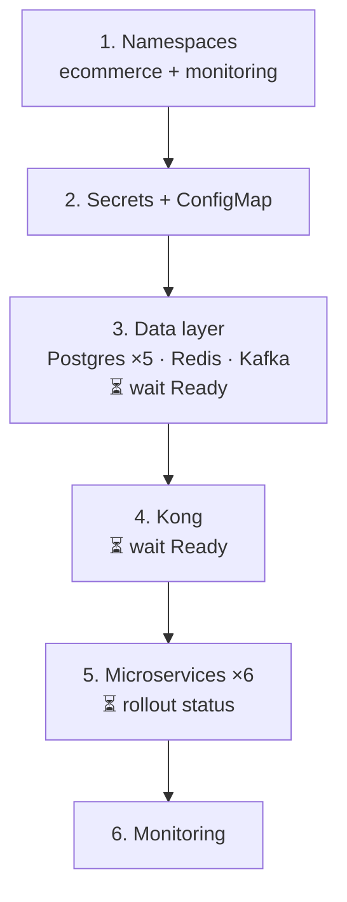

# Deployment Guide — AWS

> Source code → running on **real AWS EKS**, verified.
>
> Infrastructure (VPC, subnets, ALB, EKS, IAM) is covered in
> [INFRA-EXPLAINED.md](INFRA-EXPLAINED.md). Pipeline detail in [CICD.md](CICD.md).
>
> Docker Compose is kept for the **local development loop only** — it is not a
> deployment target.

---

## Contents

| § | |
|---|---|
| 1 | Prerequisites |
| 2 | Local development loop (Compose) |
| 3 | **Pre-flight — six changes required before AWS** |
| 4 | Build and push to ECR |
| 5 | Storage (EBS CSI) |
| 6 | Secrets |
| 7 | Deploy |
| 8 | Expose via ALB |
| 9 | Verify |
| 10 | Rollback |
| 11 | Teardown |
| 12 | Troubleshooting |

---

# 1. Prerequisites

| Tool | Version | Check |
|---|---|---|
| Java | **17** | `java -version` |
| Maven | 3.8+ | `mvn -v` |
| Docker | 20+ | `docker --version` |
| kubectl | 1.28+ | `kubectl version --client` |
| AWS CLI | **v2** | `aws --version` |
| eksctl | latest | `eksctl version` |
| Helm | 3+ | `helm version` |

```bash
aws configure          # real access key, not test/test
aws sts get-caller-identity        # confirm the account
```

**Infrastructure must already exist** — VPC, subnets, EKS cluster, node groups.
Build it via [INFRA-EXPLAINED.md](INFRA-EXPLAINED.md) (console) or
`scripts/01-vpc.sh` → `02-alb.sh` → `04-eks.sh`.

```bash
aws eks update-kubeconfig --name ecommerce-cluster --region ap-south-1
kubectl get nodes          # must show Ready nodes before continuing
```

---

# 2. Local development loop

For writing code, not for deploying. `docker-compose.yml` runs the whole stack
locally in ~3 minutes.

```bash
mvn -B -T 1C package -DskipTests
docker compose up -d --build
KONG_URL=http://localhost:8000 bash .github/smoke-test.sh
```

```bash
docker compose logs -f order-service
docker compose down -v          # stop and wipe data
```

Use this to iterate. Everything below is about AWS.

---

# 3. Pre-flight — six changes required

**The repository as written will not deploy to AWS.** These six must be done
first; the first three are hard blockers that stop the deployment entirely.

| # | Change | Without it |
|---|---|---|
| 1 | Real ECR registry URL | every service `ImagePullBackOff` |
| 2 | EBS CSI driver + StorageClass | all PVCs `Pending`, deploy aborts |
| 3 | Fix the NACL association call | `01-vpc.sh` aborts |
| 4 | Domain you own for ACM | no HTTPS listener |
| 5 | `kubernetes.io/role` subnet tags | ALB controller can't find subnets |
| 6 | metrics-server | HPA silently never scales |

## 3.1 Registry — `scripts/03-ecr.sh`

```bash
# replace:
#   REGISTRY=localhost:5100
ACCOUNT_ID=$(aws sts get-caller-identity --query Account --output text)
REGISTRY=$ACCOUNT_ID.dkr.ecr.ap-south-1.amazonaws.com
```

`localhost:5100` inside a pod means *that node* — which runs no registry.
Node roles already carry `AmazonEC2ContainerRegistryReadOnly` from `04-eks.sh`.

## 3.2 NACL association — `scripts/01-vpc.sh`

```bash
# replace:
#   aws ec2 replace-network-acl-association --network-acl-id $NACL --association-id $PUB1
for SUBNET in $PUB1 $PUB2; do
  ASSOC=$(aws ec2 describe-network-acls \
    --filters Name=association.subnet-id,Values=$SUBNET \
    --query "NetworkAcls[0].Associations[?SubnetId=='$SUBNET'].NetworkAclAssociationId" \
    --output text)
  aws ec2 replace-network-acl-association --network-acl-id $NACL --association-id $ASSOC
done
```

`--association-id` needs `aclassoc-…`, not `subnet-…`. AWS rejects the original
and `set -e` kills the script.

## 3.3 Subnet tags

The ALB controller discovers subnets **by tag**:

```bash
source scripts/.env

aws ec2 create-tags --resources $PUB1 $PUB2 \
  --tags Key=kubernetes.io/role/elb,Value=1 \
         Key=kubernetes.io/cluster/ecommerce-cluster,Value=shared

aws ec2 create-tags --resources $PRIV1 $PRIV2 \
  --tags Key=kubernetes.io/role/internal-elb,Value=1 \
         Key=kubernetes.io/cluster/ecommerce-cluster,Value=shared
```

Missing these gives `couldn't auto-discover subnets`.

## 3.4 ACM certificate

`.local` is not a real TLD — ACM can never validate it. Use a domain you own:

```bash
# scripts/02-alb.sh
DOMAIN="yourdomain.com"
```

Then **ACM → Certificates → your cert → Create records in Route 53**, and wait for
**Issued** (~5 min).

## 3.5 metrics-server

```bash
kubectl apply -f https://github.com/kubernetes-sigs/metrics-server/releases/latest/download/components.yaml
kubectl top nodes        # works once ready
```

EKS does not ship it. Without it every HPA reads `<unknown>/70%` and never scales
— silently, with no error.

Also required: `resources.requests.cpu` on each container, or HPA has no
denominator to compute against.

## 3.6 Remove the local AWS endpoint override

`k8s/services/configmap.yaml` contains:

```yaml
AWS_ENDPOINT_URL: "http://floci.ecommerce.svc.cluster.local:4566"
```

**Delete that line.** It points at a local emulator that isn't deployed in the
cluster; `notification-service` uses the AWS SDK for SES and must reach real AWS.

```yaml
data:
  KAFKA_BOOTSTRAP_SERVERS: "kafka-0.kafka.ecommerce.svc.cluster.local:9092"
  REDIS_HOST: "redis-0.redis.ecommerce.svc.cluster.local"
  REDIS_PORT: "6379"
  AWS_DEFAULT_REGION: "ap-south-1"
  SPRING_PROFILE: "prod"
```

**SES also needs setup** — verify a sender identity, and note that sandbox mode
only allows sending to verified addresses until you request production access.

```bash
aws ses verify-email-identity --email-address noreply@yourdomain.com --region ap-south-1
```

---

# 4. Build and push to ECR

```bash
./scripts/03-ecr.sh
```

Per service: creates the repo (`scanOnPush`, AES256, keep-10 lifecycle), builds
the JAR, builds the image, pushes **git SHA** and `latest` tags.

Manually if preferred:

```bash
ACCOUNT_ID=$(aws sts get-caller-identity --query Account --output text)
REGISTRY=$ACCOUNT_ID.dkr.ecr.ap-south-1.amazonaws.com
TAG=$(git rev-parse --short HEAD)

aws ecr get-login-password --region ap-south-1 \
  | docker login --username AWS --password-stdin $REGISTRY

for SVC in user-service product-service order-service \
           inventory-service payment-service notification-service; do
  aws ecr create-repository --repository-name ecommerce/$SVC \
    --image-scanning-configuration scanOnPush=true \
    --encryption-configuration encryptionType=AES256 2>/dev/null || true

  mvn -B -pl $SVC -am package -DskipTests
  docker build -t $REGISTRY/ecommerce/$SVC:$TAG $SVC/
  docker push $REGISTRY/ecommerce/$SVC:$TAG
done
```

**Verify:**
```bash
aws ecr describe-images --repository-name ecommerce/order-service \
  --query 'imageDetails[*].imageTags'
```

> **Tag by git SHA, never `latest`.** `latest` means something different tomorrow,
> so there is nothing to roll back *to*.

---

# 5. Storage

EKS has **no default StorageClass**. The 7 `volumeClaimTemplates` (5 Postgres,
Redis, Kafka) will sit `Pending` forever without this.

```bash
# IAM role for the driver
eksctl create iamserviceaccount \
  --name ebs-csi-controller-sa --namespace kube-system \
  --cluster ecommerce-cluster \
  --attach-policy-arn arn:aws:iam::aws:policy/service-role/AmazonEBSCSIDriverPolicy \
  --approve --role-only --role-name AmazonEKS_EBS_CSI_DriverRole

ACCOUNT_ID=$(aws sts get-caller-identity --query Account --output text)
eksctl create addon --name aws-ebs-csi-driver \
  --cluster ecommerce-cluster \
  --service-account-role-arn arn:aws:iam::$ACCOUNT_ID:role/AmazonEKS_EBS_CSI_DriverRole \
  --force
```

**StorageClass:**

```yaml
# k8s/storage/gp3.yaml
apiVersion: storage.k8s.io/v1
kind: StorageClass
metadata:
  name: gp3
  annotations:
    storageclass.kubernetes.io/is-default-class: "true"
provisioner: ebs.csi.aws.com
volumeBindingMode: WaitForFirstConsumer
allowVolumeExpansion: true
parameters:
  type: gp3
  encrypted: "true"
```

```bash
kubectl apply -f k8s/storage/gp3.yaml
kubectl get storageclass
```

Then set it explicitly on every `volumeClaimTemplate` rather than relying on the
default:

```yaml
volumeClaimTemplates:
  - metadata:
      name: data
    spec:
      storageClassName: gp3
      accessModes: [ReadWriteOnce]
      resources:
        requests:
          storage: 10Gi
```

> `WaitForFirstConsumer` matters — it delays creating the EBS volume until the pod
> is scheduled, so the volume lands in the **same AZ** as the pod. Without it you
> get volumes the pod can't attach to.

---

# 6. Secrets

## Quick path — Kubernetes Secrets

```bash
cp k8s/services/secrets.example.yaml k8s/services/secrets.yaml
```

Replace every `CHANGE_ME`:

| Key | Notes |
|---|---|
| `JWT_SECRET` | **≥ 32 characters** — HMAC-SHA256 rejects shorter at startup |
| `REDIS_PASSWORD` | must match `--requirepass` in `k8s/redis/redis.yaml` |
| `*_DB_USER` / `*_DB_PASS` | one pair per service |
| `AWS_ACCESS_KEY_ID` / `SECRET` | **remove these** — use IRSA instead (below) |

```bash
openssl rand -base64 48        # a sound JWT secret
```

The `*_DB_URL` values are already correct — StatefulSet pod DNS.

> `secrets.yaml` is gitignored. Keep it that way; only the `.example` belongs in Git.

## Better — no AWS keys at all

`notification-service` needs SES access. Don't put IAM keys in a Secret — give the
pod a role:

```bash
eksctl create iamserviceaccount \
  --name notification-sa --namespace ecommerce \
  --cluster ecommerce-cluster \
  --attach-policy-arn arn:aws:iam::aws:policy/AmazonSESFullAccess \
  --approve
```

```yaml
# notification-service Deployment
spec:
  template:
    spec:
      serviceAccountName: notification-sa
```

The SDK picks up temporary, auto-rotating credentials. Nothing to leak, nothing to
rotate manually.

## Production — Secrets Manager

A Kubernetes `Secret` is **base64, which is encoding — not encryption**. Anyone with
namespace read access can decode it. For real production, use the Secrets Store CSI
driver backed by AWS Secrets Manager, or Sealed Secrets.

---

# 7. Deploy

```bash
./scripts/05-deploy.sh $(git rev-parse --short HEAD)
```

## Order, and why



Secrets and ConfigMap first — pods read them **at boot**, not later. Data layer
before services, which crash-loop without a database. Kong before services so
routes exist when traffic arrives. Each stage uses `kubectl wait`, so a failure
stops the script instead of cascading.

## Manually

```bash
kubectl apply -f k8s/namespace/namespace.yaml
kubectl apply -f k8s/services/secrets.yaml
kubectl apply -f k8s/services/configmap.yaml

kubectl apply -f k8s/postgres/postgres.yaml
kubectl apply -f k8s/redis/redis.yaml
kubectl apply -f k8s/kafka/kafka.yaml
kubectl wait --for=condition=ready pod -l app=kafka -n ecommerce --timeout=300s

kubectl apply -f k8s/kong/kong.yaml
kubectl wait --for=condition=ready pod -l app=kong -n ecommerce --timeout=180s

REGISTRY=$ACCOUNT_ID.dkr.ecr.ap-south-1.amazonaws.com
TAG=$(git rev-parse --short HEAD)
sed "s|REGISTRY|$REGISTRY|g; s|IMAGE_TAG|$TAG|g" k8s/services/deployments.yaml \
  | kubectl apply -f -

kubectl apply -f k8s/monitoring/monitoring.yaml
```

> ⚠️ `05-deploy.sh` line 31 uses `sed -i` on `configmap.yaml`, editing the repo file
> in place. Change it to pipe into `kubectl` like line 55 does, or your working tree
> gets dirty and the placeholder is destroyed.

---

# 8. Expose via ALB

Kong's Service should be `ClusterIP`; the ALB is created from an **Ingress**.

## Install the AWS Load Balancer Controller

```bash
curl -O https://raw.githubusercontent.com/kubernetes-sigs/aws-load-balancer-controller/v2.7.1/docs/install/iam_policy.json
aws iam create-policy --policy-name AWSLoadBalancerControllerIAMPolicy \
  --policy-document file://iam_policy.json

eksctl utils associate-iam-oidc-provider \
  --cluster ecommerce-cluster --region ap-south-1 --approve

eksctl create iamserviceaccount \
  --cluster ecommerce-cluster --namespace kube-system \
  --name aws-load-balancer-controller \
  --role-name AmazonEKSLoadBalancerControllerRole \
  --attach-policy-arn arn:aws:iam::$ACCOUNT_ID:policy/AWSLoadBalancerControllerIAMPolicy \
  --approve

helm repo add eks https://aws.github.io/eks-charts && helm repo update
helm install aws-load-balancer-controller eks/aws-load-balancer-controller \
  -n kube-system \
  --set clusterName=ecommerce-cluster \
  --set serviceAccount.create=false \
  --set serviceAccount.name=aws-load-balancer-controller

kubectl get deploy -n kube-system aws-load-balancer-controller
```

## Kong Service → ClusterIP

```yaml
# k8s/kong/kong.yaml — remove the LoadBalancer type and the
# service.beta.kubernetes.io/aws-load-balancer-* annotations
spec:
  type: ClusterIP
```

Leaving them creates a **second** ALB alongside the Ingress one.

## The Ingress

```yaml
# k8s/ingress.yaml
apiVersion: networking.k8s.io/v1
kind: Ingress
metadata:
  name: ecommerce-ingress
  namespace: ecommerce
  annotations:
    kubernetes.io/ingress.class: alb
    alb.ingress.kubernetes.io/scheme: internet-facing
    alb.ingress.kubernetes.io/target-type: ip
    alb.ingress.kubernetes.io/listen-ports: '[{"HTTP":80},{"HTTPS":443}]'
    alb.ingress.kubernetes.io/ssl-redirect: '443'
    alb.ingress.kubernetes.io/certificate-arn: <ACM_CERT_ARN>
    alb.ingress.kubernetes.io/healthcheck-path: /status
    alb.ingress.kubernetes.io/healthcheck-port: '8100'
    alb.ingress.kubernetes.io/wafv2-acl-arn: <WAF_ACL_ARN>
spec:
  rules:
    - http:
        paths:
          - path: /
            pathType: Prefix
            backend:
              service:
                name: kong-proxy
                port:
                  number: 8000
```

```bash
kubectl apply -f k8s/ingress.yaml
kubectl get ingress -n ecommerce -w      # ADDRESS appears in ~3 min
```

**Why the Ingress and not manual `register-targets`:** the controller watches
Endpoints continuously. Pods restart, HPA scales, rolling deploys happen — targets
stay in sync automatically. A one-time `register-targets` call goes stale on the
first pod restart and starts returning 503s.

## Route 53

```bash
aws route53 change-resource-record-sets --hosted-zone-id <ZONE_ID> \
  --change-batch '{
    "Changes":[{"Action":"UPSERT","ResourceRecordSet":{
      "Name":"yourdomain.com","Type":"A",
      "AliasTarget":{
        "HostedZoneId":"<ALB_CANONICAL_ZONE_ID>",
        "DNSName":"<ALB_DNS>",
        "EvaluateTargetHealth":true}}}]}'
```

Get the ALB's canonical zone ID — don't hardcode it:

```bash
aws elbv2 describe-load-balancers \
  --query 'LoadBalancers[0].[DNSName,CanonicalHostedZoneId]' --output text
```

---

# 9. Verify

```bash
kubectl get pods -n ecommerce
# 5 postgres · 1 redis · 1 kafka · 1 kong · 6 services — all Running

kubectl get pvc -n ecommerce          # all Bound, none Pending
kubectl get ingress -n ecommerce      # ADDRESS populated
kubectl get hpa -n ecommerce          # targets show numbers, not <unknown>
```

**End-to-end:**

```bash
export KONG_URL=https://yourdomain.com
bash .github/smoke-test.sh
```

Drives 16 endpoints and pushes a real order through the full saga to `PAID` —
exercising order → Kafka → inventory (Redis lock) → Kafka → payment → notification.

**Manually:**

```bash
curl -X POST https://yourdomain.com/api/users/register \
  -H 'Content-Type: application/json' \
  -d '{"email":"a@b.com","password":"pass1234","name":"Test"}'

TOKEN=$(curl -s -X POST https://yourdomain.com/api/users/login \
  -H 'Content-Type: application/json' \
  -d '{"email":"a@b.com","password":"pass1234"}' | jq -r .token)

curl -X POST https://yourdomain.com/api/orders \
  -H "Authorization: Bearer $TOKEN" -H 'Content-Type: application/json' \
  -d '{"productId":1,"quantity":2}'

curl https://yourdomain.com/api/orders/1 -H "Authorization: Bearer $TOKEN"
# poll until CONFIRMED — the saga is asynchronous
```

**Monitoring:**
```bash
kubectl port-forward -n monitoring svc/grafana 3000:3000    # admin/admin
```

---

# 10. Rollback

Every image is tagged by git SHA, so any previous build is directly deployable.

```bash
# what's running
kubectl get deploy -n ecommerce -o \
  custom-columns=NAME:.metadata.name,IMAGE:.spec.template.spec.containers[0].image

# one service
kubectl rollout undo deployment/order-service -n ecommerce

# specific revision
kubectl rollout history deployment/order-service -n ecommerce
kubectl rollout undo deployment/order-service -n ecommerce --to-revision=3

# or redeploy an exact tag
./scripts/05-deploy.sh <older-git-sha>
```

**Database migrations do not roll back.** Flyway runs forward only. Rolling back
the image can leave old code facing a new schema — which is why migrations must be
backward-compatible. During a rolling deploy old and new pods run **simultaneously**
against the same database, so a migration that drops a column the old version still
reads breaks live traffic mid-deploy.

---

# 11. Teardown

```bash
kubectl delete -f k8s/ingress.yaml         # first — releases the ALB
kubectl delete namespace ecommerce monitoring

eksctl delete nodegroup --cluster ecommerce-cluster --name general-nodes
eksctl delete nodegroup --cluster ecommerce-cluster --name high-mem-nodes
eksctl delete cluster --name ecommerce-cluster
```

⚠️ **`06-teardown.sh` leaves billable resources running** — it never deletes the
NAT Gateway, Elastic IP, VPC, subnets, or S3 buckets. Roughly **$36/month**, mostly
the NAT. Order matters:

```bash
source scripts/.env
aws ec2 delete-nat-gateway --nat-gateway-id $NAT
aws ec2 wait nat-gateway-deleted --nat-gateway-ids $NAT   # must finish first
aws ec2 release-address --allocation-id $EIP

for S in $PUB1 $PUB2 $PRIV1 $PRIV2 $DATA1 $DATA2; do
  aws ec2 delete-subnet --subnet-id $S
done

aws ec2 detach-internet-gateway --internet-gateway-id $IGW_ID --vpc-id $VPC_ID
aws ec2 delete-internet-gateway --internet-gateway-id $IGW_ID
aws ec2 delete-vpc --vpc-id $VPC_ID

aws s3 rb s3://$LOG_BUCKET --force
aws s3 rb s3://$FL_BUCKET --force
```

**Then check the console** — EC2 → Elastic IPs and VPC → NAT Gateways. Those two
are the ones that quietly keep charging.

---

# 12. Troubleshooting

| Symptom | Diagnose | Cause |
|---|---|---|
| `ImagePullBackOff` | `kubectl describe pod <n>` | registry URL still `localhost:5100` (§3.1), or node role missing ECR read |
| PVC `Pending` | `kubectl get pvc -n ecommerce` | no StorageClass / EBS CSI not installed (§5) |
| PVC Bound, pod won't schedule | `kubectl describe pod` | volume in a different AZ — needs `WaitForFirstConsumer` |
| Ingress `ADDRESS` stays empty | `kubectl logs -n kube-system deploy/aws-load-balancer-controller` | subnet tags missing (§3.3) |
| ALB up but 503 | `aws elbv2 describe-target-health --target-group-arn <arn>` | no healthy targets — check Kong readiness on `:8100/status` |
| `CrashLoopBackOff` | `kubectl logs <pod> --previous` | wrong DB credentials, or DB not Ready |
| `JWT secret too short` | startup logs | `JWT_SECRET` under 32 chars |
| Order stuck `PENDING` | `kubectl logs -l app=inventory-service` | Kafka unreachable, or consumer crashed |
| Order `CANCELLED` unexpectedly | inventory logs | out of stock, or Redis lock failed |
| Redis `NOAUTH` | any service log | `REDIS_PASSWORD` mismatch with `redis.yaml` |
| Emails not sending | notification logs | SES identity unverified, or still in sandbox |
| HPA `<unknown>/70%` | `kubectl top pods` | metrics-server missing (§3.5), or no `resources.requests.cpu` |

### Diagnostics

```bash
kubectl describe pod <pod> -n ecommerce             # events explain why
kubectl logs <pod> -n ecommerce --previous          # the crashed instance
kubectl get events -n ecommerce --sort-by=.lastTimestamp

# is the saga flowing?
kubectl exec -n ecommerce kafka-0 -- \
  kafka-console-consumer.sh --bootstrap-server localhost:9092 \
  --topic order.created --from-beginning --max-messages 5

kubectl exec -n ecommerce redis-0 -- redis-cli -a $REDIS_PASSWORD KEYS '*'

kubectl exec -it -n ecommerce postgres-order-0 -- \
  psql -U postgres -d orderdb -c 'SELECT id,status FROM orders LIMIT 5;'
```

---

# Deployment checklist

**Pre-flight (§3)**
- ☐ Registry URL points at ECR
- ☐ EBS CSI installed, `gp3` StorageClass exists
- ☐ NACL association fixed
- ☐ ACM certificate **Issued** for a domain you own
- ☐ Subnet tags applied
- ☐ metrics-server running
- ☐ `AWS_ENDPOINT_URL` removed from the ConfigMap
- ☐ SES sender identity verified

**Deploy**
- ☐ `secrets.yaml` complete, `JWT_SECRET` ≥ 32 chars
- ☐ Images pushed for this git SHA
- ☐ All PVCs `Bound`
- ☐ Data layer Ready before services
- ☐ All 6 rollouts clean

**Post**
- ☐ Ingress has an ADDRESS
- ☐ DNS resolves, HTTPS valid
- ☐ Smoke test passes (order → `PAID`)
- ☐ HPA showing real metrics
- ☐ Grafana receiving data
- ☐ **Record the deployed git SHA** — that's your rollback target
