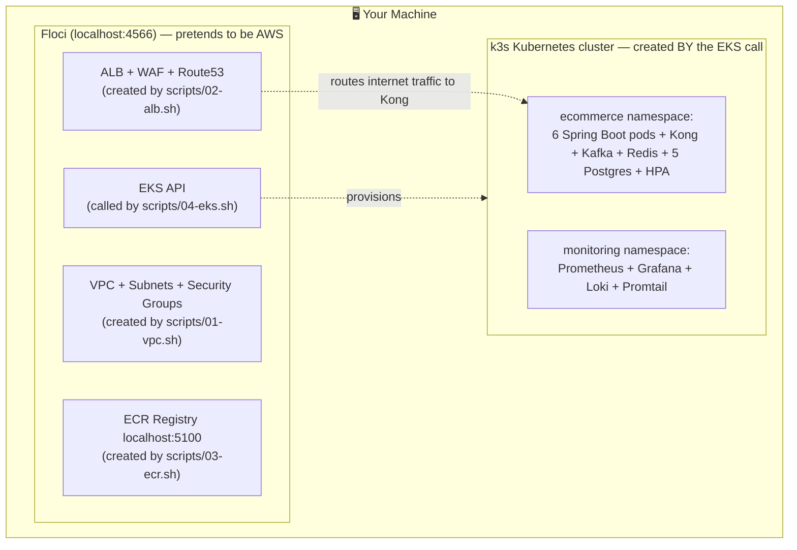

# Deployment Guide — Floci (Local AWS Simulation)

## What is Floci?

Floci is a local AWS simulator. It runs on `localhost:4566` and accepts the exact same API calls as real AWS — `aws eks create-cluster`, `aws ecr push`, `aws elbv2 create-load-balancer` — but instead of billing you and provisioning real cloud resources, it spins up local containers.

**Why use it?** You learn every AWS concept (VPC, subnets, security groups, ALB, EKS, ECR, SES) with real CLI commands, zero cost, zero risk.

---

## Architecture: What Gets Deployed Where

**Read this top-down: each script builds one layer, and the EKS call is the one that actually creates the cluster your pods run in.**



### What each piece is FOR (newbie table)

| Piece | Simple purpose | Real-AWS name | Who creates it |
|---|---|---|---|
| Floci | Fake AWS on your laptop — same commands, zero cost | — | `docker compose up -d floci` |
| VPC + Subnets | Private network so services aren't exposed to internet | Amazon VPC | `01-vpc.sh` |
| ALB + WAF | Front door: receives all internet traffic, blocks attacks | Application Load Balancer | `02-alb.sh` |
| ECR | Shelf where your 6 Docker images are stored | Elastic Container Registry | `03-ecr.sh` |
| EKS | The "boss brain" of Kubernetes (schedules pods) | Elastic Kubernetes Service | `04-eks.sh` |
| k3s cluster | The actual machines where pods run | EKS worker nodes | auto, via EKS call |
| ecommerce namespace | Folder holding all app pods | K8s namespace | `05-deploy.sh` |
| monitoring namespace | Separate folder for Grafana/Prometheus | K8s namespace | `05-deploy.sh` |

---

## Prerequisites

```bash
# Verify these are installed
docker --version          # Docker Desktop running
aws --version             # AWS CLI v2
kubectl version --client  # kubectl
bash --version            # bash 4+
```

---

## Step-by-Step Deployment

### Step 0 — Start Floci

```bash
docker compose up -d floci
# Wait until healthy:
curl http://localhost:4566/_floci/health
```

### Step 1 — VPC + Networking (01-vpc.sh)

```bash
bash scripts/01-vpc.sh
```

**What it creates:**
- VPC `10.0.0.0/16`
- 2 public subnets (10.0.1.0/24, 10.0.2.0/24) — for ALB
- 2 private subnets (10.0.10.0/24, 10.0.11.0/24) — for pods/nodes
- Internet Gateway → attached to VPC
- NAT Gateway → in public subnet, routes private subnet traffic out
- Route tables → public routes to IGW, private routes to NAT
- Security groups:
  - `alb-sg`: inbound 80, 443 from internet
  - `app-sg`: inbound 8000 from alb-sg only
  - `eks-sg`: inbound from app-sg only

**AWS concepts taught:** CIDR, public vs private subnet, IGW, NAT, route tables, security groups as firewalls.

### Step 2 — ALB + WAF + SSL (02-alb.sh)

```bash
bash scripts/02-alb.sh
```

**What it creates:**
- ALB in the 2 public subnets
- Target group (IP mode — targets are pod IPs, not node IPs)
- Listener 80 → redirect to 443
- Listener 443 → forward to target group
- WAF WebACL: OWASP rules + rate limit 2000 req/5min
- ACM certificate (self-signed in Floci)
- Route 53 hosted zone + alias record

**AWS concepts taught:** ALB vs NLB, listener rules, target groups, WAF, ACM, Route 53 alias records.

### Step 3 — Build + Push Docker Images (03-ecr.sh)

```bash
bash scripts/03-ecr.sh
```

**What it does:**
1. Creates 6 ECR repositories in Floci (`ecommerce/user-service`, etc.)
2. Builds each Spring Boot service: `mvn package` → `docker build`
3. Tags images as `localhost:5100/ecommerce/<service>:latest`
4. Pushes to Floci ECR (real Docker Registry v2 at localhost:5100)

**AWS concepts taught:** ECR (Elastic Container Registry), `docker login` with ECR token, image tagging, registry URL format.

```bash
# Verify images are in Floci ECR
aws ecr list-images --repository-name ecommerce/user-service \
  --endpoint-url http://localhost:4566
```

### Step 4 — EKS Cluster (04-eks.sh)

```bash
bash scripts/04-eks.sh
```

**What it creates:**
- IAM role for EKS cluster (`eks-cluster-role`)
- IAM role for EKS nodes (`eks-node-role`) with ECR read access
- EKS cluster `ecommerce-cluster` in private subnets
- Node group `general-nodes` (m5.large × 3) — user, product, order, Kong
- Node group `high-mem-nodes` (r5.large × 2) — Kafka consumers, payment
- Updates your `~/.kube/config` so `kubectl` connects to this cluster

**AWS concepts taught:** EKS control plane vs nodes, IAM roles for EKS, managed node groups, instance types.

```bash
# Verify cluster is running
kubectl get nodes
kubectl cluster-info
```

**IMPORTANT — Floci ECR image pull fix (one-time manual step):**
Floci's k3s node needs to know to pull from `localhost:5100` instead of Docker Hub:

```bash
# This is done automatically by 04-eks.sh now:
# Writes /etc/rancher/k3s/registries.yaml inside k3s container
CONTAINER=$(docker ps --filter "name=floci-eks" -q | head -1)
docker exec $CONTAINER bash -c 'mkdir -p /etc/rancher/k3s && cat > /etc/rancher/k3s/registries.yaml << EOF
mirrors:
  "localhost:5100":
    endpoint:
      - "http://floci-ecr-registry:5000"
EOF
kill -SIGHUP 1'
```

### Step 5 — Deploy to Kubernetes (05-deploy.sh)

```bash
bash scripts/05-deploy.sh
```

**What it deploys (in order):**
1. Namespaces (`ecommerce`, `monitoring`)
2. ConfigMaps + Secrets
3. StatefulSets: 5× Postgres, Redis, Kafka
4. Kong API Gateway
5. 6× Spring Boot microservice Deployments
6. Registers Kong pod IPs in ALB Target Group
7. Monitoring: Prometheus, Grafana, Loki, Promtail

```bash
# Verify everything is running
kubectl get pods -n ecommerce
kubectl get pods -n monitoring
kubectl get svc -n ecommerce

# Check ALB target health
aws elbv2 describe-target-health --target-group-arn $TG_ARN \
  --endpoint-url http://localhost:4566
```

### Step 6 — Test the Deployment

```bash
# Get ALB DNS (from .env written by 02-alb.sh)
source scripts/.env
echo $ALB_DNS

# Test via ALB (goes: ALB → Kong → service)
curl http://$ALB_DNS/api/products
curl -X POST http://$ALB_DNS/api/users/register \
  -H "Content-Type: application/json" \
  -d '{"name":"Rahul","email":"r@test.com","password":"pass1234"}'
```

---

## Teardown

```bash
bash scripts/06-teardown.sh
# Deletes EKS cluster, node groups, ALB, WAF, VPC, ECR repositories
```

---

## Troubleshooting

| Problem | Check | Fix |
|---|---|---|
| Pod `ImagePullBackOff` | `kubectl describe pod <name> -n ecommerce` | See registries.yaml fix in Step 4 |
| Kong 503 | `kubectl logs -n ecommerce -l app=kong` | Check if upstream service pod is running |
| ALB targets unhealthy | `aws elbv2 describe-target-health ...` | Pods not ready yet, wait 2min |
| Kafka pod crash-loop | `kubectl logs -n ecommerce kafka-0` | Check for KAFKA_NODE_ID env var issues |
| Flyway fails on startup | Service logs: `flyway connect-retry` | Postgres not ready; increase timeout |

---

## Local docker-compose vs Floci K8s

| | docker-compose | Floci K8s |
|---|---|---|
| Start time | 60s | 5-10 min |
| Resource usage | Low | Medium |
| AWS concepts | None | Full (VPC, ALB, ECR, EKS) |
| Best for | Development | Learning deployment |
