# Diagrams — Cloud, Kafka, Redis & Workflow Matrix

> Companion to [ARCHITECTURE.md](ARCHITECTURE.md). Every scenario below is traced end-to-end.

---

## 1. Cloud Topology — every provisioned resource

> Values below are the **actual** ones created by [`scripts/01-vpc.sh`](../scripts/01-vpc.sh) →
> [`02-alb.sh`](../scripts/02-alb.sh) → [`03-ecr.sh`](../scripts/03-ecr.sh) →
> [`04-eks.sh`](../scripts/04-eks.sh). Region **ap-south-1**, VPC **10.0.0.0/16**, 2 AZs.

### 1.1 Full resource inventory

| # | Resource | Identifier / value | Created by |
|---|---|---|---|
| 1 | VPC | `10.0.0.0/16` (DNS hostnames + support on) | 01 |
| 2 | Internet Gateway | attached to VPC | 01 |
| 3 | Public subnet 1 | `10.0.1.0/24` · ap-south-1a | 01 |
| 4 | Public subnet 2 | `10.0.2.0/24` · ap-south-1b | 01 |
| 5 | Private subnet 1 | `10.0.3.0/24` · ap-south-1a | 01 |
| 6 | Private subnet 2 | `10.0.4.0/24` · ap-south-1b | 01 |
| 7 | Data subnet 1 | `10.0.5.0/24` · ap-south-1a | 01 |
| 8 | Data subnet 2 | `10.0.6.0/24` · ap-south-1b | 01 |
| 9 | Elastic IP | for the NAT Gateway | 01 |
| 10 | NAT Gateway | in **public subnet 1** | 01 |
| 11 | Route table (public) | `0.0.0.0/0` → IGW | 01 |
| 12 | Route table (private) | `0.0.0.0/0` → NAT — associated to **private *and* data** subnets | 01 |
| 13 | Security group | `alb-sg` | 01 |
| 14 | Security group | `eks-sg` | 01 |
| 15 | Security group | `db-sg` | 01 |
| 16 | Network ACL | subnet-level stateless filter | 01 |
| 17 | S3 bucket | `ecommerce-vpc-flowlogs-<ts>` (versioned) | 01 |
| 18 | VPC Flow Logs | VPC → that S3 bucket | 01 |
| 19 | ACM certificate | for `ecommerce.local` | 02 |
| 20 | S3 bucket | `ecommerce-alb-logs-<ts>` + bucket policy | 02 |
| 21 | WAFv2 Web ACL | `ecommerce-waf`, associated to ALB | 02 |
| 22 | ALB | `ecommerce-alb` (public subnets, access logs on) | 02 |
| 23 | Target group | `ecommerce-kong-tg` | 02 |
| 24 | Listener :443 | HTTPS, ACM cert → target group | 02 |
| 25 | Listener :80 | redirect → 443 | 02 |
| 26 | Listener rule(s) | path routing on the 443 listener | 02 |
| 27 | Route53 hosted zone | `ecommerce.local` | 02 |
| 28 | Route53 record | alias → ALB DNS | 02 |
| 29 | ECR repositories ×6 | `ecommerce/<service>` · scanOnPush · AES256 · keep-10 lifecycle | 03 |
| 30 | IAM role | `eks-cluster-role` → `AmazonEKSClusterPolicy` | 04 |
| 31 | IAM role | `eks-node-role` → WorkerNode + ECR-ReadOnly + CNI | 04 |
| 32 | EKS cluster | `ecommerce-cluster`, k8s **1.28** | 04 |
| 33 | Nodegroup | `general-nodes` · m5.large · min2/max8/**desired3** | 04 |
| 34 | Nodegroup | `high-mem-nodes` · r5.large · min1/max4/**desired2** | 04 |
| 35 | Auto Scaling Groups | one per nodegroup (implicit) | 04 |

### 1.2 Network topology — all 6 subnets, both AZs

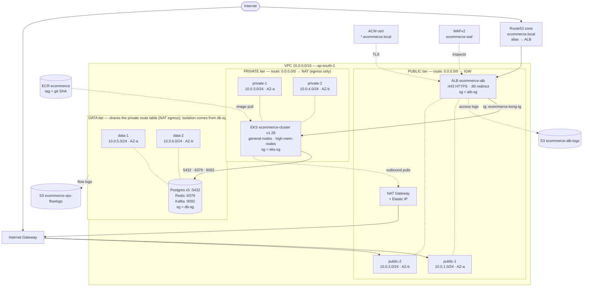

### 1.3 Security groups — actual allowed hops

| From | To | Port | Source type |
|---|---|---|---|
| Internet | `alb-sg` | 443 | `0.0.0.0/0` |
| Internet | `alb-sg` | 80 | `0.0.0.0/0` (redirects to 443) |
| `alb-sg` | `eks-sg` | 8000 | **SG reference**, not CIDR |
| `eks-sg` | `db-sg` | 5432 | SG reference (Postgres) |
| `eks-sg` | `db-sg` | 6379 | SG reference (Redis) |
| `eks-sg` | `db-sg` | 9092 | SG reference (Kafka) |
| `eks-sg` | `eks-sg` | 1024-65535 | node-to-node / kubelet |
| data tier | Internet | outbound | via NAT (shares the private route table) — **inbound still impossible** |

Two independent layers: **NACLs** (stateless, subnet-wide) and **security groups**
(stateful, per-ENI). SG rules reference *other SGs* rather than IP ranges, so they
stay correct when Pod/node IPs change.

### 1.4 Why a NAT Gateway is needed

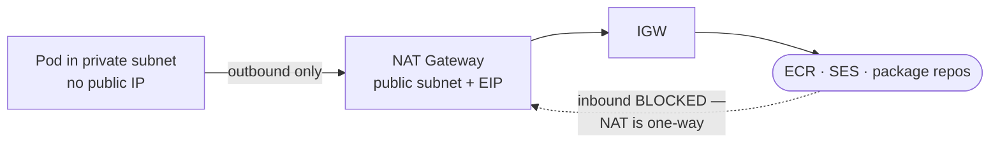

Nodes must reach out (pull images, call SES) but must not be reachable *from*
the internet. NAT allows exactly that asymmetry — outbound yes, inbound no.

### 1.5 Pod placement across the two nodegroups

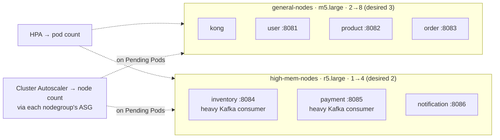

Both nodegroups span `private-1` + `private-2`, so a single-AZ failure never takes
out the whole cluster. Kafka consumers sit on `high-mem` because each holds in-flight
record batches per partition; request/response services stay on `general`.

**Two distinct scaling loops:** HPA changes **Pod** count (reacting to CPU/memory);
Cluster Autoscaler changes **node** count (reacting to Pods stuck `Pending`).

---

## 2. Kafka Architecture

### 2.1 Topics, producers, consumers

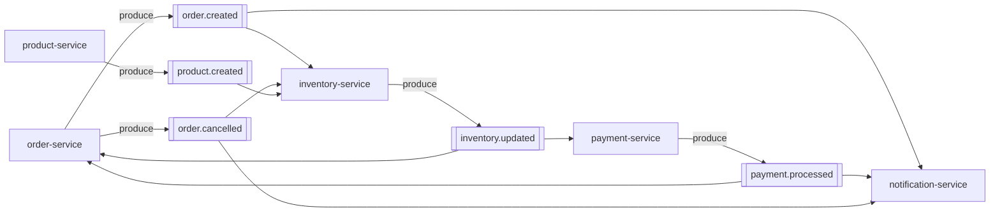

### 2.2 Who listens to what — the full matrix

| Topic | Producer | Consumers | Consumer action |
|---|---|---|---|
| `order.created` | order | inventory, notification | reserve stock / send "order placed" mail |
| `inventory.updated` | inventory | order, payment | update saga state / charge if reserved |
| `payment.processed` | payment | order, notification | CONFIRMED-or-CANCELLED / send receipt |
| `order.cancelled` | order | inventory, notification | **release** stock / send cancellation mail |
| `product.created` | product | inventory | seed initial stock row |

Every service has **its own consumer group** — so the same event reaches
inventory *and* notification independently; neither steals it from the other.

### 2.3 Partitions & ordering

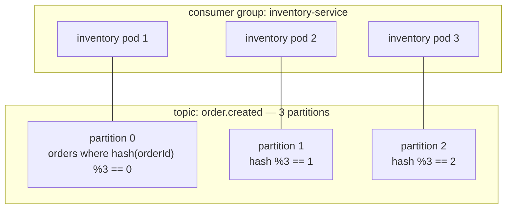

Key = `orderId` → **all events for one order always land on the same partition**,
so that order's events are processed in emit-order. Different orders run in
parallel across partitions. Scaling past 3 pods adds idle consumers — partitions,
not pods, are the parallelism ceiling.

### 2.4 Why events instead of REST

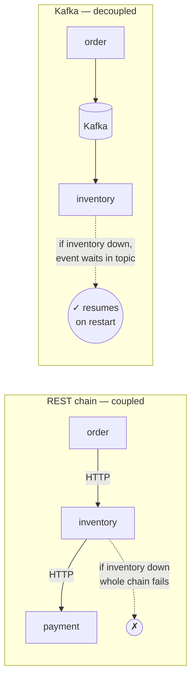

---

## 3. Redis — three unrelated jobs, one instance

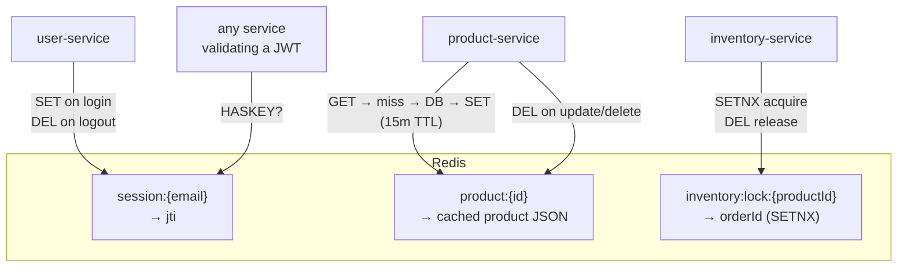

### 3.1 Session store — real logout

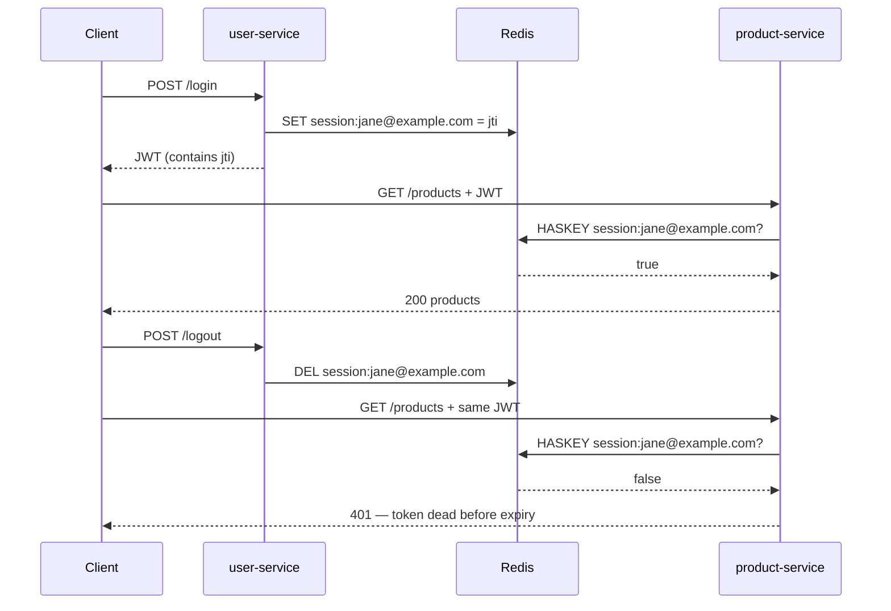

Plain JWT can't be revoked before expiry. The Redis check is what makes logout real.

### 3.2 Product cache — 15-min TTL

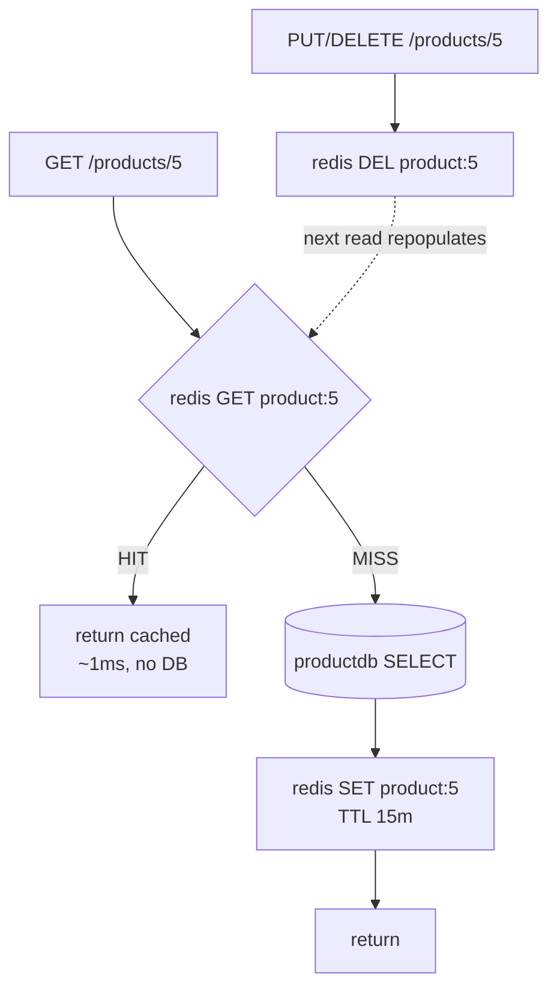

### 3.3 Distributed lock — oversell prevention

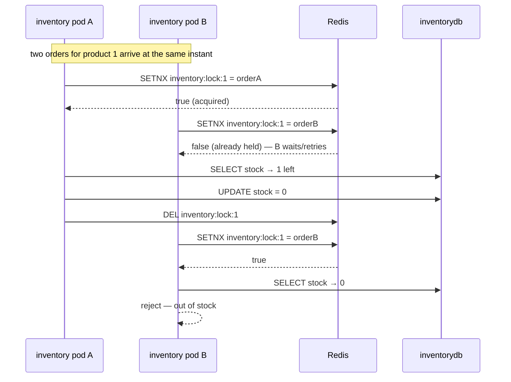

Without the lock both pods read "1 left" simultaneously and both sell it — **oversell**.
Lock key is per-**product**, so different products never block each other.

---

## 4. Workflow Matrix — every path traced

### 4.1 Outcome table

| # | Stock | Payment | Final order state | Compensation | Emails sent |
|---|---|---|---|---|---|
| 1 | ✅ available | ✅ success | **CONFIRMED** | none | placed + receipt |
| 2 | ✅ available | ❌ declined | **CANCELLED** | stock released | placed + failure |
| 3 | ❌ out of stock | — never runs | **CANCELLED** | nothing to release | placed + cancellation |
| 4 | ✅ available | ⏳ timeout | **PENDING** → retry | lock TTL expires | placed only |
| 5 | ✅ available | ✅ success | **CONFIRMED** | none | placed + receipt (dedup on retry) |

### 4.2 Case 1 — happy path

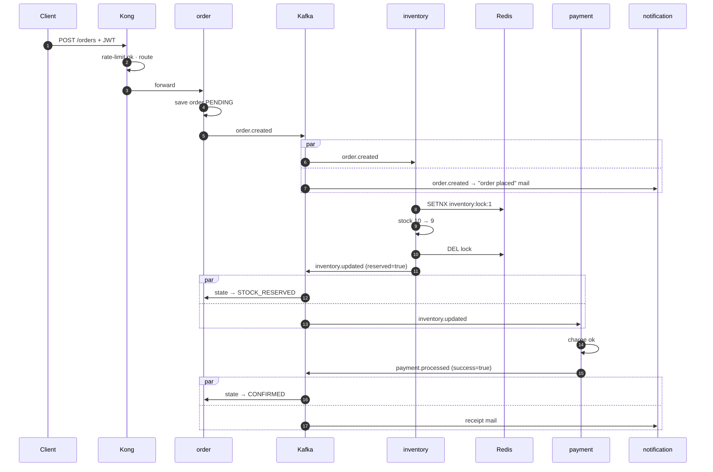

### 4.3 Case 2 — payment declined (compensation fires)

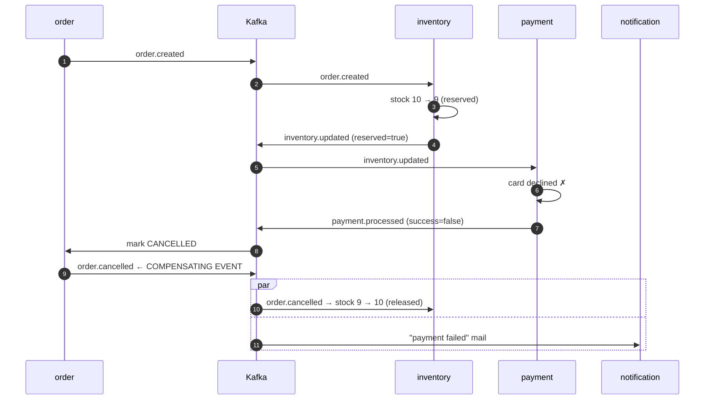

The stock that was already reserved **must** be given back — that's the whole
point of a compensating event. No orchestrator tells inventory to do this;
it reacts to `order.cancelled` on its own.

### 4.4 Case 3 — out of stock (payment never runs)

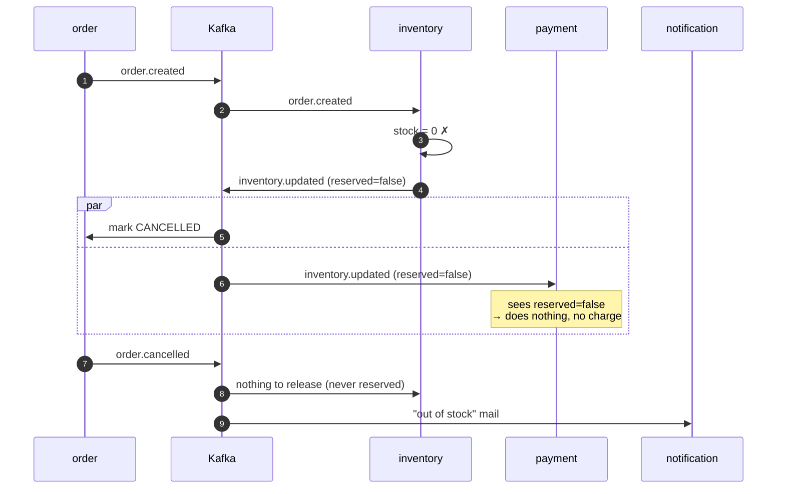

Payment **subscribes** to `inventory.updated` but self-filters on `reserved=false` —
the customer is never charged for something that was never reserved.

### 4.5 Case 4 — concurrent orders, same product, 1 left

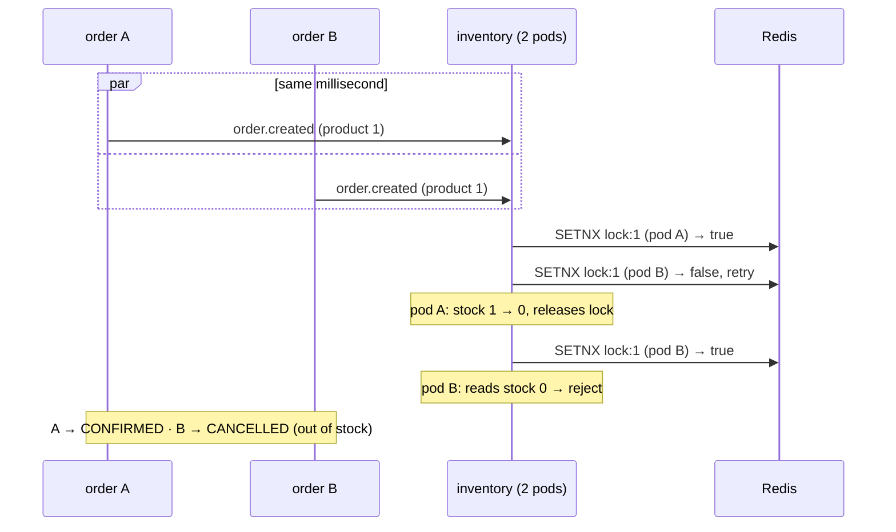

### 4.6 Auth permutations at the gateway

| Request | Kong | Service | Redis session | Result |
|---|---|---|---|---|
| no JWT | pass | reject | not checked | **401** |
| expired JWT | pass | reject | not checked | **401** |
| valid JWT, logged in | pass | accept | `HASKEY` → true | **200** |
| valid JWT, logged out | pass | reject | `HASKEY` → false | **401** |
| valid JWT, >N req/min | **rate-limited** | never reached | — | **429** |

---

## 5. Failure & Recovery Matrix

| What dies | Immediate effect | Recovery |
|---|---|---|
| one service pod | HPA/Deployment reschedules; Kafka rebalances its partitions to surviving pods | automatic |
| **Redis** | logins fail, cache misses go to DB, inventory lock unavailable → inventory pauses rather than risk oversell | restart; sessions lost (users re-login) |
| **Kafka** | saga freezes — orders stay PENDING, nothing is lost | on restart consumers resume from last committed offset |
| one Postgres | only that service degrades; others unaffected (DB-per-service) | restore that DB alone |
| **Kong** | no external traffic enters; internal Kafka flow keeps draining | ALB routes to healthy Kong pod |
| **ALB** | total external outage | multi-AZ ALB fails over |

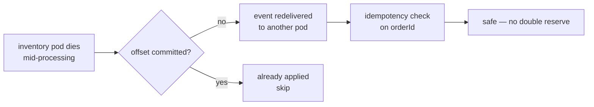

---

## 6. Request Path Comparison

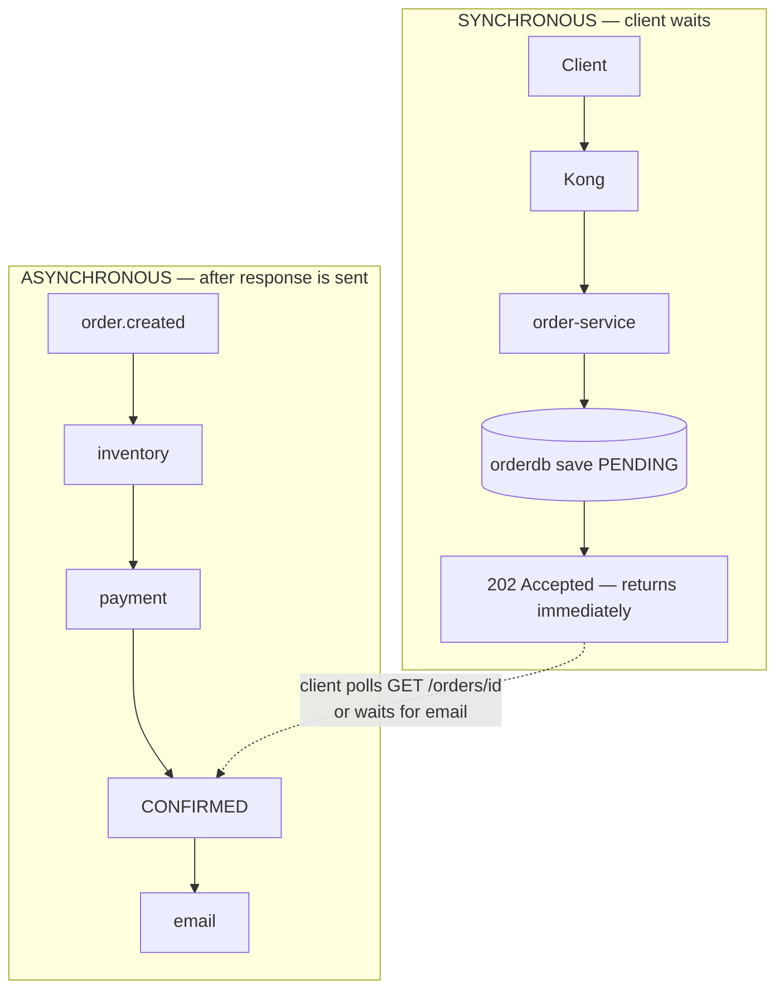

The client never waits for the whole saga — it gets an order id instantly and the
final state arrives via polling or email. That is the practical payoff of choreography.
