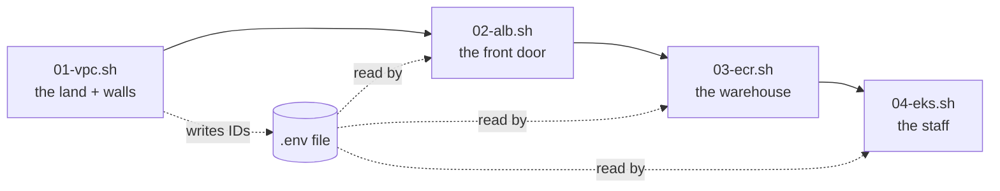
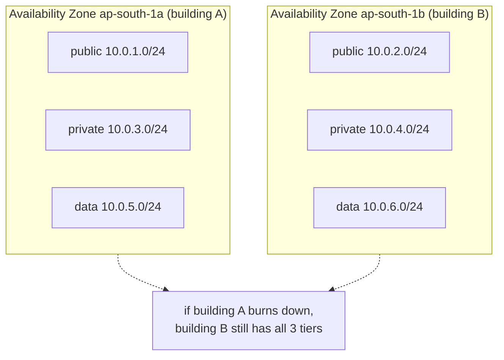
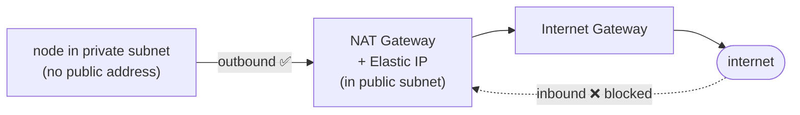
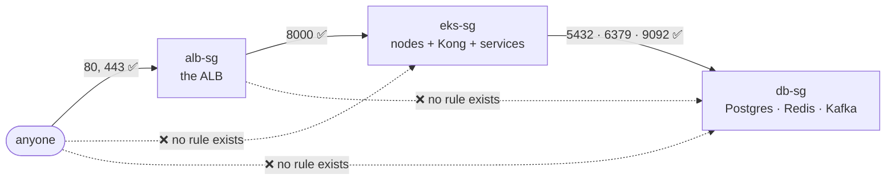
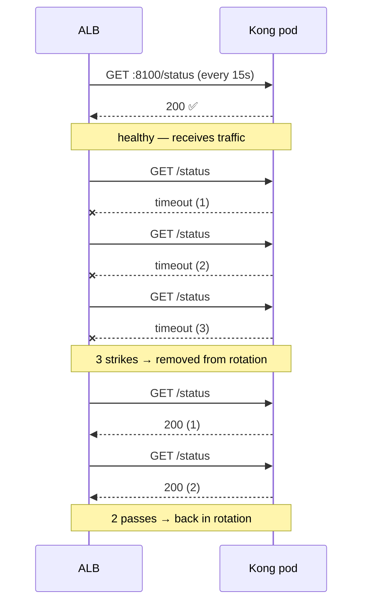
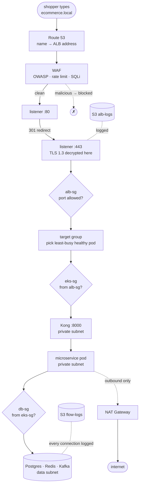
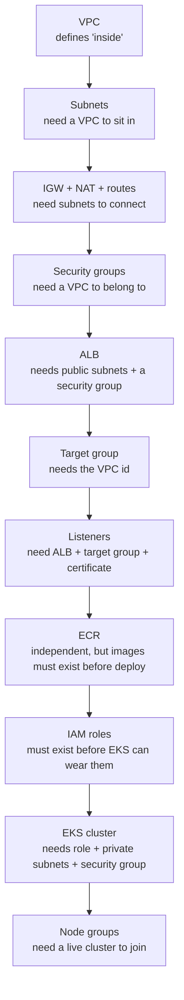
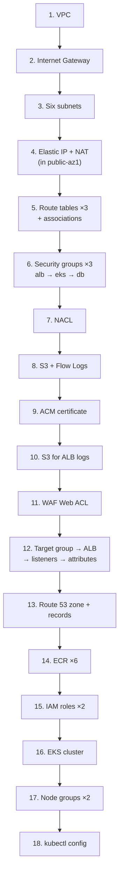

# Infrastructure, Explained Simply

> Every cloud resource we build, in the exact order we build it.
> For each one: **what** it is · **what we attach** to it · **what settings** we give it · **why** it must exist.
>
> The running analogy: **we are building a shopping mall.**

---

## The 4 scripts, in order



Each script saves the IDs it created into `scripts/.env`, and the next script
reads them. That is why the order cannot be changed — script 2 cannot place a
door without knowing where script 1 put the walls.

---

# PART 1 — `01-vpc.sh` · The land and the walls

## 1.1 VPC — the plot of land

**What it is:** your own private, fenced-off section of the cloud. Nobody else's
servers are inside it.

> 🏬 **Mall analogy:** you buy an empty plot of land. There is a wall around it.
> Nothing is built yet — but the boundary now exists and it is *yours*.

**Configuration we gave it:**

| Setting | Value | What it means |
|---|---|---|
| `--cidr-block` | `10.0.0.0/16` | The range of house-numbers available inside: `10.0.0.0` → `10.0.255.255` (**65,536 addresses**) |
| `Name` tag | `ecommerce-vpc` | A human-readable label |
| `--enable-dns-hostnames` | on | Machines inside get names, not just numbers |
| `--enable-dns-support` | on | Machines inside can look up names → numbers |

**Why `/16`?** The `/16` means "the first 16 bits (`10.0`) are fixed, the rest is
yours to hand out." That leaves room for 65,536 addresses — far more than we
need, but big blocks are free, and running out later is painful.

**Why is it required?** Without a VPC there is no "inside." Every other resource
(subnets, servers, databases) must live inside a VPC. It is the container for
everything else.

---

## 1.2 Internet Gateway — the gate in the outer wall

**What it is:** the single doorway between your VPC and the public internet.

> 🏬 The mall's **main gate**. Without it, the mall is a sealed concrete box —
> no shoppers can get in, no deliveries can get out.

**What we attach it to:** the VPC (`attach-internet-gateway`).

**Configuration:** none — it has no settings. It is either attached or not.

**Why is it required?** A VPC is **completely sealed by default**. Not attaching
an IGW means zero internet traffic in or out, forever. But note: attaching it
does **not** by itself let traffic flow — a *route* must also point at it
(that comes in 1.4). Two separate steps.

---

## 1.3 Six subnets — dividing the land into zones

**What they are:** smaller numbered slices of the VPC's address range. Each one
lives in a specific **Availability Zone** (a physically separate data centre).

> 🏬 You divide the mall into three kinds of area:
> - the **entrance lobby** anyone may walk into,
> - the **staff-only corridors** behind the shops,
> - the **locked stockroom** where the valuables sit.
>
> And you build **two of each**, in two separate buildings — so if one building
> loses power, the mall still trades.

| Tier | Subnet | CIDR | AZ | Who lives here |
|---|---|---|---|---|
| Public | `public-az1` | `10.0.1.0/24` | ap-south-1**a** | ALB, NAT Gateway |
| Public | `public-az2` | `10.0.2.0/24` | ap-south-1**b** | ALB |
| Private | `private-az1` | `10.0.3.0/24` | ap-south-1**a** | EKS nodes, Kong, services |
| Private | `private-az2` | `10.0.4.0/24` | ap-south-1**b** | EKS nodes, Kong, services |
| Data | `data-az1` | `10.0.5.0/24` | ap-south-1**a** | Postgres, Redis, Kafka |
| Data | `data-az2` | `10.0.6.0/24` | ap-south-1**b** | Postgres, Redis, Kafka |

**Why `/24`?** Each slice gets 256 addresses (`10.0.1.0`→`10.0.1.255`). Plenty
for the pods in one tier, and the numbers stay easy to read.

**Why two AZs?** An Availability Zone is a real, physical building. If one
catches fire, floods, or loses power, everything in it dies. Spreading every
tier across **two** AZs means the site survives losing one entire data centre.

**Why three tiers?** So that "how exposed is this thing?" is decided by *where
you put it*, not by remembering to configure it correctly. A database placed in
the data tier is unreachable from the internet **by construction**.



---

## 1.4 Route tables — the signposts

**What they are:** a list of instructions saying *"traffic for destination X goes
out via Y."* Every subnet must be attached to exactly one.

> 🏬 Signposts on the corridor walls. Same corridor, but one sign says
> **"Exit → main gate"** and another says **"Exit → staff side-door only."**

### Public route table
| Destination | Target |
|---|---|
| `0.0.0.0/0` (= *anywhere*) | the **Internet Gateway** |

**Attached to:** `public-az1`, `public-az2`.
**Effect:** these two subnets can send traffic to the internet **and receive it**.

### Private route table
| Destination | Target |
|---|---|
| `0.0.0.0/0` (= *anywhere*) | the **NAT Gateway** |

**Attached to:** `private-az1`, `private-az2`, **and both data subnets**.
**Effect:** these four subnets can start outbound conversations, but the internet
cannot start one with them.

> ⚠️ **Worth knowing:** the data subnets share the *private* route table, so they
> **can** reach out to the internet through NAT (for package updates, etc.).
> They are protected by their **security group** (`db-sg`), not by being
> route-less. A stricter production build would give data its own route table
> with no `0.0.0.0/0` entry at all.

**Why required?** A subnet with no route to `0.0.0.0/0` is an island. The route
table is what actually turns the Internet Gateway from "attached" into "working."

---

## 1.5 Elastic IP + NAT Gateway — the one-way staff exit

**What they are:** the NAT Gateway lets machines in private subnets *reach out*
to the internet while remaining unreachable *from* it. The Elastic IP is the
fixed public address it uses to do so.

> 🏬 A **staff side-door that only opens outwards.** Employees can step out to
> collect a delivery. Nobody outside can pull it open and walk in.

**What we attach:**
- Elastic IP → attached to the NAT Gateway
- NAT Gateway → placed **inside `public-az1`** (it needs a public-facing spot to work)

**Why does a private thing live in a public subnet?** The NAT itself must be able
to talk to the internet, so it sits in public. The *private* machines then route
their outbound traffic **through** it. NAT is the bridge, so it stands with one
foot on each side.

**Why is it required?** EKS nodes must pull container images, call SES, fetch
OS updates — all outbound. But they must never be directly reachable from the
internet. NAT gives exactly that asymmetry.



---

## 1.6 Three security groups — the ID-card readers

**What they are:** a firewall wrapped around each individual machine. It is
**stateful** — if a request is allowed in, its reply is automatically allowed
back out. Default behaviour is **deny everything**; you only list what to allow.

> 🏬 **Card readers on each door.** The lobby door opens for anybody. The
> corridor door only opens for a *lobby staff* badge. The stockroom door only
> opens for a *corridor staff* badge.

| Group | Allows in | On port | From |
|---|---|---|---|
| `alb-sg` | web traffic | 80, 443 | `0.0.0.0/0` — **anyone on earth** |
| `eks-sg` | Kong traffic | 8000 | **`alb-sg`** (the group, not an IP) |
| `eks-sg` | node-to-node | 1024–65535 | **`eks-sg`** (itself) |
| `db-sg` | Postgres | 5432 | **`eks-sg`** |
| `db-sg` | Redis | 6379 | **`eks-sg`** |
| `db-sg` | Kafka | 9092 | **`eks-sg`** |

**The key idea — rules point at *groups*, not at IP addresses.** `db-sg` says
"accept 5432 from whoever holds `eks-sg`." Pods restart and change IP constantly;
their *group membership* does not. So the rule never needs updating.

**Why is it required?** Being in the data subnet stops internet traffic. The
security group stops *internal* traffic too — a compromised Kong pod still
cannot open a Postgres connection unless `db-sg` explicitly allows it.



Notice the last dotted line: even the **ALB** cannot reach the database. Nothing
was configured to forbid it — it is simply never allowed, and default is deny.

---

## 1.7 Network ACL — the second, dumber guard

**What it is:** a firewall at the **subnet** level rather than the machine level.
It is **stateless** — it does not remember that a request went out, so the reply
coming back must be allowed by its own explicit rule.

> 🏬 A **guard at the entrance to the whole wing**, checking everyone before they
> even reach the individual door card-readers.

**Rules we gave it** (evaluated in number order, first match wins):

| Rule # | Direction | Port | Action | Why |
|---|---|---|---|---|
| 100 | in | 443 | **allow** | HTTPS |
| 110 | in | 80 | **allow** | HTTP (gets redirected to 443) |
| 120 | in | 1024–65535 | **allow** | **return traffic** — needed because NACLs are stateless |
| 32766 | in | all | **deny** | catch-all: anything not matched above is dropped |
| 100 | out | all | allow | replies may leave freely |

**Attached to:** both public subnets.

**Why rule 120 exists:** when your server replies to a browser, the reply arrives
on a random high-numbered "ephemeral" port. A security group would allow that
automatically (stateful). A NACL will **not** — so without rule 120, every reply
would be silently dropped and the site would appear frozen.

**Why have both NACL and security groups?** *Defence in depth.* Two independent
layers, different mechanisms. A misconfiguration in one is still caught by the
other.

---

## 1.8 VPC Flow Logs + S3 bucket — the CCTV

**What it is:** a record of **every** network connection inside the VPC —
accepted *and* rejected — written to an S3 bucket.

> 🏬 **CCTV cameras.** They do not stop a burglar. They tell you afterwards
> exactly who tried which door, and when.

**What we attach:**
- an S3 bucket: `ecommerce-vpc-flowlogs-<timestamp>`
- flow logs on the **whole VPC**, writing into that bucket

**Configuration:**

| Setting | Value | Meaning |
|---|---|---|
| `--traffic-type` | `ALL` | log both allowed **and** blocked traffic |
| `--log-destination-type` | `s3` | store in S3 |
| `--log-format` | srcaddr, dstaddr, srcport, dstport, protocol, packets, bytes, start, end, **action**, log-status | the columns in each line |

**Why is it required?** If someone probes your database, the security group
blocks it — but silently. Flow logs are what let you *see* the attempt. Needed
for security investigations, compliance audits, and debugging "why can't A reach B."

---

# PART 2 — `02-alb.sh` · The front door

## 2.1 ACM certificate — the proof of identity

**What it is:** an SSL/TLS certificate. It does two jobs: proves the site really
is `ecommerce.local`, and encrypts traffic so nobody in between can read it.

> 🏬 The mall's **verified registration plaque** — proof it is the real business
> and not a copycat.

**Configuration:**

| Setting | Value | Meaning |
|---|---|---|
| `--domain-name` | `ecommerce.local` | the main domain |
| `--subject-alternative-names` | `*.ecommerce.local` | **wildcard** — also covers `api.`, `shop.`, any subdomain |
| `--validation-method` | `DNS` | prove ownership by adding a DNS record |

**Why is it required?** Without it there is no `https://` — only `http://`.
Browsers show "Not secure," passwords travel in plain readable text, and modern
browsers block many features outright.

---

## 2.2 S3 bucket for ALB logs — the visitor book

**What it is:** a bucket where the load balancer writes one line for every single
request it handles.

**What we attach:**
- **versioning: enabled** — an overwritten file keeps its old copies
- a **bucket policy** allowing the AWS log-delivery service (`delivery.logs.amazonaws.com`) to write into `alb-logs/AWSLogs/*`

**Why the bucket policy?** A bucket rejects all writers by default. AWS's logging
service is a *different* service — it needs explicit written permission, or the
logs silently never appear.

**Why versioning?** Logs are audit evidence. Versioning means a deletion or
overwrite cannot quietly erase the trail.

---

## 2.3 WAF Web ACL — the bouncer

**What it is:** a filter that inspects the **content** of each request and blocks
malicious ones before they reach your application.

> 🏬 The **bouncer** at the entrance. Not just "is the door open?" but
> "are *you* trouble?"

**Three rules, in priority order:**

| # | Rule | What it blocks |
|---|---|---|
| 1 | `AWSManagedRulesCommonRuleSet` | The OWASP Top 10 — the standard list of common web attacks. Maintained and updated by AWS. |
| 2 | `RateLimitRule` | Any single IP sending **more than 2000 requests per 5 minutes** — stops brute-force and cheap denial-of-service |
| 3 | `AWSManagedRulesSQLiRuleSet` | **SQL injection** — requests trying to smuggle database commands through a form field |

**Default action:** `Allow` — anything the three rules do not object to passes.

**What we attach it to:** the ALB (step 2.9), so it is inspected *before* the
request reaches Kong.

**Why is it required?** The security group checks *where* traffic came from and
*which port* — it cannot see that a login form contains `' OR 1=1 --`. WAF reads
the actual content. Different layer, different question.

---

## 2.4 The ALB — the reception desk

**What it is:** the Application Load Balancer. Everything from the internet
arrives here first, and it decides which backend gets the request.

**Configuration:**

| Setting | Value | Why |
|---|---|---|
| `--name` | `ecommerce-alb` | identifier |
| `--subnets` | `public-az1` + `public-az2` | must be public to receive internet traffic; two AZs for redundancy |
| `--security-groups` | `alb-sg` | only 80/443 may enter |
| `--scheme` | `internet-facing` | gets a public address (the opposite is `internal`) |
| `--type` | `application` | Layer 7 — understands HTTP paths and headers |
| `--ip-address-type` | `ipv4` | address family |

**Why is the ALB public but everything else private?** This is the whole security
design in one sentence: **exactly one resource is exposed, and it is the one
hardened for the job.** The ALB accepts the internet's traffic and forwards it
inward — but nothing behind it is directly reachable.

---

## 2.5 ALB attributes — the operating rules

Set with `modify-load-balancer-attributes`:

| Attribute | Value | Why |
|---|---|---|
| `access_logs.s3.enabled` | `true` | start writing the visitor book |
| `access_logs.s3.bucket` | the log bucket | where to write |
| `access_logs.s3.prefix` | `alb-logs` | folder inside the bucket |
| `deletion_protection.enabled` | `true` | **a delete command will be refused** until this is switched off — prevents wiping production by accident |
| `idle_timeout.timeout_seconds` | `60` | drop connections idle for 60s, so dead ones don't pile up |
| `routing.http2.enabled` | `true` | HTTP/2 — many requests share one connection, faster |
| `routing.http.drop_invalid_header_fields` | `true` | discard malformed headers, a common attack trick |

---

## 2.6 Target group — the list of who is on duty

**What it is:** the pool of backends the ALB may forward to, plus the health
check that decides who is currently fit to receive traffic.

> 🏬 The reception desk's **staff-on-duty board.** Someone goes home sick →
> their name comes off the board → no work is sent to them.

**Configuration:**

| Setting | Value | Why |
|---|---|---|
| `--name` | `ecommerce-kong-tg` | identifier |
| `--protocol` / `--port` | HTTP / `8000` | Kong listens on 8000 |
| `--target-type` | **`ip`** | send straight to **pod IPs**, not node IPs — required for EKS CNI networking, and one hop faster |
| `--health-check-path` | `/status` | the URL to poll |
| `--health-check-port` | `8100` | Kong's separate admin/status port |
| `--health-check-interval-seconds` | `15` | check every 15s |
| `--health-check-timeout-seconds` | `5` | no answer in 5s = failure |
| `--healthy-threshold-count` | `2` | **2** passes in a row → back on duty |
| `--unhealthy-threshold-count` | `3` | **3** failures in a row → taken off duty |
| `--matcher` | `HttpCode=200` | only HTTP 200 counts as healthy |

**Why 3 failures and not 1?** One missed check might just be a moment of load.
Removing a healthy pod over a single blip would cause more outages than it
prevents. Three-in-a-row means "genuinely down."

### Target group attributes

| Attribute | Value | Why |
|---|---|---|
| `deregistration_delay.timeout_seconds` | `30` | when a pod is shutting down, keep letting its **in-flight requests finish** for 30s before cutting it off — this is what makes deploys drop zero requests |
| `stickiness.enabled` | `false` | any pod may serve any request — sessions live in **Redis**, so no pod holds special state |
| `load_balancing.algorithm.type` | `least_outstanding_requests` | send the next request to whichever pod is **least busy right now** — better than plain round-robin when some requests take much longer than others |



---

## 2.7 Two listeners — the doors on the desk

**What they are:** a listener watches one port and says what to do with whatever
arrives there.

### Listener on port 80 (HTTP)
**Action:** redirect → HTTPS on port 443, status code **301**.

**Why 301 and not 302?** 301 means *permanent*. Browsers remember it and go
straight to HTTPS next time, skipping the insecure request entirely.

### Listener on port 443 (HTTPS)

| Setting | Value | Why |
|---|---|---|
| `--certificates` | the ACM cert | needed to serve HTTPS |
| `--ssl-policy` | `ELBSecurityPolicy-TLS13-1-2-2021-06` | allows only **TLS 1.2 and 1.3**; the old, breakable TLS 1.0/1.1 are refused |
| default action | forward → `ecommerce-kong-tg` | everything goes to Kong |
| rule priority 10 | path `/api/*` → same target group | an explicit API path rule |

**Why terminate TLS at the ALB?** Decryption is expensive. Doing it once at the
front door means the six services behind it never spend CPU on it, and only one
place needs the certificate.

---

## 2.8 Route 53 — the phone book

**What it is:** DNS. It turns the name a human types into the address a machine
can reach.

**What we create:**
- a **hosted zone** for `ecommerce.local`
- an **A record**: `ecommerce.local` → the ALB
- an **A record**: `api.ecommerce.local` → the ALB

Both are **alias** records with `EvaluateTargetHealth: true`.

**Why alias instead of CNAME?**

| | Alias | CNAME |
|---|---|---|
| Extra DNS lookup | no | yes — slower |
| Cost per query | free | charged |
| Works on the root domain | **yes** | **no** — CNAME cannot be used at the apex |
| Follows ALB health | yes | no |

**Why is it required?** The ALB's own DNS name is long, ugly, and can change.
Route 53 puts a stable, human name in front of it.

---

## 2.9 Attaching WAF to the ALB

Only now does the bouncer actually start working:

```
Internet → Route 53 → WAF → ALB listener :443 → target group → Kong
```

Creating the Web ACL (2.3) only *defined* the rules. `associate-web-acl` is what
puts them in the path of real traffic.

---

# PART 3 — `03-ecr.sh` · The warehouse

## 3.1 Six ECR repositories

**What it is:** a private Docker registry. One repository per service:
`ecommerce/user-service`, `ecommerce/product-service`, `ecommerce/order-service`,
`ecommerce/inventory-service`, `ecommerce/payment-service`,
`ecommerce/notification-service`.

> 🏬 The **stockroom**, with a labelled shelf for each shop.

**Configuration per repository:**

| Setting | Value | Why |
|---|---|---|
| `scanOnPush` | `true` | every uploaded image is **automatically scanned for known security vulnerabilities** |
| `encryptionType` | `AES256` | images encrypted at rest |
| lifecycle policy | keep newest **10** images, expire the rest | old images cost storage forever otherwise |

**Why one repo per service instead of one shared?** Separate version histories,
separate lifecycle rules, and separate access control per service.

## 3.2 Image tagging — the git SHA

```
IMAGE_TAG = short git commit SHA   (e.g. a3f9c21)
```
Each image is pushed **twice**: once as `:a3f9c21` and once as `:latest`.

**Why tag with the commit SHA?** It is **immutable and traceable**. Given a
running container you can find the exact line of source code inside it, and
rolling back is just deploying the previous SHA. `:latest` is a moving target —
it means something different tomorrow, so it can never be rolled back to.

> ⚠️ **Floci note:** pushes go to a real Docker Registry container on
> `localhost:5100`. Floci implements ECR's *control plane* (creating repos,
> policies) but not the Docker Registry protocol on port 4566 — hence the
> separate address.

---

# PART 4 — `04-eks.sh` · The staff

## 4.1 Two IAM roles — the job badges

**What they are:** an IAM role is a set of permissions that a *service* can wear,
rather than a person. No passwords or keys involved.

> 🏬 **Job badges.** The badge is not a person — it is a role. Whoever is on
> shift wears it and gets exactly that role's access.

### `eks-cluster-role` — worn by the EKS control plane
- **Trust policy:** only `eks.amazonaws.com` may assume it
- **Attached policy:** `AmazonEKSClusterPolicy`
- **Why:** the cluster brain must create network interfaces and manage AWS
  resources for you

### `eks-node-role` — worn by the worker machines
- **Trust policy:** only `ec2.amazonaws.com` may assume it
- **Attached policies (3):**

| Policy | Grants |
|---|---|
| `AmazonEKSWorkerNodePolicy` | permission to join the cluster and be managed |
| `AmazonEC2ContainerRegistryReadOnly` | permission to **pull images from ECR** |
| `AmazonEKS_CNI_Policy` | permission to assign pod networking / IP addresses |

**Why is the trust policy important?** It answers *"who is allowed to wear this
badge?"* Without it, the permissions exist but nothing can pick them up.

**Why two separate roles?** **Least privilege.** The control plane and the worker
nodes need different things. Merging them would give both sides powers neither
should have.

---

## 4.2 The EKS cluster — the manager

**What it is:** the Kubernetes control plane — the brain that decides which pod
runs where, restarts what crashes, and tracks desired state.

**Configuration:**

| Setting | Value | Why |
|---|---|---|
| `--name` | `ecommerce-cluster` | identifier |
| `--kubernetes-version` | `1.28` | pinned — upgrades become a deliberate act, never a surprise |
| `--role-arn` | `eks-cluster-role` | the badge it wears |
| `subnetIds` | `private-az1`, `private-az2` | **private only** — the control plane is not internet-exposed |
| `securityGroupIds` | `eks-sg` | its firewall |
| `--logging` | `api`, `audit`, `authenticator`, `controllerManager`, `scheduler` — **all enabled** | full record of every cluster action, for audit and debugging |

Then `aws eks wait cluster-active` blocks until the cluster is genuinely ready —
because creating node groups against a still-provisioning cluster fails.

**Important:** a cluster is **only a brain**. It has no CPU or memory of its own
to run your containers. That is the next step.

---

## 4.3 Two node groups — the workers

**What they are:** pools of EC2 machines that provide the actual compute. Each
group is backed by an Auto Scaling Group.

> 🏬 The manager can plan all day, but **somebody has to stand behind the
> counter.** These are the staff.

### `general-nodes`

| Setting | Value | Why |
|---|---|---|
| `--instance-types` | `m5.large` | balanced CPU/memory |
| `--scaling-config` | min **2**, max **8**, desired **3** | never fewer than 2 (survive one dying), never more than 8 (cost ceiling) |
| `--disk-size` | 20 GB | |
| `--ami-type` | `AL2_x86_64` | Amazon Linux 2 |
| `--labels` | `role=general` | lets pods target this group |
| `--subnets` | both private subnets | spread across AZs |

Runs: Kong, user, product, order.

### `high-mem-nodes`

| Setting | Value | Why |
|---|---|---|
| `--instance-types` | `r5.large` | **memory-optimised** |
| `--scaling-config` | min **1**, max **4**, desired **2** | smaller pool |
| `--disk-size` | 30 GB | more room for Kafka data |
| `--labels` | `role=high-memory` | |

Runs: inventory, payment, notification — the Kafka consumers.

**Why two different machine types?** Kafka consumers hold batches of messages in
memory per partition, so they are memory-hungry. Request/response services are
not. Giving everything the expensive memory-optimised machine would waste money;
giving the consumers the balanced one would starve them.

**Why `min` above zero?** `minSize=2` guarantees that even at idle, two machines
are alive. If one fails, work continues while a replacement boots.

---

## 4.4 kubectl config

```
aws eks update-kubeconfig --name ecommerce-cluster --region ap-south-1
```

Writes cluster address and credentials into `~/.kube/config` so that `kubectl`
commands go to **this** cluster. Purely a local convenience — it changes nothing
in the cloud.

---

# The complete journey of one request



Every hop is a checkpoint. Any one of them saying no ends the request there.

---

# Why this order, and not any other



Each resource depends on IDs produced by the one before it — which is exactly why
the scripts pass `scripts/.env` down the chain.

---

# One-line summary of each resource

| Resource | In one sentence |
|---|---|
| VPC | your own private land in the cloud |
| Internet Gateway | the gate connecting that land to the internet |
| Public subnets | the area outsiders are allowed to reach |
| Private subnets | where the application runs, unreachable from outside |
| Data subnets | where the databases sit, reachable only from the application |
| Route tables | the signposts saying which exit each area uses |
| Elastic IP | a fixed public address for the NAT |
| NAT Gateway | a one-way exit: out yes, in no |
| `alb-sg` | lets the world reach the front door only on 80/443 |
| `eks-sg` | lets only the front door reach the application |
| `db-sg` | lets only the application reach the databases |
| Network ACL | a second, subnet-wide guard for defence in depth |
| Flow Logs + S3 | CCTV recording every connection attempt |
| ACM certificate | proof of identity + encryption for HTTPS |
| ALB logs bucket | the visitor book of every request |
| WAF | the bouncer that inspects request contents |
| ALB | the reception desk everything arrives at |
| Target group | the on-duty board with health checks |
| Listener :80 | pushes everyone to the secure door |
| Listener :443 | the secure door where TLS is decrypted |
| Route 53 | the phone book turning the name into an address |
| ECR ×6 | the stockroom shelf per service |
| `eks-cluster-role` | the manager's badge |
| `eks-node-role` | the workers' badge |
| EKS cluster | the manager that decides what runs where |
| `general-nodes` | the everyday staff |
| `high-mem-nodes` | the specialists with extra memory |

---
---

# PART 5 — Building all of this in the AWS Console

> Same resources, same order, clicked instead of scripted.
> Order matters: nearly every step needs an ID produced by an earlier one.

## Console map — where each thing lives

| Resource | Console | Left-sidebar item |
|---|---|---|
| VPC, subnets, route tables, IGW, NAT, EIP, SG, NACL, flow logs | **VPC** | matching name |
| ALB, target groups, listeners | **EC2** | *Load Balancers* / *Target Groups* |
| Certificates | **Certificate Manager (ACM)** | — |
| Web ACL | **WAF & Shield** | *Web ACLs* |
| DNS | **Route 53** | *Hosted zones* |
| Image repos | **ECR** | *Repositories* |
| Roles | **IAM** | *Roles* |
| Cluster, node groups | **EKS** | *Clusters* |
| Buckets | **S3** | *Buckets* |

⚠️ **Set your region to `ap-south-1` first** (top-right dropdown). Resources are region-scoped — build them in the wrong region and nothing will find anything else.

---

## 5.1 VPC

**VPC → Your VPCs → Create VPC**

| Field | Value |
|---|---|
| Resources to create | **VPC only** ← *not* "VPC and more" |
| Name tag | `ecommerce-vpc` |
| IPv4 CIDR | `10.0.0.0/16` |
| IPv6 CIDR | No IPv6 |
| Tenancy | Default |

→ **Create VPC**

Then turn on DNS (matching `--enable-dns-hostnames` / `--enable-dns-support`):

Select the VPC → **Actions → Edit VPC settings** → tick **Enable DNS resolution** and **Enable DNS hostnames** → Save.

> 💡 "VPC and more" auto-creates subnets/IGW/NAT in one shot. Convenient, but you learn nothing and get AWS's layout, not yours. Use **VPC only**.

---

## 5.2 Internet Gateway

**VPC → Internet gateways → Create internet gateway**

- Name tag: `ecommerce-igw` → **Create**

It appears as **Detached**. Now attach it:

Select it → **Actions → Attach to VPC** → choose `ecommerce-vpc` → **Attach**

---

## 5.3 The six subnets

**VPC → Subnets → Create subnet**

Pick `ecommerce-vpc`, then use **Add new subnet** to create all six in one submission:

| Name | AZ | CIDR |
|---|---|---|
| `public-az1` | ap-south-1**a** | `10.0.1.0/24` |
| `public-az2` | ap-south-1**b** | `10.0.2.0/24` |
| `private-az1` | ap-south-1**a** | `10.0.3.0/24` |
| `private-az2` | ap-south-1**b** | `10.0.4.0/24` |
| `data-az1` | ap-south-1**a** | `10.0.5.0/24` |
| `data-az2` | ap-south-1**b** | `10.0.6.0/24` |

→ **Create subnet**

**Optional but recommended for the public two:** select `public-az1` → **Actions → Edit subnet settings** → tick **Enable auto-assign public IPv4 address** → Save. Repeat for `public-az2`. (Nothing you launch there needs it in this build, but it's what makes a subnet behave "publicly" in the normal sense.)

---

## 5.4 Elastic IP + NAT Gateway

**Elastic IP first — VPC → Elastic IPs → Allocate Elastic IP address** → **Allocate**

**Then VPC → NAT gateways → Create NAT gateway**

| Field | Value |
|---|---|
| Name | `ecommerce-nat` |
| **Subnet** | **`public-az1`** ← must be public |
| Connectivity type | **Public** |
| Elastic IP allocation ID | the one just allocated |

→ **Create NAT gateway**, then wait for **Status: Available** (1-2 min).

⚠️ Choosing a *private* subnet here is the classic mistake — it creates fine, then nothing works, because the NAT itself has no route out.

---

## 5.5 Route tables

### Public route table

**VPC → Route tables → Create route table** → Name `public-rt`, VPC `ecommerce-vpc` → **Create**

Select it →
- **Routes** tab → **Edit routes** → **Add route**: Destination `0.0.0.0/0`, Target **Internet Gateway** → `ecommerce-igw` → **Save changes**
- **Subnet associations** tab → **Edit subnet associations** → tick `public-az1`, `public-az2` → **Save**

### Private route table

**Create route table** → Name `private-rt` → **Create**

Select it →
- **Edit routes** → **Add route**: Destination `0.0.0.0/0`, Target **NAT Gateway** → `ecommerce-nat` → **Save changes**
- **Subnet associations** → tick `private-az1`, `private-az2` → **Save**

### Data route table — *the hardened version*

**Create route table** → Name `data-rt` → **Create**

- **Do not add any route.** The `local` route is already there and is all you need.
- **Subnet associations** → tick `data-az1`, `data-az2` → **Save**

> This is the one place the console build **improves on the script**, which put the data subnets on `private-rt` and thereby gave the databases internet egress. See §1.4.

---

## 5.6 The three security groups

**VPC → Security groups → Create security group.** Order matters — each references the previous.

### `alb-sg`

| Field | Value |
|---|---|
| Name | `alb-sg` · Description `ALB Security Group` · VPC `ecommerce-vpc` |

Inbound rules:

| Type | Source type | Source |
|---|---|---|
| **HTTP** (auto-fills 80) | Anywhere-IPv4 | `0.0.0.0/0` |
| **HTTPS** (auto-fills 443) | Anywhere-IPv4 | `0.0.0.0/0` |

Leave outbound default → **Create**

### `eks-sg` — needs two passes

**Pass 1** — create with one rule:

| Type | Port | Source type | Source |
|---|---|---|---|
| Custom TCP | `8000` | **Custom** | type `alb-sg`, pick it from the dropdown |

**Pass 2** — it can only reference itself once it exists. Reopen `eks-sg` → **Edit inbound rules** → **Add rule**:

| Type | Port range | Source type | Source |
|---|---|---|---|
| Custom TCP | `1024-65535` | **Custom** | select **`eks-sg`** itself |

→ **Save rules**

### `db-sg`

Three rules, all Source type **Custom** → `eks-sg`:

| Type | Port |
|---|---|
| **PostgreSQL** (preset) | 5432 |
| Custom TCP | `6379` |
| Custom TCP | `9092` |

→ **Create**

> The critical click: **Source type = Custom**, then pick a *security group* from the dropdown. Choosing "Anywhere-IPv4" instead would expose Kong to the whole internet.

---

## 5.7 Network ACL

**VPC → Network ACLs → Create network ACL** → Name `ecommerce-public-nacl`, VPC `ecommerce-vpc` → **Create**

⚠️ A new custom NACL **denies everything** until you add rules.

**Inbound rules → Edit inbound rules → Add new rule** ×4:

| Rule # | Type | Port range | Source | Allow/Deny |
|---|---|---|---|---|
| `100` | HTTPS (443) | 443 | `0.0.0.0/0` | Allow |
| `110` | HTTP (80) | 80 | `0.0.0.0/0` | Allow |
| `120` | Custom TCP | `1024-65535` | `0.0.0.0/0` | **Allow** ← return traffic |
| `32766` | All traffic | All | `0.0.0.0/0` | Deny |

**Outbound rules → Edit outbound rules → Add new rule:**

| Rule # | Type | Destination | Allow/Deny |
|---|---|---|---|
| `100` | All traffic | `0.0.0.0/0` | Allow |

**Subnet associations → Edit** → tick `public-az1`, `public-az2` → **Save**

> Numbering in 10s leaves room to insert a deny rule (e.g. `50`) later without renumbering.
> Rule **120** is the one people forget — miss it and every reply is dropped, so the site just hangs.
> A subnet can hold only **one** NACL; associating yours silently removes it from the default.

---

## 5.8 VPC Flow Logs

**S3 → Create bucket** first:

| Field | Value |
|---|---|
| Name | `ecommerce-vpc-flowlogs-<unique>` |
| Region | `ap-south-1` |
| Block Public Access | leave **all blocked** |

→ Create, then **Properties → Bucket Versioning → Edit → Enable**.

**VPC → Your VPCs → select `ecommerce-vpc` → Flow logs tab → Create flow log**

| Field | Value |
|---|---|
| Name | `ecommerce-vpc-flowlogs` |
| **Filter** | **All** (accepted *and* rejected — rejected is the interesting half) |
| Max aggregation interval | 10 minutes |
| Destination | **Send to an Amazon S3 bucket** |
| S3 bucket ARN | `arn:aws:s3:::ecommerce-vpc-flowlogs-<unique>` |
| Log record format | **AWS default format** |

→ **Create flow log**

> The script's long `--log-format` string is exactly AWS's 14 default fields — in the console just choose **AWS default format**.
> The console adds the required bucket policy for `delivery.logs.amazonaws.com` automatically.
> First logs appear after **~10 minutes**. An empty bucket before that is normal.

---

## 5.9 ACM certificate

**Certificate Manager → Request a certificate → Request a public certificate**

| Field | Value |
|---|---|
| Fully qualified domain name | `ecommerce.local` |
| **Add another name** | `*.ecommerce.local` (wildcard) |
| Validation method | **DNS validation** |
| Key algorithm | RSA 2048 |

→ **Request**

Status will read **Pending validation**. On real AWS you then open the certificate and click **Create records in Route 53** (only possible once the hosted zone in §5.13 exists), and it becomes **Issued** in ~5 minutes.

> ⚠️ `.local` is not a real public TLD — real ACM cannot validate it. Fine on Floci; for actual AWS use a domain you own.

---

## 5.10 S3 bucket for ALB access logs

**S3 → Create bucket** → `ecommerce-alb-logs-<unique>`, region `ap-south-1`, public access blocked → Create.

Then **Properties → Bucket Versioning → Enable**.

The bucket policy allowing the ALB to write is added automatically in §5.12 when you enable access logs.

---

## 5.11 WAF Web ACL

**WAF & Shield → Web ACLs → Create web ACL**

**Step 1 — describe:**

| Field | Value |
|---|---|
| Name | `ecommerce-waf` |
| Resource type | **Regional resources (ALB, API Gateway…)** |
| Region | Asia Pacific (Mumbai) |
| Associated resources | skip for now — the ALB doesn't exist yet |

**Step 2 — Add rules → Add managed rule groups → AWS managed rule groups:**
- ✅ **Core rule set (CRS)** — the OWASP Top 10 protection
- ✅ **SQL database** — SQL-injection rules

Then **Add rules → Add my own rules → Rule builder**:

| Field | Value |
|---|---|
| Name | `RateLimitRule` |
| Type | **Rate-based rule** |
| Rate limit | `2000` |
| Aggregation | **Source IP** |
| Action | **Block** |

**Step 3 — Set rule priority:** Core rule set → SQL database → RateLimitRule
**Step 4 — Metrics:** leave defaults → **Create web ACL**

---

## 5.12 ALB + target group + listeners

**EC2 → Target Groups → Create target group** (do this first — the listener needs it)

| Field | Value |
|---|---|
| Target type | **IP addresses** ← required for EKS pod IPs |
| Name | `ecommerce-kong-tg` |
| Protocol / Port | HTTP / `8000` |
| VPC | `ecommerce-vpc` |
| Protocol version | HTTP1 |

**Health checks** (expand *Advanced health check settings*):

| Field | Value |
|---|---|
| Protocol / Path | HTTP / `/status` |
| Port | **Override → `8100`** |
| Healthy threshold | `2` |
| Unhealthy threshold | `3` |
| Timeout | `5` seconds |
| Interval | `15` seconds |
| Success codes | `200` |

→ Next → **Create target group** (register no targets — EKS does that)

Then select it → **Attributes → Edit**:

| Attribute | Value |
|---|---|
| Deregistration delay | `30` seconds |
| Stickiness | **off** |
| Load balancing algorithm | **Least outstanding requests** |

### Now the ALB

**EC2 → Load Balancers → Create load balancer → Application Load Balancer**

| Field | Value |
|---|---|
| Name | `ecommerce-alb` |
| Scheme | **Internet-facing** |
| IP address type | IPv4 |
| VPC | `ecommerce-vpc` |
| **Mappings** | tick **both** AZs → `public-az1`, `public-az2` |
| Security groups | **`alb-sg`** (remove the default group) |

**Listeners:**

| Protocol | Port | Default action |
|---|---|---|
| HTTPS | 443 | Forward to `ecommerce-kong-tg` |

Under *Secure listener settings*:
- Security policy: **`ELBSecurityPolicy-TLS13-1-2-2021-06`**
- Certificate: **From ACM** → `ecommerce.local`

→ **Create load balancer**

### Add the port-80 redirect

Select the ALB → **Listeners and rules** tab → **Add listener**

| Field | Value |
|---|---|
| Protocol / Port | HTTP / 80 |
| Default action | **Redirect to URL** |
| Protocol / Port | HTTPS / 443 |
| Status code | **301 — Permanently moved** |

→ **Add**

### ALB attributes

Select the ALB → **Attributes → Edit**:

| Attribute | Value |
|---|---|
| **Deletion protection** | **Enable** |
| Idle timeout | `60` seconds |
| HTTP/2 | Enabled |
| Drop invalid header fields | Enabled |
| **Access logs** | Enable → bucket `ecommerce-alb-logs-<unique>`, prefix `alb-logs` |

Enabling access logs triggers a prompt to add the bucket policy — accept it.

### Attach the WAF

**WAF & Shield → Web ACLs → `ecommerce-waf` → Associated AWS resources → Add AWS resources** → select `ecommerce-alb` → **Add**

Only now do the WAF rules actually inspect live traffic.

---

## 5.13 Route 53

**Route 53 → Hosted zones → Create hosted zone**

| Field | Value |
|---|---|
| Domain name | `ecommerce.local` |
| Type | **Public hosted zone** |

→ **Create hosted zone**

**Create record** ×2:

| Record name | Type | Alias | Route traffic to |
|---|---|---|---|
| *(blank = root)* | A | **on** | Alias to Application Load Balancer → ap-south-1 → `ecommerce-alb` |
| `api` | A | **on** | same |

Leave **Evaluate target health: Yes** → **Create records**

> Toggling **Alias** on is the important click. A plain A record wants an IP — the ALB doesn't have a fixed one. Alias tracks the ALB, works at the root domain (CNAME can't), and costs nothing per query.

---

## 5.14 ECR — six repositories

**ECR → Repositories → Create repository**, once per service:

| Field | Value |
|---|---|
| Visibility | **Private** |
| Name | `ecommerce/user-service` |
| **Image scan on push** | **Enable** |
| Encryption | AES-256 |

Repeat for `product-service`, `order-service`, `inventory-service`, `payment-service`, `notification-service`.

**Lifecycle policy** per repo: select it → **Lifecycle Policy → Create rule**

| Field | Value |
|---|---|
| Priority | `1` · Description `Keep 10` |
| Image status | Any |
| Match criteria | **Image count more than** `10` |
| Action | **Expire** |

**To push:** open the repo → **View push commands** — it shows the exact `docker login` / `build` / `tag` / `push` lines for that repo.

---

## 5.15 IAM roles

**IAM → Roles → Create role**

### `eks-cluster-role`

| Step | Value |
|---|---|
| Trusted entity type | **AWS service** |
| Use case | **EKS → EKS - Cluster** |
| Permissions | `AmazonEKSClusterPolicy` (pre-selected) |
| Role name | `eks-cluster-role` |

### `eks-node-role`

| Step | Value |
|---|---|
| Trusted entity type | **AWS service** |
| Use case | **EC2** |
| Permissions — attach **all three** | `AmazonEKSWorkerNodePolicy`<br>`AmazonEC2ContainerRegistryReadOnly`<br>`AmazonEKS_CNI_Policy` |
| Role name | `eks-node-role` |

> Picking the right **use case** is what sets the trust policy — *who may wear this badge*. Cluster role → `eks.amazonaws.com`; node role → `ec2.amazonaws.com`. Choose wrong and the role exists but nothing can assume it.

---

## 5.16 EKS cluster

**EKS → Clusters → Create cluster**

**Step 1 — Configure cluster:**

| Field | Value |
|---|---|
| Name | `ecommerce-cluster` |
| Kubernetes version | **1.28** |
| Cluster service role | **`eks-cluster-role`** |

**Step 2 — Specify networking:**

| Field | Value |
|---|---|
| VPC | `ecommerce-vpc` |
| **Subnets** | **`private-az1` + `private-az2` only** — untick everything else |
| Security groups | **`eks-sg`** |
| Cluster endpoint access | Public and private (or Private for a hardened build) |

**Step 3 — Observability:** enable all five control-plane logs — **API server, Audit, Authenticator, Controller manager, Scheduler**

**Step 4-5:** defaults → **Create**

Takes **10-15 minutes** on real AWS. Wait for **Active** before continuing.

---

## 5.17 Node groups

**EKS → `ecommerce-cluster` → Compute tab → Add node group**

### `general-nodes`

| Step | Field | Value |
|---|---|---|
| 1 | Name | `general-nodes` |
| 1 | Node IAM role | **`eks-node-role`** |
| 1 | Labels | `role` = `general` |
| 2 | AMI type | Amazon Linux 2 (`AL2_x86_64`) |
| 2 | Instance type | **`m5.large`** |
| 2 | Disk size | `20` GB |
| 2 | Min / Max / Desired | **2 / 8 / 3** |
| 3 | Subnets | `private-az1`, `private-az2` |

### `high-mem-nodes`

| Step | Field | Value |
|---|---|---|
| 1 | Name | `high-mem-nodes` |
| 1 | Node IAM role | `eks-node-role` |
| 1 | Labels | `role` = `high-memory` |
| 2 | Instance type | **`r5.large`** |
| 2 | Disk size | `30` GB |
| 2 | Min / Max / Desired | **1 / 4 / 2** |
| 3 | Subnets | `private-az1`, `private-az2` |

Each takes ~5 minutes to reach **Active**.

---

## 5.18 Connect kubectl

The one step with no console equivalent — it configures your **local machine**:

```bash
aws eks update-kubeconfig --name ecommerce-cluster --region ap-south-1
kubectl get nodes
```

You should see 5 nodes (3 general + 2 high-mem) in `Ready` state.

---

## Console build order — the dependency chain



**Why the order can't change:** the ALB needs the security group *and* public subnets; the listener needs the target group *and* the certificate; the cluster needs the IAM role *and* private subnets; the node groups need a live cluster. Each step consumes something the previous one produced — the same reason the scripts pass `.env` down the chain.

---

## Console vs script — honest comparison

| | Console | Script |
|---|---|---|
| First time learning | ✅ you see every field and its options | ❌ values fly past |
| Repeatability | ❌ ~90 clicks, easy to fat-finger | ✅ identical every run |
| Rebuild after teardown | ❌ do it all again by hand | ✅ one command |
| Code review / audit trail | ❌ nothing to diff | ✅ it's in git |
| Real production | ❌ nobody does this | ✅ (usually Terraform/CDK) |

**The realistic path:** build it once in the console to understand what each field means, then never again — script it (or use Terraform) from then on. This document exists so the script's flags stop being magic strings.

