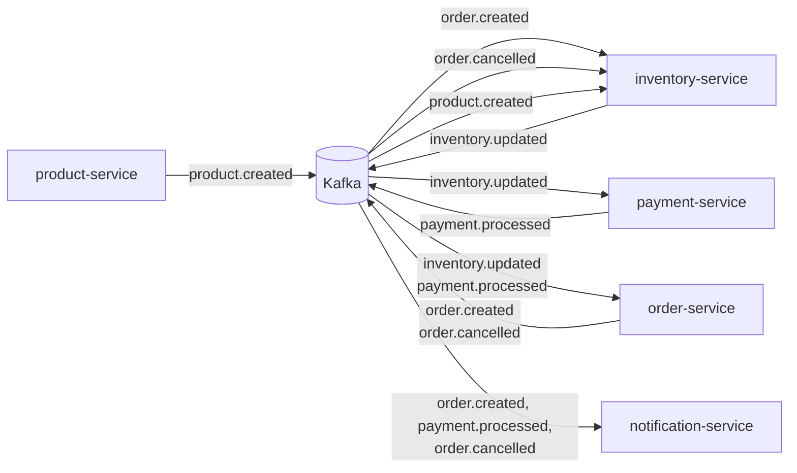
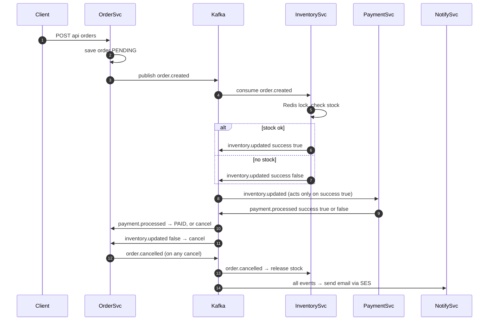

# Kafka — HLD & LLD (Newbie-Friendly)

## A. The one-line idea

**Services never call each other directly. They drop messages on Kafka topics; whoever cares, listens.**

## B. HLD — who publishes, who listens



| Principle | Meaning in plain words |
|---|---|
| Choreography | No boss service; each one reacts to events on its own |
| At-least-once | A message may arrive twice, but never gets lost |
| Key = orderId | All events of one order stay in order (same partition) |

## C. LLD — topics, declared vs actually used

**7 topics are created, only 5 are used by code:**

| Topic | Partitions | Status | Publisher | Consumers |
|---|---|---|---|---|
| `order.created` | 12 | ✅ Active | order | inventory, notification |
| `payment.processed` | 12 | ✅ Active | payment | order, notification |
| `inventory.updated` | 6 | ✅ Active | inventory | order, payment |
| `order.cancelled` | 3 | ✅ Active | order | inventory, notification |
| `product.created` | 4 | ✅ Active | product | inventory |
| `order.confirmed` | 6 | ⚠️ Dead — nobody uses it | — | — |
| `notification.send` | 4 | ⚠️ Dead — nobody uses it | — | — |

## D. Consumer groups & concurrency

| Service | Topic | groupId | concurrency |
|---|---|---|---|
| inventory | order.created | inventory-service-group | 6 |
| inventory | order.cancelled | inventory-service-group | 3 |
| inventory | product.created | inventory-service-group | 1 (default) |
| order | inventory.updated | order-service-group | 6 |
| order | payment.processed | order-service-group | 6 |
| payment | inventory.updated | payment-service-group | 6 |
| notification | order.created | notification-service-group | 4 |
| notification | payment.processed | notification-service-group | 4 |
| notification | order.cancelled | notification-service-group | 3 |

**concurrency** = threads reading partitions in parallel. Never set it above the topic's partition count (extra threads sit idle).

**Different groupIds on the same topic = fan-out:** order-service-group and payment-service-group EACH get a full copy of every `inventory.updated` message.

## E. The Order Saga — full flow



**Order states:** `PENDING → PAID` (happy) or `PENDING → CANCELLED` (no stock / payment failed).

## F. Producer reliability (KafkaConfig.java)

```java
config.put(ProducerConfig.ACKS_CONFIG, "all");              // wait for all replicas
config.put(ProducerConfig.RETRIES_CONFIG, 3);               // retry blips
config.put(ProducerConfig.ENABLE_IDEMPOTENCE_CONFIG, true); // retry ≠ duplicate
```

Without idempotence, a retried send could double-charge an order.

## G. Known gaps

1. 2 dead topics (`order.confirmed`, `notification.send`)
2. No dead-letter queue — a bad message is logged and lost
3. No schema registry — payloads are hand-built JSON, typos surface only at runtime
