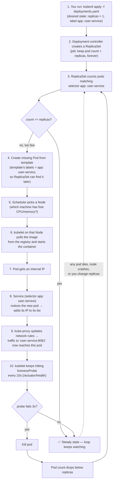
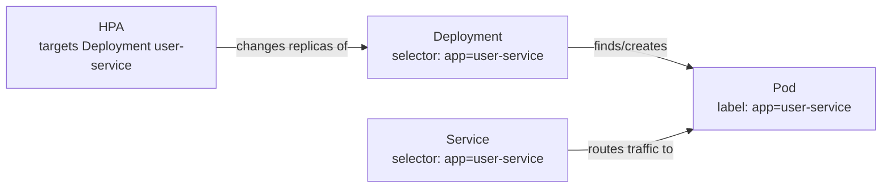
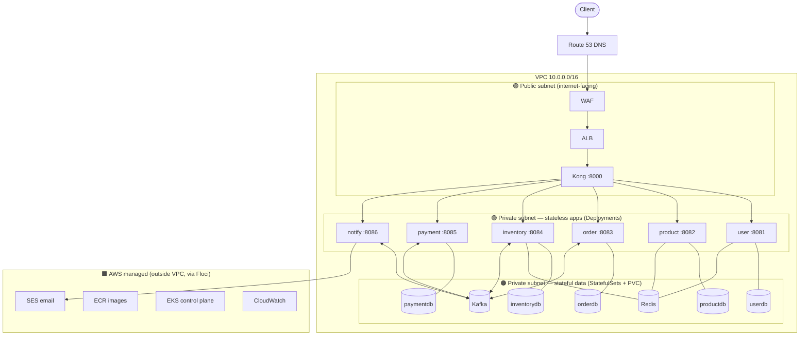

# Kubernetes — Architecture & Internal Workflow (Newbie-Friendly)

## A. First, the words (no jargon left unexplained)

| Word | Plain meaning |
|---|---|
| Container | One running copy of your app (built from a Docker image) |
| Pod | Kubernetes' wrapper around 1 (or more) containers — the unit K8s manages |
| Deployment | "Keep N identical pods of this app alive, always" — for **stateless** apps |
| StatefulSet | Same, but for apps that hold data (Postgres/Kafka/Redis) — stable name + own disk |
| Service | A fixed internal "phone number" that forwards to whichever pod is healthy |
| Label / Selector | Sticky tag on pods / the search query that finds pods by tag |
| HPA | Autoscaler: CPU high → add pods, CPU low → remove pods |
| PVC | A disk that survives even when its pod dies |

## B. THE core workflow — what happens inside Kubernetes when you apply a Deployment

This loop **never stops running**. It is the heart of Kubernetes ("reconciliation loop").



**The one sentence to remember:** you declare *what you want* (replicas: 1), and controllers loop forever comparing "what I want" vs "what exists," fixing any difference — that's why a killed pod comes back by itself.

## C. How labels glue everything together



Three different objects never reference each other by ID — **they all just match the same label**. Change the label on one side and everything silently disconnects (a classic beginner bug).

## D. This project's cloud architecture (zones)



| Zone | Object type used | Why |
|---|---|---|
| 🟢 Public | Service type LoadBalancer | Must be reachable from internet |
| 🟣 Private apps | Deployment | Stateless — safe to kill/recreate |
| 🟠 Private data | StatefulSet + PVC | Holds data — needs stable identity + disk |
| 🟧 AWS managed | (not K8s) | AWS runs these for you |

## E. Apply order (why `05-deploy.sh` goes 1→8)

```
1 Namespace → 2 Secrets/ConfigMaps → 3 Postgres+Redis+Kafka (wait ready)
→ 4 Kong → 5 Microservices → 6 Register Kong in ALB → 7 Monitoring → 8 Verify
```

Rule behind the order: **a thing must exist before anything that references it starts.** Services crash-loop if the DB isn't up; a pod fails with `CreateContainerConfigError` if its Secret doesn't exist yet.

## F. Same YAML, three environments

| Environment | Cluster comes from | Image registry |
|---|---|---|
| 🔵 Docker Compose | (no K8s at all) | local build |
| 🟠 Floci | `04-eks.sh` fake-EKS → k3s | localhost:5100 |
| 🟣 CI | k3d created per pipeline run | `k3d image import` (no registry) |

The YAML in `k8s/` never changes — only `REGISTRY`/`IMAGE_TAG` placeholders and Secret values get swapped per environment.
