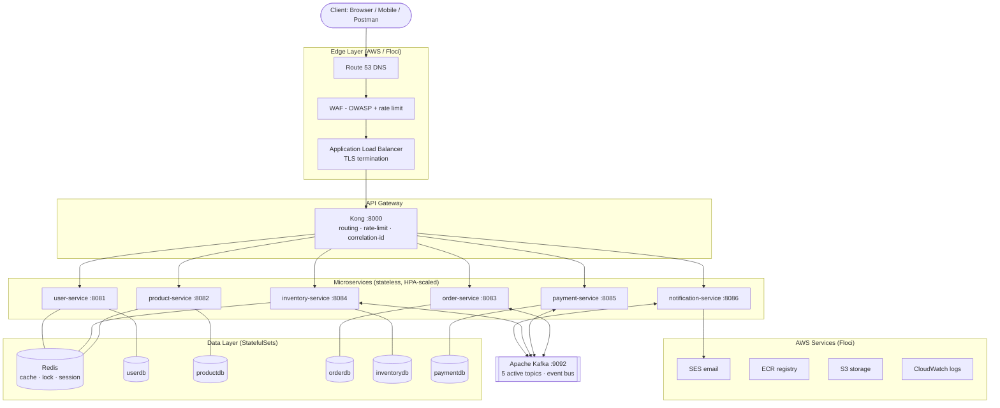
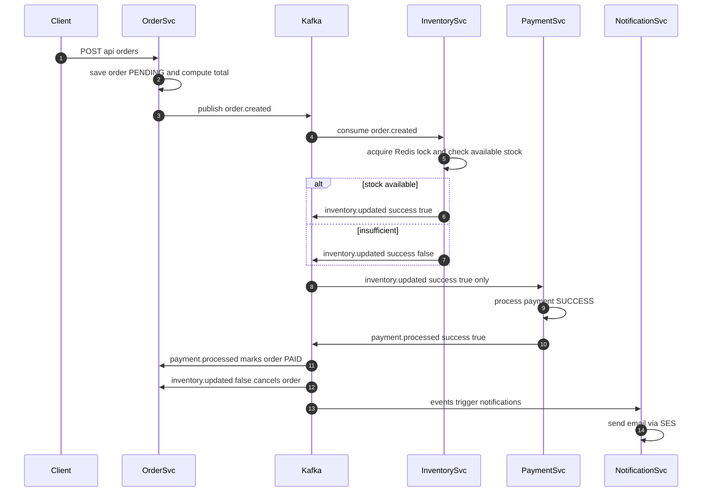

# Master Guide — Complete Project Reference

> The single document to learn this entire project: the exact order to read every file,
> high- and low-level design, all diagrams, every script, all code, and the full record
> of what was built and fixed.

---

# PART A — The Learning Sequence (read files in THIS order)

Follow these 10 stages top to bottom. Each builds on the previous.

### Stage 0 — See it run first
| # | File / Action | Why |
|---|---|---|
| 0.1 | `docker compose up -d` | Watch the whole system boot before reading any code |
| 0.2 | `curl localhost:8000/api/products` | Prove the gateway → service path works |

### Stage 1 — The map
| # | File | What you learn |
|---|---|---|
| 1.1 | `README.md` | Project overview, service list, quick start |
| 1.2 | `docs/MASTER_GUIDE.md` (this file) | The whole picture |
| 1.3 | `docs/ARCHITECTURE.md` | System diagrams + data flow |

### Stage 2 — How traffic enters
| # | File | What you learn |
|---|---|---|
| 2.1 | `docker-compose.yml` | Every container, port, env var, dependency |
| 2.2 | `kong/kong.yml` | Gateway routing: which URL → which service (`strip_path:false`) |

### Stage 3 — One service, end to end (use `user-service` — simplest)
| # | File | Layer |
|---|---|---|
| 3.1 | `user-service/src/main/resources/application.yml` | Config: DB, Redis, JWT |
| 3.2 | `.../model/User.java` | Entity (maps to `users` table) |
| 3.3 | `.../repository/UserRepository.java` | DB queries (Spring Data JPA) |
| 3.4 | `.../service/UserService.java` | Business logic |
| 3.5 | `.../controller/UserController.java` | REST endpoints |
| 3.6 | `.../config/SecurityConfig.java` + `JwtAuthenticationFilter.java` | JWT auth |
| 3.7 | `.../resources/db/migration/V1__init.sql` | Flyway schema |

### Stage 4 — The event backbone (`order` → `inventory` → `payment` → `notification`)
| # | File | What you learn |
|---|---|---|
| 4.1 | `order-service/.../kafka/OrderEventPublisher.java` | Publishing `order.created` |
| 4.2 | `inventory-service/.../kafka/InventoryEventConsumer.java` | Reserving stock |
| 4.3 | `inventory-service/.../service/InventoryService.java` | Redis lock + atomic upsert |
| 4.4 | `payment-service/.../kafka/PaymentEventConsumer.java` | Charging only after stock OK |
| 4.5 | `order-service/.../kafka/OrderEventConsumer.java` | Completing saga → PAID / CANCELLED |
| 4.6 | `notification-service/.../kafka/NotificationConsumer.java` | Emails via SES |

### Stage 5 — Caching & concurrency
| # | File | What you learn |
|---|---|---|
| 5.1 | `product-service/.../service/ProductService.java` | Redis cache (15-min TTL) |
| 5.2 | `inventory-service/.../service/InventoryService.java` | Redis distributed lock (oversell prevention) |

### Stage 6 — Containerisation
| # | File | What you learn |
|---|---|---|
| 6.1 | `*/Dockerfile` | How each service becomes an image |
| 6.2 | `pom.xml` (root) | Multi-module reactor, Flyway, JaCoCo |

### Stage 7 — Kubernetes
| # | File | What you learn |
|---|---|---|
| 7.1 | `k8s/namespace/namespace.yaml` | Namespaces |
| 7.2 | `k8s/postgres/postgres.yaml` | StatefulSets (5 DBs) |
| 7.3 | `k8s/kafka/kafka.yaml` + `redis/redis.yaml` | Stateful infra |
| 7.4 | `k8s/kong/kong.yaml` | Gateway + LoadBalancer service |
| 7.5 | `k8s/services/deployments.yaml` | Deployments + HPA |
| 7.6 | `k8s/services/configmap.yaml` + `secrets.example.yaml` | Config vs secrets |
| 7.7 | `k8s/monitoring/monitoring.yaml` | Prometheus, Grafana, Loki |

### Stage 8 — AWS via Floci (scripts)
| # | File | What you learn |
|---|---|---|
| 8.1 | `scripts/01-vpc.sh` | VPC, subnets, SG, NAT |
| 8.2 | `scripts/02-alb.sh` | ALB, WAF, ACM, Route53 |
| 8.3 | `scripts/03-ecr.sh` | Build + push images to ECR |
| 8.4 | `scripts/04-eks.sh` | EKS cluster + node groups |
| 8.5 | `scripts/05-deploy.sh` | Deploy manifests + register in ALB |
| 8.6 | `scripts/06-teardown.sh` | Delete everything |

### Stage 9 — CI/CD & governance
| # | File | What you learn |
|---|---|---|
| 9.1 | `.github/workflows/ci-cd.yml` | Full pipeline |
| 9.2 | `.github/smoke-test.sh` | 16-endpoint E2E saga test |
| 9.3 | `.github/workflows/codeql.yml` | Security scanning |
| 9.4 | `.github/dependabot.yml` | Dependency automation |
| 9.5 | `scripts/setup-github-governance.sh` | Environments + branch protection |
| 9.6 | `docs/CI_CD.md`, `DEPLOYMENT.md`, `AUTOSCALING.md`, `MONITORING.md` | Deep dives |

---

# PART B — High-Level Design (HLD)

**HLD = the big picture: major components and how they talk. No class detail.**



### HLD principles
| Principle | How it's applied |
|---|---|
| **Database per service** | 5 separate Postgres DBs; no shared tables |
| **API Gateway** | Kong is the single entry; services never exposed directly |
| **Event-driven** | Services communicate via Kafka events, not direct calls (loose coupling) |
| **Stateless services** | Any pod can serve any request; state lives in DB/Redis/Kafka |
| **CQRS-lite / Saga** | Order flow is a choreographed saga across services |

---

# PART C — Low-Level Design (LLD)

**LLD = the internals: layers, classes, tables, and exact message flow.**

## C1. Standard service layering (every service follows this)

```mermaid
graph LR
    HTTP[HTTP request] --> C[Controller<br/>@RestController]
    C --> S[Service<br/>@Service - business logic]
    S --> R[Repository<br/>JpaRepository]
    R --> DB[(PostgreSQL)]
    S -.publish.-> K[[Kafka]]
    S -.cache.-> RD[(Redis)]
    C -.->|@Valid| DTO[DTO validation]
    S --> M[Model / @Entity]
```

| Layer | Annotation | Responsibility | Must NOT |
|---|---|---|---|
| Controller | `@RestController` | HTTP mapping, status codes | contain business logic |
| Service | `@Service` `@Transactional` | business rules, orchestration | know about HTTP |
| Repository | `extends JpaRepository` | DB access only | contain logic |
| Model | `@Entity` | table mapping | contain behaviour |
| DTO | plain + `@Valid` | request/response shape | expose entities directly |
| Kafka | `@KafkaListener` / publisher | async events | block on responses |

## C2. Database schemas (LLD data model)

```
userdb.users            (id, name, email UNIQUE, password_hash, role, active, created_at)
productdb.products      (id, name, price, category, description, created_at)
orderdb.orders          (id, user_id, status, total_amount, shipping_address, created_at, updated_at)
orderdb.order_items     (id, order_id FK, product_id, product_name, quantity, price)
inventorydb.inventory   (id, product_id UNIQUE, quantity, reserved, version)   ← @Version optimistic lock
paymentdb.payments      (id, order_id, user_id, amount, status, transaction_id, created_at)
```

## C3. The Order Saga (detailed LLD sequence)



**Order status machine:** `PENDING → PAID` (happy) or `PENDING → CANCELLED` (no stock / payment fail).

**See `KAFKA.md` for the full topic reference. See `KUBERNETES.md` for the cloud architecture, deployment order, and the internal reconciliation-loop workflow (how a Deployment actually creates and maintains Pods).**

## C4. Kafka topics (LLD messaging)

| Topic | Publisher | Consumers | Payload keys |
|---|---|---|---|
| `order.created` | order | inventory, payment*, notification | orderId, userId, amount, items |
| `inventory.updated` | inventory | order, payment | orderId, success, reason |
| `payment.processed` | payment | order, notification | orderId, success, transactionId |
| `order.cancelled` | order | inventory, notification | orderId, reason |
| `product.created` | product | inventory | productId |

\*payment only acts on `inventory.updated{success:true}`, never on raw `order.created`.

**Note — 2 dead topics exist in infra but are unused by any service:** `order.confirmed` (6 partitions) and `notification.send` (4 partitions) are created by `docker-compose.yml`/`k8s/kafka/kafka.yaml` but never published to or consumed by any service.

## C5. Redis usage (LLD)

| Key pattern | Service | Purpose | TTL |
|---|---|---|---|
| `session:{email}` | user | JWT session | 24h |
| `product:{id}` | product | read cache | 15 min |
| `inventory:lock:{productId}` | inventory | distributed lock (oversell guard) | 30s |

---

# PART D — Every Script Explained

| Script | Does | Key AWS concepts |
|---|---|---|
| `scripts/01-vpc.sh` | VPC 10.0.0.0/16, 2 public + 2 private subnets, IGW, NAT, route tables, 3 security groups | CIDR, public/private subnet, NAT, SG |
| `scripts/02-alb.sh` | ALB in public subnets, target group (IP mode), listeners 80→443, WAF, ACM cert, Route53 | ALB, listeners, target groups, WAF, ACM |
| `scripts/03-ecr.sh` | Create 6 ECR repos, `mvn package`, `docker build`, push to Floci ECR (localhost:5100) | ECR, docker login, image tags |
| `scripts/04-eks.sh` | IAM roles, EKS cluster, 2 node groups, kubeconfig, **auto-writes k3s registries.yaml for ECR pulls** | EKS, IAM roles, node groups |
| `scripts/05-deploy.sh` | Apply all k8s manifests in order, register Kong pod IPs in ALB target group | kubectl apply order, target registration |
| `scripts/06-teardown.sh` | Delete EKS, ALB, WAF, VPC, ECR | clean teardown |
| `scripts/setup-github-governance.sh` | Create `production`+`dev` environments, branch protection on main/develop via GitHub API | environments, required reviewers, branch rules |
| `.github/smoke-test.sh` | Drive all 16 REST endpoints through Kong + verify order→PAID saga; runs local (KONG_URL) or CI (port-forward) | E2E testing |
| `scripts/generate-pdf-docs.js` | Combine all docs into one printable HTML | docs tooling |

---

# PART E — What We Built & Fixed (the full journey)

### Phase 1 — Get endpoints working on Docker
| Bug found | Fix |
|---|---|
| Kafka advertised `localhost:9092` in compose | changed to `kafka:9092` |
| Product Redis cache crash (serialization) | `Product implements Serializable` |
| Order JSON infinite recursion | `@JsonIgnore` on `OrderItem.order` |
| No JWT filter in user-service | added `JwtAuthenticationFilter` + stateless `SecurityConfig` |
| 500s instead of proper codes | added `GlobalExceptionHandler` (404/401/409) |
| Kong 404 on all routes | added `strip_path: false` to all 6 routes |
| Payment charged even when out of stock | rewired: payment only on `inventory.updated{success:true}` |

### Phase 2 — Kubernetes
| Bug | Fix |
|---|---|
| Kafka crash-loop (missing KAFKA_NODE_ID) | merged duplicate `env:` block |
| Kafka `$(POD_NAME)` unresolved | reordered env vars |
| Promtail crash (missing ConfigMap) | added `promtail-config` + RBAC |
| Secrets in git | removed; inject via `kubectl create secret` |

### Phase 3 — CI/CD
| Bug | Fix |
|---|---|
| `configure-aws-credentials` rejects test creds | export env vars directly for Floci |
| Kind too slow for CI | switched to k3d (fast k3s) |
| k3d-action pinned v5.4.6 URL 404 | install latest k3d directly |
| CI smoke test 503 | wait for ALL services before testing |
| Trivy re-downloads DB | cached official action |

### Phase 4 — Completing the app (found via full E2E test)
| Gap | Fix |
|---|---|
| No way to add stock (every order cancelled) | added `POST /api/inventory/{id}/restock` |
| Paid orders stuck at PENDING forever | added `payment.processed` listener → mark PAID |
| `restock` 500 under concurrency (duplicate key race) | atomic `INSERT ... ON CONFLICT` upsert |

### Phase 5 — Governance
- `production` environment with required reviewer (approval gate)
- Branch protection: PR + 6 test checks + no force-push on main & develop
- Repo made public to unlock free branch protection
- **Verified end-to-end:** develop auto-deploy green, main gated deploy approved & green

---

# PART F — How To Run / Verify Everything

```bash
# 1. Local (fastest)
docker compose up -d
KONG_URL=http://localhost:8000 bash .github/smoke-test.sh   # expect 17/17

# 2. Full AWS simulation (Floci)
bash scripts/01-vpc.sh && bash scripts/02-alb.sh && bash scripts/03-ecr.sh
bash scripts/04-eks.sh && bash scripts/05-deploy.sh
kubectl get pods -n ecommerce

# 3. CI/CD
git push origin develop     # → tests + k8s deploy + smoke test
# open PR develop→main → merge → approve production gate

# 4. Monitoring
kubectl port-forward svc/grafana 3000:3000 -n monitoring
```

**Definition of done (all achieved):** every endpoint tested on every deploy, full saga reaches PAID, real Kubernetes deploy green on both environments, production gated behind human approval.
