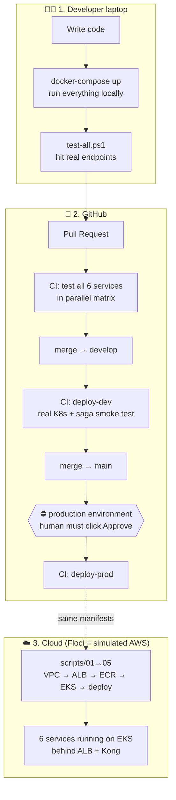
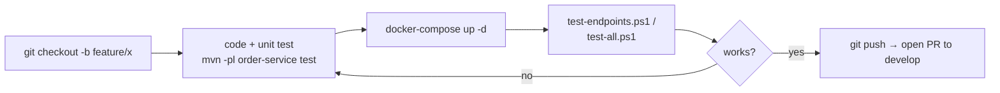
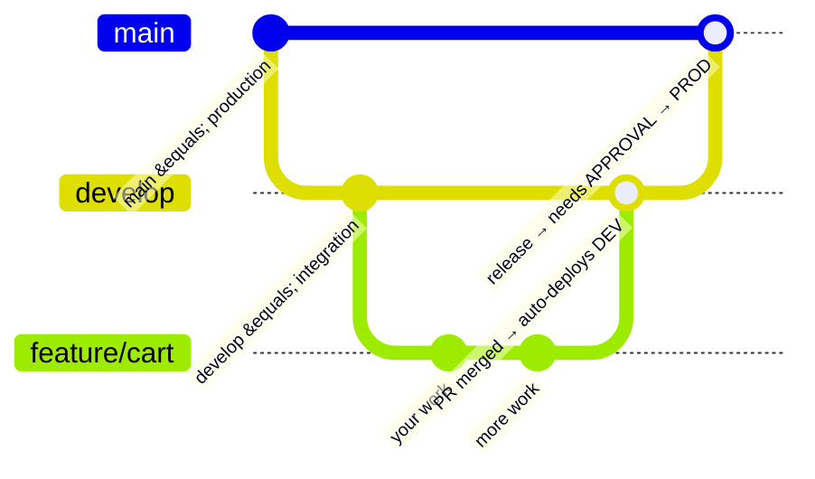
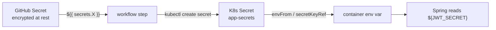
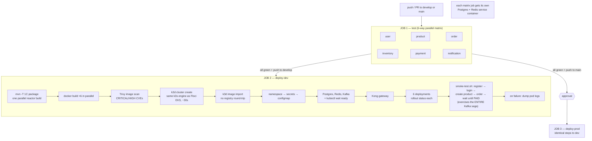
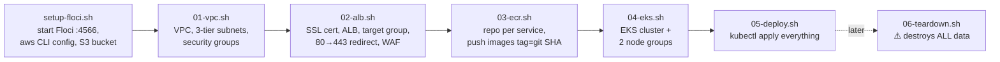
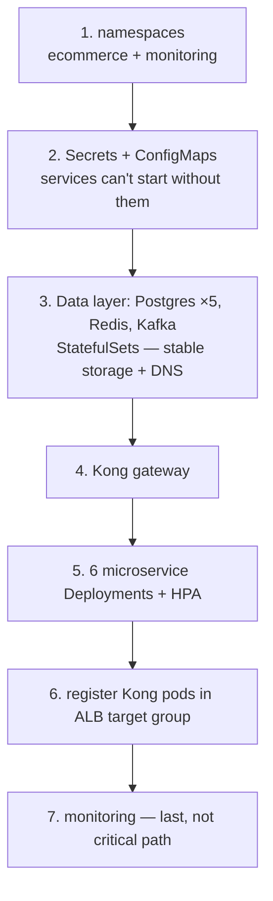
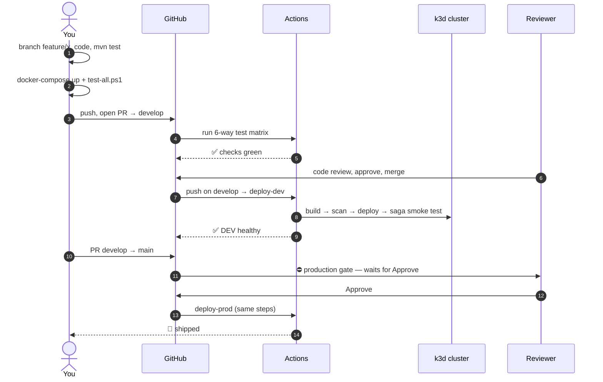

# End-to-End Workflow — From Laptop to Production

> How code travels: **your editor → git branch → GitHub → CI tests → K8s deploy → smoke test → approval → prod**.
> Every box below is something that actually exists in this repo. Read top to bottom — this is the order things happen.

---

## 0. The Big Picture (one diagram, whole project)



Three worlds, **same Docker images and same K8s YAML in all of them** — only environment variables change:

| World | How it runs | Purpose |
|---|---|---|
| Laptop | `docker-compose up` | fast inner loop |
| CI (GitHub Actions) | k3d (k3s-in-docker) cluster, built fresh each run | prove app + manifests work |
| Cloud | Floci EKS + ALB + ECR via `scripts/01-06` | full AWS production shape |

---

## 1. Developer Inner Loop (daily work)



- `docker-compose.yml` starts: **5 Postgres** (one per service), **Redis**, **Kafka** (+ kafka-init creating topics), **Floci** (:4566), and the 6 services.
- Never commit secrets — locally they come from your `.env`; see [§3](#3-github-environments--secrets) for where CI gets them.

---

## 2. Git Branching Model



| Branch | Protected by | What a push triggers |
|---|---|---|
| `feature/*` | — | tests only (on PR) |
| `develop` | PR + green tests | **deploy-dev** job (full K8s deploy + smoke test) |
| `main` | PR + green tests + **human approval** | **deploy-prod** job |

---

## 3. GitHub Environments & Secrets

CI never contains passwords in code. GitHub stores them encrypted; the workflow reads `${{ secrets.NAME }}` at runtime.

**Two GitHub Environments** (Settings → Environments):

| Environment | Used by job | Protection |
|---|---|---|
| `dev` | deploy-dev | none — auto-deploys on push to develop |
| `production` | deploy-prod | **required reviewer** — pipeline pauses until a human approves |

**14 secrets to configure** (Settings → Secrets and variables → Actions):

```
JWT_SECRET                     REDIS_PASSWORD
FLOCI_AWS_ACCESS_KEY_ID        FLOCI_AWS_SECRET_ACCESS_KEY
USER_DB_USER      USER_DB_PASS
PRODUCT_DB_USER   PRODUCT_DB_PASS
ORDER_DB_USER     ORDER_DB_PASS
INVENTORY_DB_USER INVENTORY_DB_PASS
PAYMENT_DB_USER   PAYMENT_DB_PASS
```

How a secret reaches a running pod:



`scripts/setup-github-governance.sh` automates branch protection + environments.

---

## 4. CI/CD Pipeline in Detail (`.github/workflows/ci-cd.yml`)



Why it's built this way:

- **Matrix tests** — 6 services test simultaneously; `fail-fast: false` so one red service doesn't hide the others.
- **k3d, not real EKS in CI** — boots in ~30 s, and it's the *same k3s engine* Floci's EKS provisions, so passing CI ≈ working on Floci. The real AWS path is exercised by `scripts/01-06` locally.
- **Smoke test = real business proof** — it doesn't just check pods are Running; it places an order and waits for the saga (order → inventory → payment → PAID) to complete through Kafka.
- **Security:** `codeql.yml` scans source on every push; Trivy scans the built image.

---

## 5. Cloud Provisioning (Floci = simulated AWS)

Run once to build the "cloud", in this exact order — each script's output feeds the next:



What each script actually builds:

| Script | Creates | Key design |
|---|---|---|
| `01-vpc.sh` | VPC + 6 subnets + security groups | 3 tiers: **public** 10.0.1-2.x (ALB only) → **private** 10.0.3-4.x (EKS nodes, Kong, services) → **data** 10.0.5-6.x (Postgres/Redis/Kafka, reachable only from private) |
| `02-alb.sh` | ACM SSL cert, ALB in public subnets, target group, listeners, health checks, WAF | port 80 → redirect 443; 443 → forward to Kong target group |
| `03-ecr.sh` | one ECR repo per service, builds + pushes 6 images | tag = **git SHA** (immutable — you always know exactly what's deployed); Floci serves the registry on host port 5100 |
| `04-eks.sh` | EKS cluster + node groups | `general` (m5.large: services, Kong) + `high-mem` (r5.large: Kafka consumers); all nodes in **private** subnets |
| `05-deploy.sh` | everything in the cluster | strict dependency order below |
| `06-teardown.sh` | — | deletes it all, including data |

`05-deploy.sh` applies K8s resources in dependency order (the same order CI uses):



Traffic path in the cloud:

```
Internet → ALB (:80) → Kong (rate-limit, routing) → Service → Pod
```

---

## 6. Inside Kubernetes (what's actually running)

```mermaid
flowchart TB
    subgraph NS1[namespace: ecommerce]
        KONG[Kong Deployment] --> S1[Svc: user] & S2[Svc: product] & S3[Svc: order] & S4[Svc: inventory] & S5[Svc: payment]
        S1 --> P1[pods + HPA]
        S3 --> P3[pods + HPA]
        subgraph DATA[StatefulSets]
            PG[postgres-user … postgres-payment ×5]
            RD[redis]
            KF[kafka]
        end
        P1 -. jdbc DNS:<br/>postgres-user-0.postgres-user<br/>.ecommerce.svc.cluster.local .-> PG
        P3 --> KF
        CM[ConfigMap: non-secret config] & SEC[Secret: app-secrets] --> P1 & P3
    end
    subgraph NS2[namespace: monitoring]
        MO[monitoring stack]
    end
```

Key concepts an intern must know here:

| Concept | In this project | Why |
|---|---|---|
| **Deployment** | each of the 6 services | stateless, replaceable, rolling updates |
| **StatefulSet** | Postgres/Redis/Kafka | stable name + storage (`postgres-user-0`) |
| **Service (DNS)** | `order-service.ecommerce.svc.cluster.local` | pods die, DNS name survives |
| **ConfigMap vs Secret** | config in ConfigMap, passwords in Secret | secrets never in git — only `secrets.example.yaml` is committed |
| **HPA** | per service | auto-adds pods under CPU load |
| **kubectl wait / rollout status** | in scripts + CI | don't proceed until dependency is actually ready |

---

## 7. One Change, Start to Finish (the intern checklist)



---

## 8. When Something Breaks (quick triage)

| Symptom | First command | Usual cause |
|---|---|---|
| Pod CrashLoopBackOff | `kubectl logs <pod> -n ecommerce --previous` | missing secret / DB not ready |
| Pod Pending | `kubectl describe pod <pod> -n ecommerce` | no node capacity / PVC unbound |
| Order stuck PENDING | `kubectl logs -l app=inventory-service -n ecommerce` | Kafka consumer down / topic missing |
| 429 from gateway | — | Kong per-IP rate limit (working as intended) |
| 401 after login | check Redis | session store down → JWT validation fails |
| CI deploy red | Actions log → "Dump logs on failure" step | pod logs are auto-printed for all 6 services + Kong |

---

## Read next

Runtime architecture in depth (saga, auth, topics, per-service table): [ARCHITECTURE.md](ARCHITECTURE.md)
